<!-- START doctoc generated TOC please keep comment here to allow auto update -->
<!-- DON'T EDIT THIS SECTION, INSTEAD RE-RUN doctoc TO UPDATE -->
**Table of Contents**  *generated with [DocToc](https://github.com/thlorenz/doctoc)*

- [特点](#%E7%89%B9%E7%82%B9)
- [事件注册](#%E4%BA%8B%E4%BB%B6%E6%B3%A8%E5%86%8C)
  - [setInitialDOMProperties](#setinitialdomproperties)
    - [ensureListeningTo](#ensurelisteningto)
    - [listenTo](#listento)
    - [trapBubbledEvent](#trapbubbledevent)
      - [addEventBubbleListener](#addeventbubblelistener)
  - [小结](#%E5%B0%8F%E7%BB%93)
- [事件分发](#%E4%BA%8B%E4%BB%B6%E5%88%86%E5%8F%91)
  - [dispatchEvent](#dispatchevent)
    - [getClosestInstanceFromNode](#getclosestinstancefromnode)
    - [batchedUpdates](#batchedupdates)
    - [handleTopLevel](#handletoplevel)
- [事件执行](#%E4%BA%8B%E4%BB%B6%E6%89%A7%E8%A1%8C)
  - [extractEvents 构造合成事件](#extractevents-%E6%9E%84%E9%80%A0%E5%90%88%E6%88%90%E4%BA%8B%E4%BB%B6)
    - [SimpleEventPlugin.extractEvents：从合成事件对象池中取对象](#simpleeventpluginextractevents%E4%BB%8E%E5%90%88%E6%88%90%E4%BA%8B%E4%BB%B6%E5%AF%B9%E8%B1%A1%E6%B1%A0%E4%B8%AD%E5%8F%96%E5%AF%B9%E8%B1%A1)
      - [getPooledEvent：获取（构造）合成事件](#getpooledevent%E8%8E%B7%E5%8F%96%E6%9E%84%E9%80%A0%E5%90%88%E6%88%90%E4%BA%8B%E4%BB%B6)
      - [accumulateTwoPhaseDispatches 进一步加工合成事件](#accumulatetwophasedispatches-%E8%BF%9B%E4%B8%80%E6%AD%A5%E5%8A%A0%E5%B7%A5%E5%90%88%E6%88%90%E4%BA%8B%E4%BB%B6)
  - [runEventsInBatch：批处理合成事件](#runeventsinbatch%E6%89%B9%E5%A4%84%E7%90%86%E5%90%88%E6%88%90%E4%BA%8B%E4%BB%B6)
- [补充](#%E8%A1%A5%E5%85%85)
  - [SyntheticEvent：合成事件](#syntheticevent%E5%90%88%E6%88%90%E4%BA%8B%E4%BB%B6)
    - [寄生组合式继承](#%E5%AF%84%E7%94%9F%E7%BB%84%E5%90%88%E5%BC%8F%E7%BB%A7%E6%89%BF)

<!-- END doctoc generated TOC please keep comment here to allow auto update -->

>参考：[上](https://juejin.im/post/5bd32493f265da0ae472cc8e#heading-1)、[下](https://juejin.im/post/5bd32b5cf265da0af609f79a)<br/>
       react版本：v16.8.6<br/>

# 特点
1. React事件使用了【事件委托】的机制
    - 一般事件委托的作用都是为了减少页面的注册事件数量，减少内存开销，优化浏览器性能，
    - 另外可以更好的【管理事件】，
    - 实际上，React中所有的事件最后都是被委托到了 document这个顶级DOM上
2. React中就存在了自己的 合成事件(SyntheticEvent)，
    - 合成事件由对应的 EventPlugin负责合成，不同类型的事件由不同的 plugin合成，例如 SimpleEvent Plugin、TapEvent Plugin等
3. 为了进一步提升事件的性能，使用了 EventPluginHub这个东西来负责合成事件对象的创建和销毁

# 事件注册
案例代码
```
//index.js
ReactDOM.render(<App />, document.getElementById('root'));
//App.js
class App extends React.Component {
    //...
    render() {
        return <div onClick={this.clickHandler}>这是A组件</div>
    }
}
```

调用栈以及事件注册的入口
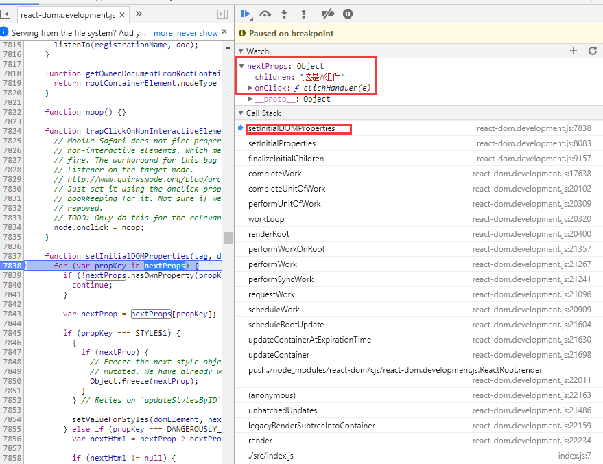

## setInitialDOMProperties
>node_modules/react-dom/cjs/react-dom.development.js

```
function setInitialDOMProperties(tag, domElement, rootContainerElement, nextProps, isCustomComponentTag) {
    for (var propKey in nextProps) {
        if (!nextProps.hasOwnProperty(propKey)) {
            continue;
        }

        var nextProp = nextProps[propKey];

        if (propKey === STYLE$1) {
            //...
        } else if (propKey === DANGEROUSLY_SET_INNER_HTML) {
            //...
        } else if (propKey === CHILDREN) {
            //...
        } else if (propKey === SUPPRESS_CONTENT_EDITABLE_WARNING || propKey === SUPPRESS_HYDRATION_WARNING$1) {// Noop
        } else if (propKey === AUTOFOCUS) {
            //...
        } else if (registrationNameModules.hasOwnProperty(propKey)) {
            if (nextProp != null) {
                if (true && typeof nextProp !== 'function') {
                    warnForInvalidEventListener(propKey, nextProp);
                }

                ensureListeningTo(rootContainerElement, propKey);
            }
        } else if (nextProp != null) { 
            //...
        }
    }
}
```
变量registrationNameModules的含义，存储一堆事件映射
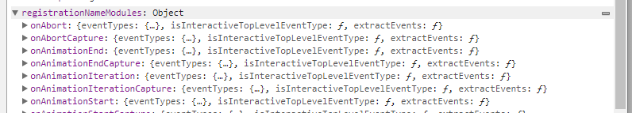

### ensureListeningTo

```
function ensureListeningTo(rootContainerElement, registrationName) {
  var isDocumentOrFragment = rootContainerElement.nodeType === DOCUMENT_NODE || rootContainerElement.nodeType === DOCUMENT_FRAGMENT_NODE;
  var doc = isDocumentOrFragment ? rootContainerElement : rootContainerElement.ownerDocument;
  listenTo(registrationName, doc);
}
```
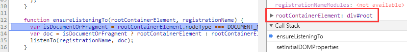
1. 首先判断了 rootContainerElement是不是一个 document或者 Fragment(文档片段节点)，示例中传过来的是 .box这个 div，显然不是，
2. 所以 doc这个变量就被赋值为 rootContainerElement.ownerDocument，这个东西其实就是document元素，
3. 把这个document传到下面的 listenTo里了，【事件委托也就是在这里做的】，
4. 所有的事件最终都会被委托到 document 或者 fragment上去，大部分情况下都是 document，
5. 然后这个 registrationName就是事件名称 onClick
 

### listenTo
```
switch (dependency) {
  // 省略一些代码
  default: 
    var isMediaEvent = mediaEventTypes.indexOf(dependency) !== -1;
    if (!isMediaEvent) {
      trapBubbledEvent(dependency, mountAt);
    }
    break;
} 
```
这个方法其实就是注册事件的入口<br/>
变量：registrationNameDependencies<br/>
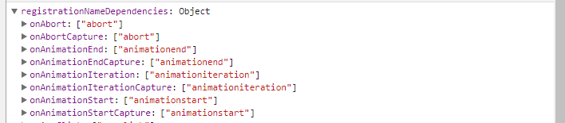<br/>
可以看到，React是给事件名做了一些跨浏览器兼容事情的，比如传入 onChange事件，会自动对应上 blur change click focus等多种浏览器原生事件<br/>

1. 除了 scroll focus blur cancel close方法走【trapCapturedEvent】方法，
2. invalid submit reset方法不处理之外，
3. 剩下的事件类型全走default，执行【trapBubbledEvent】这个方法（注册冒泡阶段的事件）
4. trapCapturedEvent 和 trapBubbledEvent二者唯一的不同之处就在于，对于最终的合成事件，前者注册捕获阶段的事件监听器，而后者则注册冒泡阶段的事件监听器
 
>由于大部分合成事件的代理注册的都是冒泡阶段的事件监听器，也就是委托到 document上注册的是冒泡阶段的事件监听器，所以就算你显示声明了一个捕获阶段的 React事件，例如 onClickCapture，此事件的响应也会晚于原生事件的捕获事件以及冒泡事件
 实际上，所有原生事件的响应(无论是冒泡事件还是捕获事件)，都将早于 React合成事件(SyntheticEvent)，对原生事件调用 e.stopPropagation()将阻止对应 SyntheticEvent的响应，因为对应的事件根本无法到达document 这个事件委托层就被阻止掉了
  
### trapBubbledEvent
```
function trapBubbledEvent(topLevelType, element) {
  if (!element) {
    return null;
  }

  var dispatch = isInteractiveTopLevelEventType(topLevelType) ? dispatchInteractiveEvent : dispatchEvent;
  addEventBubbleListener(element, getRawEventName(topLevelType), dispatch.bind(null, topLevelType));
}
```

1. addEventBubbleListener这个方法接收三个参数：
    - 第一个参数 element其实就是 document元素，
    - getRawEventName(topLevelType)就是 click事件，
    - 第三个参数的 dispatch就是 dispatchInteractiveEvent，
2. dispatchInteractiveEvent其实最后还是会执行 dispatchEvent这个方法，只是在执行这个方法之前做了一些额外的事情，这里不需要关心，可以暂且认为二者是一样的
 
#### addEventBubbleListener
 ```
function addEventBubbleListener(element, eventType, listener) {
   element.addEventListener(eventType, listener, false);
}
```

## 小结
流程图如下：<br/>
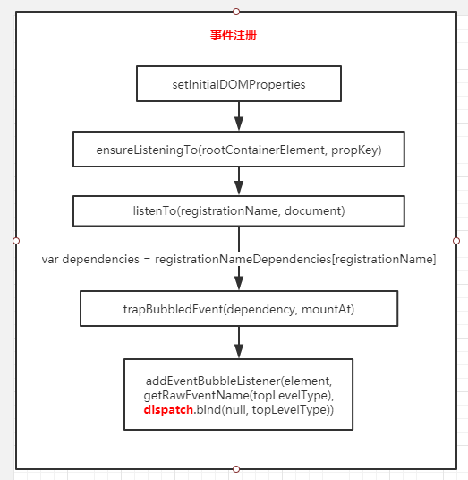<br/>
----<br/>
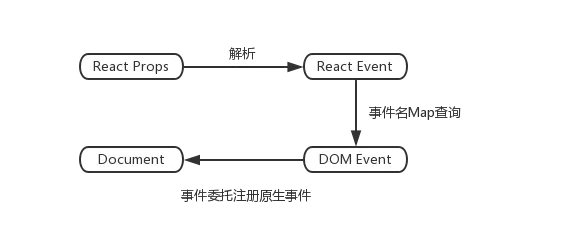<br/>

# 事件分发
该案例总trapBubbledEvent方法中会对document添加onClick事件，回调为dispatchInteractiveEvent\dispatchEvent <br/>

点击案例中注册click事件的div后，触发dispatchEvent事件<br/>
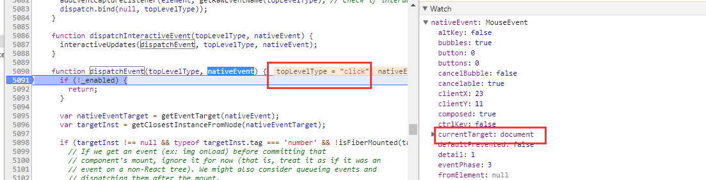


## dispatchEvent
```
function dispatchEvent(topLevelType, nativeEvent) {
  if (!_enabled) {
    return;
  }

  var nativeEventTarget = getEventTarget(nativeEvent); //nativeEvent：原生事件对象
  var targetInst = getClosestInstanceFromNode(nativeEventTarget);//寻找最近的祖先组件实例
  if (targetInst !== null && typeof targetInst.tag === 'number' && !isFiberMounted(targetInst)) { 
    targetInst = null;
  }

  var bookKeeping = getTopLevelCallbackBookKeeping(topLevelType, nativeEvent, targetInst);

  try { 
   // 把当前触发的事件放入了批处理队列中，其中，handleTopLevel是事件分发的核心所在
    batchedUpdates(handleTopLevel, bookKeeping);
  } finally {
    releaseTopLevelCallbackBookKeeping(bookKeeping);
  }
}
```

变量targetInst为FiberNode类型
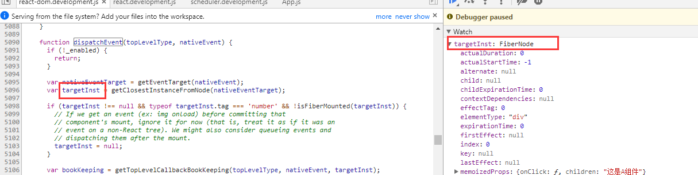

### getClosestInstanceFromNode
通过node获取最近的祖先react【组件实例】（ReactDOMComponent or ReactDOMTextComponent）
```
var randomKey = Math.random().toString(36).slice(2);
var internalInstanceKey = '__reactInternalInstance$' + randomKey;

function getClosestInstanceFromNode(node) {
  if (node[internalInstanceKey]) {
    return node[internalInstanceKey];
  }

  while (!node[internalInstanceKey]) {
    if (node.parentNode) {
      node = node.parentNode;
    } else { 
      return null;
    }
  }

  var inst = node[internalInstanceKey];
  if (inst.tag === HostComponent || inst.tag === HostText) {
    // In Fiber, this will always be the deepest root.
    return inst;
  }

  return null;
}
```

### batchedUpdates
把当前触发的事件放入了批处理队列中

### handleTopLevel
```
function handleTopLevel(bookKeeping) {
  var targetInst = bookKeeping.targetInst;

  // Loop through the hierarchy, in case there's any nested components.
  // It's important that we build the array of ancestors before calling any
  // event handlers, because event handlers can modify the DOM, leading to
  // inconsistencies with ReactMount's node cache. See #1105.
  var ancestor = targetInst;
  do {
    if (!ancestor) {
      bookKeeping.ancestors.push(ancestor);
      break;
    }
    var root = findRootContainerNode(ancestor);
    if (!root) {
      break;
    }
    bookKeeping.ancestors.push(ancestor);
    ancestor = getClosestInstanceFromNode(root);
  } while (ancestor);

  for (var i = 0; i < bookKeeping.ancestors.length; i++) { // 遍历所有组件实例，执行runExtractedEventsInBatch（事件执行的入口）
    targetInst = bookKeeping.ancestors[i];
    runExtractedEventsInBatch(bookKeeping.topLevelType, targetInst, bookKeeping.nativeEvent, getEventTarget(bookKeeping.nativeEvent));
  }
}

```

1. 首先在事件回调之前，根据当前组件，向上遍历得到其所有的父组件，存储到 ancestors中，由于所有的事件都委托到了 document上，
2. 所以在事件触发后，无论是冒泡事件还是捕获事件，其在相关元素上的触发肯定是要有一个次序关系的，比如在子元素和父元素上都注册了一个鼠标点击冒泡事件，
3. 事件触发后，肯定是子元素的事件响应快于父元素，所以在事件队列里，子元素就要排在父元素前面，而在事件回调之前就要进行缓存，
4. 原因是事件回调可能会改变 DOM结构，所以要先遍历好组件层级关系，缓存起来

 
# runExtractedEventsInBatch：事件执行
```
function runExtractedEventsInBatch(topLevelType, targetInst, nativeEvent, nativeEventTarget) {
  var events = extractEvents(topLevelType, targetInst, nativeEvent, nativeEventTarget);
  runEventsInBatch(events);
}
```
runExtractedEventsInBatch这个方法中又调用了两个方法：
    - extractEvents用于构造合成事件，
    - runEventsInBatch用于批处理 extractEvents构造出的合成事件
     
## extractEvents 构造合成事件 
```
function extractEvents(topLevelType, targetInst, nativeEvent, nativeEventTarget) {
  var events = null;
  for (var i = 0; i < plugins.length; i++) {
    // Not every plugin in the ordering may be loaded at runtime.
    var possiblePlugin = plugins[i];
    if (possiblePlugin) {
      var extractedEvents = possiblePlugin.extractEvents(topLevelType, targetInst, nativeEvent, nativeEventTarget);
      if (extractedEvents) {
        events = accumulateInto(events, extractedEvents);
      }
    }
  }
  return events;
}
```

extractEvents方法中的plugins来源
```
//注释：
// 可注入`EventPluginHub`的模块，用于指定'EventPlugin`s的确定性排序。
// 一种简便的方法来推理插件，而无需打包每一个插件。
// 这比插件按照它们注入的顺序排序要好，因为排序会受到包装顺序的影响。
// `ResponderEventPlugin`必须在`SimpleEventPlugin`之前发生，以便在`SimpleEventPlugin`处理程序中方便地防止事件的默认。
var DOMEventPluginOrder = ['ResponderEventPlugin', 'SimpleEventPlugin', 'EnterLeaveEventPlugin', 'ChangeEventPlugin', 'SelectEventPlugin', 'BeforeInputEventPlugin'];

//...
injection.injectEventPluginOrder(DOMEventPluginOrder);

//...
function injectEventPluginOrder(injectedEventPluginOrder) {
  !!eventPluginOrder ? invariant(false, 'EventPluginRegistry: Cannot inject event plugin ordering more than once. You are likely trying to load more than one copy of React.') : void 0;
  // Clone the ordering so it cannot be dynamically mutated.
  eventPluginOrder = Array.prototype.slice.call(injectedEventPluginOrder);
  recomputePluginOrdering(); // 注册到plugins变量中
}
```

### SimpleEventPlugin.extractEvents：从合成事件对象池中取对象
SyntheticMouseEvent、SyntheticUIEvent、SyntheticEvent三者的关系
1. SyntheticUIEvent
```
var SyntheticUIEvent = SyntheticEvent.extend({});
```

2. SimpleEventPlugin
```
var SyntheticMouseEvent = SyntheticUIEvent.extend({});
```

3. SimpleEventPlugin.extractEvents
```
var SimpleEventPlugin = {
    extractEvents: function (topLevelType, targetInst, nativeEvent, nativeEventTarget) {
        switch (topLevelType) {
            //...
            case TOP_CLICK: // clik事件
                // Firefox creates a click event on right mouse clicks. This removes the
                // unwanted click events.
                if (nativeEvent.button === 2) {
                  return null;
                }
            //...
            EventConstructor = SyntheticMouseEvent;
            break;
        }
        var event = EventConstructor.getPooled(dispatchConfig, targetInst, nativeEvent, nativeEventTarget);
        accumulateTwoPhaseDispatches(event);
        return event;    
    }
}
```

1. 上面的EventConstructor是SyntheticMouseEvent（对于案例中的click事件）<br/>
2. 补充部分关于合成事件章节
    - 说到了使用寄生组合的方式实现的继承功能<br/>
    - 对SyntheticEvent调用addEventPoolingTo增加事件池相关功能（如getPooled）
3. 本节开始部分说到了plugin的继承关系<br/>
    - SyntheticMouseEvent通过SyntheticEvent.extend方法继承了SyntheticUIEvent
    - SyntheticUIEvent通过SyntheticEvent.extend方法继承了SyntheticEvent 
综上三点得出，这里EventConstructor.getPooled调用的是SyntheticEvent.getPooled

getPooled就是从 event对象池中取出合成事件，这种操作是 React的一大亮点，将所有的事件缓存在对象池中,可以大大降低对象创建和销毁的时间，提升性能
这个方法是位于 SyntheticEvent这个对象上，流程示意图如下：
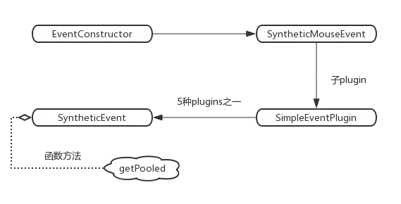

#### getPooledEvent：获取（构造）合成事件
```
function getPooledEvent(dispatchConfig, targetInst, nativeEvent, nativeInst) {
  var EventConstructor = this;
  if (EventConstructor.eventPool.length) { // 非首次触发走这里
    var instance = EventConstructor.eventPool.pop();
    EventConstructor.call(instance, dispatchConfig, targetInst, nativeEvent, nativeInst);
    return instance;
  }
  return new EventConstructor(dispatchConfig, targetInst, nativeEvent, nativeInst); // 首次触发初始化，EventConstructor指向SyntheticMouseEvent
}
```

上面提到SyntheticMouseEvent、SyntheticUIEvent、SyntheticEvent三者的继承关系
因此下面代码回去调用父类的构造函数SyntheticUIEvent、SyntheticEvent，而真正的合成过程在SyntheticEvent中，见【SyntheticEvent：合成事件】章节
```
new EventConstructor(dispatchConfig, targetInst, nativeEvent, nativeInst); // 首次触发初始化
```
 
合成事件挂载属性的特点：
1. 合成事件中挂载的属性是经过处理的，具备跨浏览器的能力
2. 但是属性的调用（如stopPropagation）是作用在document上的，因此需要做一些特殊处理来达到原生事件的效果，如何处理的呢？？

下面以 stopPropagation 为例说明实现的逻辑
```
function functionThatReturnsTrue() {
  return true;
}

_assign(SyntheticEvent.prototype, {
    stopPropagation: function () {
        var event = this.nativeEvent;
        if (!event) {
          return;
        }
    
        if (event.stopPropagation) {
          event.stopPropagation();
        } else if (typeof event.cancelBubble !== 'unknown') { 
          event.cancelBubble = true;
        }
    
        this.isPropagationStopped = functionThatReturnsTrue; // 用于模拟原生事件阻止冒泡
    },
});
```

#### accumulateTwoPhaseDispatches 进一步加工合成事件
1. 保存当前元素及其父元素上挂在的所有【事件回调函数】，包括捕获事件(captured)和冒泡事件(bubbled)，保存到事件event的 _dispatchListeners属性上，
2. 并且将当前元素及其父元素的【react实例：FiberNode类型】保存到event的 _dispatchInstances属性上
3. 拿到了所有与事件相关的元素实例以及事件的回调函数之后，就可以对合成事件进行批量处理了 

 ```
 var SimpleEventPlugin = {
     extractEvents: function (topLevelType, targetInst, nativeEvent, nativeEventTarget) {
        //... 
         var event = EventConstructor.getPooled(dispatchConfig, targetInst, nativeEvent, nativeEventTarget);
         accumulateTwoPhaseDispatches(event);
         return event;    
     }
 }
 ```
 
流程图<br/>
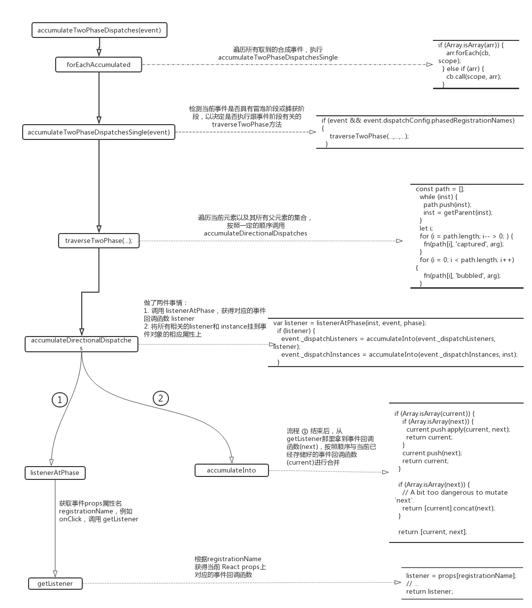
 
 
traverseTwoPhase<br/>
作用：方法名称结合代码暗示，处理两个事件流的阶段（捕获、冒泡）<br/>
调用栈<br/>
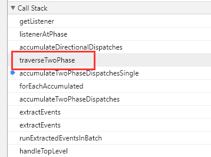  
```
function traverseTwoPhase(inst, fn, arg) { // fn ：accumulateDirectionalDispatches
  var path = [];

  while (inst) {
    path.push(inst);
    inst = getParent(inst);
  }

  var i = void 0;

  for (i = path.length; i-- > 0;) {
    fn(path[i], 'captured', arg);
  }

  for (i = 0; i < path.length; i++) {
    fn(path[i], 'bubbled', arg);
  }
}
``` 

accumulateDirectionalDispatches<br/>
作用：_dispatchListeners、_dispatchInstances<br/>
dispatchListeners：存储(合并)回调函数<br/>
dispatchInstances：存储(合并)组件实例（FiberNode）<br/>
```
function accumulateDirectionalDispatches(inst, phase, event) {
  {
    !inst ? warningWithoutStack$1(false, 'Dispatching inst must not be null') : void 0;
  }
  var listener = listenerAtPhase(inst, event, phase);

  if (listener) {
    event._dispatchListeners = accumulateInto(event._dispatchListeners, listener);
    event._dispatchInstances = accumulateInto(event._dispatchInstances, inst);
  }
```

listenerAtPhase<br/>
作用：获取事件的回调函数<br/>
```
function listenerAtPhase(inst, event, propagationPhase) {
  var registrationName = event.dispatchConfig.phasedRegistrationNames[propagationPhase];
  return getListener(inst, registrationName);
}
``` 

accumulateInto<br/>
作用：合并

 案例中click事件回调<br/>
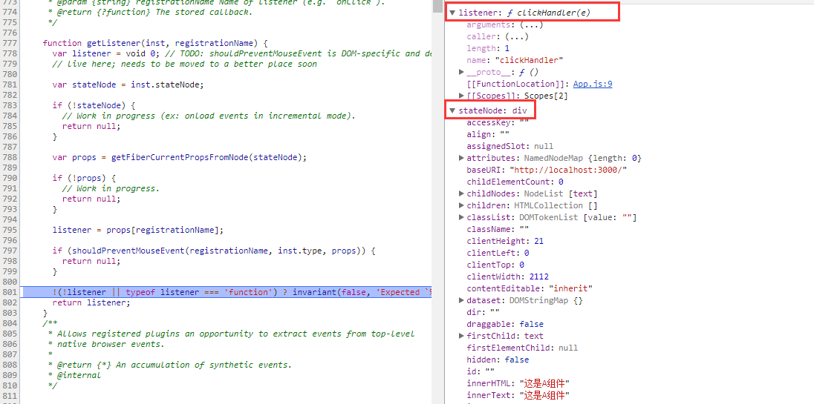 


## runEventsInBatch：批处理合成事件
  runEventsInBatch<br/>
  executeDispatchesAndReleaseTopLevel<br/>
  executeDispatchesAndRelease<br/>
  【事件处理的核心】executeDispatchesInOrder -> if(event.isPropagationStopped())<br/>

### executeDispatchesInOrder：事件处理的核心
```
function executeDispatchesInOrder(event) {
  var dispatchListeners = event._dispatchListeners;
  var dispatchInstances = event._dispatchInstances;
  {
    validateEventDispatches(event);
  }
  if (Array.isArray(dispatchListeners)) {
    for (var i = 0; i < dispatchListeners.length; i++) { // 一个一个对应的处理：组件实例-事件回调
      if (event.isPropagationStopped()) {
        break;
      }
      // Listeners and Instances are two parallel arrays that are always in sync.
      executeDispatch(event, dispatchListeners[i], dispatchInstances[i]);
    }
  } else if (dispatchListeners) {
    executeDispatch(event, dispatchListeners, dispatchInstances);
  }
  event._dispatchListeners = null;
  event._dispatchInstances = null;
}
```

=> executeDispatch<br/> 
=> invokeGuardedCallbackImpl <br/>

invokeGuardedCallbackImpl
``` 
var invokeGuardedCallbackImpl = function (name, func, context, a, b, c, d, e, f) {
  var funcArgs = Array.prototype.slice.call(arguments, 3);
  try {
    func.apply(context, funcArgs);
  } catch (error) {
    this.onError(error);
  }
};
```

1. funcArgs是什么呢？其实就是合成事件对象，包括原生浏览器事件对象的基本上所有属性和方法，除此之外还另外挂载了额外其他一些跟 React合成事件相关的属性和方法，
2. 而 func则就是传入的事件回调函数，对于本示例来说，就等于clickHandler这个回调方法：
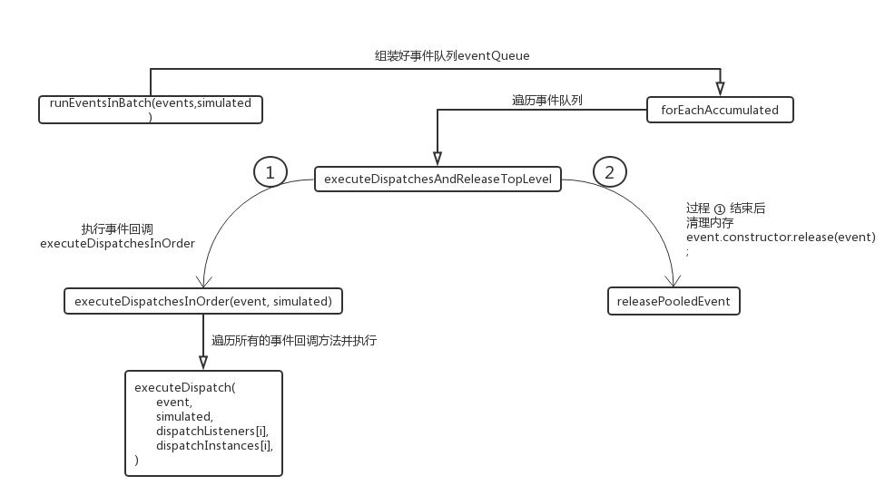

## 事件清理
事件执行完毕之后，接下来就是一些清理工作了，因为 React采用了对象池的方式来管理合成事件，所以当事件执行完毕之后就要清理释放掉，减少内存占用<br/>

executeDispatchesAndRelease<br/>
该方法在runEventsInBatch的调用栈中<br/>
```
var executeDispatchesAndRelease = function (event) {
  if (event) {
    executeDispatchesInOrder(event);

    if (!event.isPersistent()) {
      event.constructor.release(event); // addEventPoolingTo(SyntheticEvent);//添加事件池先关功能
    }
  }
};
```

releasePooledEvent
```
function releasePooledEvent(event) {
  var EventConstructor = this;
  !(event instanceof EventConstructor) ? invariant(false, 'Trying to release an event instance into a pool of a different type.') : void 0;
  event.destructor();
  if (EventConstructor.eventPool.length < EVENT_POOL_SIZE) {
    EventConstructor.eventPool.push(event); 
  }
}
```
event.destructor()的作用：析构函数<br/>
1. JavaScript引擎有自己的垃圾回收机制，一般来说不需要开发者亲自去回收内存空间，但这并不是说开发者就完全无法影响这个过程了，
2. 常见的手动释放内存的方法就是将对象置为 null，
3. destructor这个方法主要就是做这件事情，遍历事件对象上所有属性，并将所有属性的值置为 null
 
如果当前事件池没有满，则将析构后的event对象存储进去，析构后的event对象以及其属性还是存在的并且通用占用内存，只是其属性均指向null）。<br/>
由于react中将所有的的事件都委托给了document，必定会出现很多的事件对象，而这些事件对象的属性【名】是一致，因此事件对象（可以认为是一堆变量的集合，而这些变量均指向为null）可以复用

# 补充
## SyntheticEvent：合成事件
特点：
    - 事件层面上具有跨浏览器兼容性，符合w3c规范（如preventDefault、stopPropagation）
    - SyntheticEvent.extend采用寄生组合式继承
    
```
function SyntheticEvent(dispatchConfig, targetInst, nativeEvent, nativeEventTarget) {}

_assign(SyntheticEvent.prototype, {
    preventDefault: function () {},
    stopPropagation: function () {}, 
    persist: function () {}, 
    isPersistent: functionThatReturnsFalse, 
    destructor: function () {}
});

SyntheticEvent.Interface = EventInterface;
 
SyntheticEvent.extend = function (Interface) {};

addEventPoolingTo(SyntheticEvent);//添加事件池先关功能
```

addEventPoolingTo
```
function addEventPoolingTo(EventConstructor) {
  EventConstructor.eventPool = [];
  EventConstructor.getPooled = getPooledEvent;  // 获取事件池
  EventConstructor.release = releasePooledEvent; // 用于事件清理
}
```

### 寄生组合式继承
```
SyntheticEvent.extend = function (Interface) {
  var Super = this;

  // 原型式继承
  var E = function () {};
  E.prototype = Super.prototype;
  var prototype = new E();
    
  // 构造函数继承  
  function Class() {
    return Super.apply(this, arguments);
  }
  
  _assign(prototype, Class.prototype);
  // 寄生式继承：用于增强
  Class.prototype = prototype;
  Class.prototype.constructor = Class;

  Class.Interface = _assign({}, Super.Interface, Interface);
  Class.extend = Super.extend;
  addEventPoolingTo(Class);

  return Class;
};
```
 
# 总结
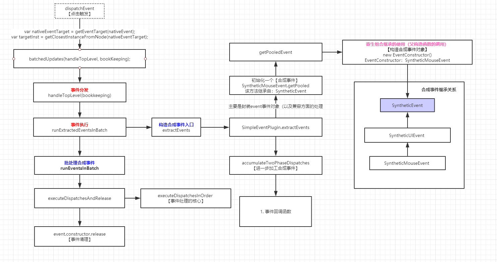