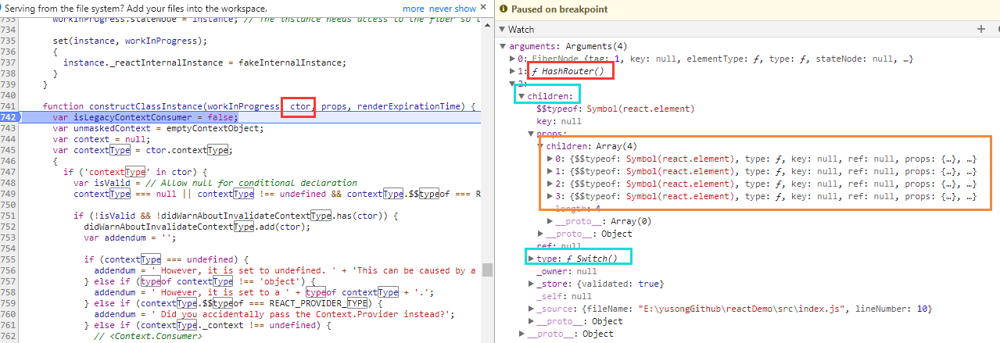
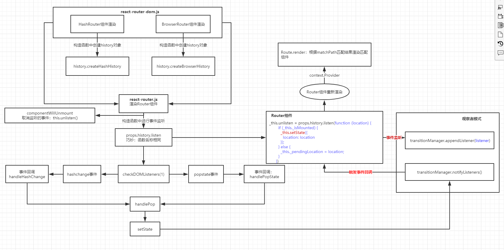

<!-- START doctoc generated TOC please keep comment here to allow auto update -->
<!-- DON'T EDIT THIS SECTION, INSTEAD RE-RUN doctoc TO UPDATE -->
**Table of Contents**  *generated with [DocToc](https://github.com/thlorenz/doctoc)*

- [简易路由实现](#%E7%AE%80%E6%98%93%E8%B7%AF%E7%94%B1%E5%AE%9E%E7%8E%B0)
- [react-router使用](#react-router%E4%BD%BF%E7%94%A8)
  - [withRouter](#withrouter)
- [react-router分析](#react-router%E5%88%86%E6%9E%90)
  - [HashRouter作为组件被渲染到页面中](#hashrouter%E4%BD%9C%E4%B8%BA%E7%BB%84%E4%BB%B6%E8%A2%AB%E6%B8%B2%E6%9F%93%E5%88%B0%E9%A1%B5%E9%9D%A2%E4%B8%AD)
    - [执行HashRouter构造函数](#%E6%89%A7%E8%A1%8Chashrouter%E6%9E%84%E9%80%A0%E5%87%BD%E6%95%B0)
      - [history.createHashHistory](#historycreatehashhistory)
  - [Router组件渲染以及hashChange事件](#router%E7%BB%84%E4%BB%B6%E6%B8%B2%E6%9F%93%E4%BB%A5%E5%8F%8Ahashchange%E4%BA%8B%E4%BB%B6)
    - [hashChange事件的监听](#hashchange%E4%BA%8B%E4%BB%B6%E7%9A%84%E7%9B%91%E5%90%AC)
      - [history.listen](#historylisten)
      - [事件注销](#%E4%BA%8B%E4%BB%B6%E6%B3%A8%E9%94%80)
  - [跨组件数据共享](#%E8%B7%A8%E7%BB%84%E4%BB%B6%E6%95%B0%E6%8D%AE%E5%85%B1%E4%BA%AB)
  - [BrowserRouter的渲染](#browserrouter%E7%9A%84%E6%B8%B2%E6%9F%93)
    - [history.js createBrowserHistory](#historyjs-createbrowserhistory)
- [总结](#%E6%80%BB%E7%BB%93)

<!-- END doctoc generated TOC please keep comment here to allow auto update -->


**参考**
[参考1](https://github.com/joeyguo/blog/issues/2)<br/>
[参考2](https://juejin.im/post/5995a2506fb9a0249975a1a4)<br/>

# 简易路由实现
``` 
function Router() {
    this.routes = {};
    this.currentUrl = '';
}
Router.prototype.route = function(path, callback) {
    this.routes[path] = callback || function(){};
};
Router.prototype.refresh = function() {
    this.currentUrl = location.hash.slice(1) || '/';
    this.routes[this.currentUrl]();
};
Router.prototype.init = function() {
    window.addEventListener('load', this.refresh.bind(this), false);
    window.addEventListener('hashchange', this.refresh.bind(this), false);
}
```
[简易路由实现](testDemo/simple-router.html)<br/>

# react-router使用
http://react-guide.github.io/react-router-cn/index.html
## withRouter

# react-router分析
react-router的使用：[官方文档](https://github.com/ReactTraining/react-router)<br/>

各模块结构
1. react-router-dom
```
export { BrowserRouter, HashRouter, Link, NavLink };
```

2. react-router
```
export { MemoryRouter, Prompt, Redirect, Route, Router, StaticRouter, Switch, generatePath, matchPath, withRouter, context as __RouterContext };
```

3. history.js
```
export { createBrowserHistory, createHashHistory, createMemoryHistory, createLocation, locationsAreEqual, parsePath, createPath };
``` 

以下面代码为例，说下路由渲染和切换的流程
```
var Routers = <HashRouter>
    <Switch>
        <Route path="/404" component={_404Page}/>
        <Route path="/home" component={App} a="test" exact/>

        <Redirect from="/" to="/home" exact/>
        <Redirect to={{pathname: "/404"}}/>
    </Switch>
</HashRouter>;

ReactDOM.render(Routers, document.getElementById('root'));
```

## HashRouter作为组件被渲染到页面中  
```
//node_modules/react-dom/cjs/react-dom.development.js

function constructClassInstance(workInProgress, ctor, props, renderExpirationTime) {
    //...
    var instance = new ctor(props, context); // 构造组件实例
    //...
}
```
<br/>


### 执行HashRouter构造函数
[HashRouter代码](https://github.com/yusongjohn/reactDemo/blob/master/frameSource/react-router-master/packages/react-router-dom/modules/HashRouter.js))

注意这里的render方法可以进行改写
```
  _proto.render = function render() {
    return React.createElement(Router, {
      history: this.history,
      children: this.props.children
    });
  };
```

等价于下面代码，因此在渲染HashRouter的过程中，会去渲染Router组件
``` 
render(){
    return <Router history={this.history} children={this.props.children}></Router>
}
```
 
#### history.createHashHistory
在执行HashRouter构造函数时会调用createHashHistory：创建histroy对象，并作为属性传递到Router组件中 
```
//node_modules/history/esm/history.js

function createHashHistory(props) {
    function listen(listener) {
        var unlisten = transitionManager.appendListener(listener);
        checkDOMListeners(1);
        return function () {
          checkDOMListeners(-1);
          unlisten();
        };
    }

    var history = {
        length: globalHistory.length,
        action: 'POP',
        location: initialLocation,
        createHref: createHref,
        push: push,
        replace: replace,
        go: go,
        goBack: goBack,
        goForward: goForward,
        block: block,
        listen: listen // 事件监听入口
    }; 
}
```

## Router组件渲染以及hashChange事件
[Router代码](https://github.com/yusongjohn/reactDemo/blob/master/frameSource/react-router-master/packages/react-router/modules/Router.js)

### hashChange事件的监听
props.history.listen：props.history来源于父组件HashRouter<br/>
```
 _this.unlisten = props.history.listen(function (location) { // hashChange回调
    if (_this._isMounted) {
      _this.setState({  // 关键之处：引起子组件重新渲染，解释了hash值的变化导致组件的重新渲染的过程
        location: location
      });
    } else {
      _this._pendingLocation = location;
    }
  });
```
注意这里的返回值 _this.unlisten：用于注销注册的事件

#### history.listen 
>node_modules/history/esm/history.js

```
function listen(listener) {
    var unlisten = transitionManager.appendListener(listener);
    checkDOMListeners(1);
    return function () {
      checkDOMListeners(-1);
      unlisten();
    };
}
```

checkDOMListeners：监听hashChange事件
```
  var HashChangeEvent$1 = 'hashchange';
  function checkDOMListeners(delta) {
    listenerCount += delta;

    if (listenerCount === 1 && delta === 1) {
      window.addEventListener(HashChangeEvent$1, handleHashChange);
    } else if (listenerCount === 0) {
      window.removeEventListener(HashChangeEvent$1, handleHashChange);
    }
  }
```

#### 事件注销
```
//node_modules/react-router/esm/react-router.js

var Router =
/*#__PURE__*/
function (_React$Component) {
   //...
  _proto.componentWillUnmount = function componentWillUnmount() {
    if (this.unlisten) this.unlisten();
  };
  //...
}
```


## 跨组件数据共享
Router、Route、Switch、matchPath、withRouter、Link的作用及源码分析[参考](https://juejin.im/post/5b45c878f265da0f783c89a6)<br/>
[Router、Route、Switch、matchPath、withRouter：相关源码地址](https://github.com/yusongjohn/reactDemo/tree/master/frameSource/react-router-master/packages/react-router/modules)<br/>
[Link：相关源码地址](https://github.com/yusongjohn/reactDemo/tree/master/frameSource/react-router-master/packages/react-router-dom/modules)<br/>

1. <Route />有一部分源码与<Router />相似，可以实现路由的嵌套，但其核心是通过Context共享的router，判断是否匹配当前路由的路径，然后渲染组件
2. <Link />的核心就是渲染<a>标签，拦截<a>标签的点击事件，然后通过<Router />共享的router对history进行路由操作，进而通知<Router />重新渲染
  
## BrowserRouter的渲染
[BrowserRouter代码](https://github.com/yusongjohn/reactDemo/blob/master/frameSource/react-router-master/packages/react-router-dom/modules/BrowserRouter.js)
关键之出在于：createBrowserHistory

### history.js createBrowserHistory
```
function createBrowserHistory(props) {
    //...
      function checkDOMListeners(delta) {
        listenerCount += delta;
    
        if (listenerCount === 1 && delta === 1) {
          window.addEventListener(PopStateEvent, handlePopState);
          if (needsHashChangeListener) window.addEventListener(HashChangeEvent, handleHashChange);
        } else if (listenerCount === 0) {
          window.removeEventListener(PopStateEvent, handlePopState);
          if (needsHashChangeListener) window.removeEventListener(HashChangeEvent, handleHashChange);
        }
      }
    //...
}
```

# 总结
整个react-router其实就是围绕着<Router />的Context来构建的

<br/>

