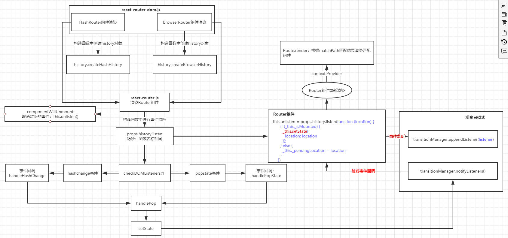

<!-- START doctoc generated TOC please keep comment here to allow auto update -->
<!-- DON'T EDIT THIS SECTION, INSTEAD RE-RUN doctoc TO UPDATE -->
**Table of Contents**  *generated with [DocToc](https://github.com/thlorenz/doctoc)*

- [简易路由实现](#%E7%AE%80%E6%98%93%E8%B7%AF%E7%94%B1%E5%AE%9E%E7%8E%B0)
- [react-router使用](#react-router%E4%BD%BF%E7%94%A8)
- [react-router源码分析](#react-router%E6%BA%90%E7%A0%81%E5%88%86%E6%9E%90)
  - [HashRouter作为组件被渲染到页面中](#hashrouter%E4%BD%9C%E4%B8%BA%E7%BB%84%E4%BB%B6%E8%A2%AB%E6%B8%B2%E6%9F%93%E5%88%B0%E9%A1%B5%E9%9D%A2%E4%B8%AD)
    - [执行HashRouter构造函数](#%E6%89%A7%E8%A1%8Chashrouter%E6%9E%84%E9%80%A0%E5%87%BD%E6%95%B0)
      - [history.createHashHistory](#historycreatehashhistory)
  - [Router组件渲染以及hashChange事件](#router%E7%BB%84%E4%BB%B6%E6%B8%B2%E6%9F%93%E4%BB%A5%E5%8F%8Ahashchange%E4%BA%8B%E4%BB%B6)
    - [hashChange事件的监听](#hashchange%E4%BA%8B%E4%BB%B6%E7%9A%84%E7%9B%91%E5%90%AC)
      - [history.listen](#historylisten)
      - [事件注销](#%E4%BA%8B%E4%BB%B6%E6%B3%A8%E9%94%80)
  - [Router、Route、Switch等组件的作用](#routerrouteswitch%E7%AD%89%E7%BB%84%E4%BB%B6%E7%9A%84%E4%BD%9C%E7%94%A8)
  - [BrowserRouter的渲染](#browserrouter%E7%9A%84%E6%B8%B2%E6%9F%93)
    - [history.js createBrowserHistory](#historyjs-createbrowserhistory)
- [总结](#%E6%80%BB%E7%BB%93)
  - [点击一个 Link 跳转的过程。](#%E7%82%B9%E5%87%BB%E4%B8%80%E4%B8%AA-link-%E8%B7%B3%E8%BD%AC%E7%9A%84%E8%BF%87%E7%A8%8B)

<!-- END doctoc generated TOC please keep comment here to allow auto update -->


# 前言
**参考**<br/>
[参考1](https://github.com/joeyguo/blog/issues/2)<br/>
[***quick-start***](https://reacttraining.com/react-router/web/guides/quick-start)<br/>

先粗略整理下，后续对着官方文档细看源码分析功能（2019.8.2）

# 简易路由实现
``` 
function Router() {
    this.routes = {};
    this.currentUrl = '';
}
Router.prototype.route = function(path, callback) {
    this.routes[path] = callback || function(){};
};
Router.prototype.refresh = function() {
    this.currentUrl = location.hash.slice(1) || '/';
    this.routes[this.currentUrl]();
};
Router.prototype.init = function() {
    window.addEventListener('load', this.refresh.bind(this), false);
    window.addEventListener('hashchange', this.refresh.bind(this), false);
}
```
[简易路由实现](testDemo/simple-router.html)<br/>

# react-router实战
[参考***](https://juejin.im/post/5995a2506fb9a0249975a1a4)<br/> 

v3与v4的区别<br/> 
1. 在 v3 中（集中式路由），路由是我们的应用程序直接呈现给 DOM 的最巨大的东西。 现在，除了 <BrowserRouter> 外，我们首先抛给 DOM 的是我们的应用程序本身
2. 在 v3 的例子中有而在 v4 中没有的是，使用 {props.children} 来嵌套组件。这是因为在 v4 中，<Route> 组件在任何地方编写，如果路由匹配，子组件将在那里渲染
 
包容性路由<br/> 
V3 的路由规则是“排他性”的，这意味着只有一条路由将获胜。V4 的路由默认为“包含”的，这意味着多个 <Route> 可以同时进行匹配和渲染。

排他性路由【**Switch组件的作用**】<br/> 
1. 如果你只需要在路由列表里匹配一个路由，则使用 <Switch> 来启用排他路由：
2. <Redirect> 组件将会始终执行浏览器重定向，但是当它位于 <Switch> 语句中时，只有在其他路由不匹配的情况下，才会渲染重定向组件


## 嵌套布局
方案1：
```
const PrimaryLayout = props => {
  return (
    <div className="primary-layout">
      <PrimaryHeader />
      <main>
        <Switch>
          <Route path="/" exact component={HomePage} />
          <Route path="/users" exact component={BrowseUsersPage} />
          <Route path="/users/:userId" component={UserProfilePage} />
          <Route path="/products" exact component={BrowseProductsPage} />
          <Route path="/products/:productId" component={ProductProfilePage} />
          <Redirect to="/" />
        </Switch>
      </main>
    </div>
  )
} 

const BrowseUsersPage = () => (
  <div className="user-sub-layout">
    <aside>
      <UserNav />
    </aside>
    <div className="primary-content">
      <BrowseUserTable />
    </div>
  </div>
)

const UserProfilePage = props => (
  <div className="user-sub-layout">
    <aside>
      <UserNav />
    </aside>
    <div className="primary-content">
      <UserProfile userId={props.match.params.userId} />
    </div>
  </div>
) 
```
 
方案2：
```
const PrimaryLayout = props => {
  return (
    <div className="primary-layout">
      <PrimaryHeader />
      <main>
        <Switch>
          <Route path="/" exact component={HomePage} />
          <Route path="/users" component={UserSubLayout} />
          <Route path="/products" component={ProductSubLayout} />
          <Redirect to="/" />
        </Switch>
      </main>
    </div>
  )
} 

const UserSubLayout = () => (
  <div className="user-sub-layout">
    <aside>
      <UserNav />
    </aside>
    <div className="primary-content">
      <Switch>
        <Route path="/users" exact component={BrowseUsersPage} />
        <Route path="/users/:userId" component={UserProfilePage} />
      </Switch>
    </div>
  </div>
)
 
```

方案1与方案2的区别：
方案1：公共部分如UserNav组件会被重复渲染，创建一个新的实例，所有的生命周期方法都将重新开始（会造成渲染成本的浪费、如果有请求则会浪费网格流量）
方案2：用户页面之间的不重复布局

**props.match.path的使用：完整路径** <br/> 
即使我们在布局结构中深入嵌套（以方案2为例），路由仍然需要识别它们的完整路径才能匹配。为了节省重复输入（以防你决定将“用户”改为其他内容），请改用 props.match.path
```
const UserSubLayout = props => (
  <div className="user-sub-layout">
    <aside>
      <UserNav />
    </aside>
    <div className="primary-content">
      <Switch>
        <Route path={props.match.path} exact component={BrowseUsersPage} />
        <Route path={`${props.match.path}/:userId`} component={UserProfilePage} />
      </Switch>
    </div>
  </div>
) 
```

## props.match 
match.path vs match.url <br/> 
1. match.url 是浏览器 URL 中的实际路径，而 match.path 是为路由编写的路径
2. 借助上面案例1：UserProfilePage渲染时：match.url 将是 "/users/5" 而 match.path 将是 "/users/:userId"
3. 如果你要使用其中一个来帮助你构建路由路径，应选择 match.path
<br/>

## 其他
1. <Link> vs <NavLink>
    - <NavLink> 与 <Link> 一样，但如果 <NavLink> 匹配浏览器的 URL，那么它可以提供一些额外的样式能力
    - 使用 <NavLink> 可以让我给任何一个激活的链接设置一个 active 样式
2. url查询字符串
    没有提供，自己处理：query-string库 

# react-router源码分析
react-router的使用：[官方文档](https://github.com/ReactTraining/react-router)<br/>

各模块结构
1. react-router-dom
```
export { BrowserRouter, HashRouter, Link, NavLink };
```

2. react-router
```
export { MemoryRouter, Prompt, Redirect, Route, Router, StaticRouter, Switch, generatePath, matchPath, withRouter, context as __RouterContext };
```

3. history.js
```
export { createBrowserHistory, createHashHistory, createMemoryHistory, createLocation, locationsAreEqual, parsePath, createPath };
``` 

以下面代码为例，说下路由渲染和切换的流程
```
var Routers = <HashRouter>
    <Switch>
        <Route path="/404" component={_404Page}/>
        <Route path="/home" component={App} a="test" exact/>

        <Redirect from="/" to="/home" exact/>
        <Redirect to={{pathname: "/404"}}/>
    </Switch>
</HashRouter>;

ReactDOM.render(Routers, document.getElementById('root'));
```

## HashRouter作为组件被渲染到页面中  
```
//node_modules/react-dom/cjs/react-dom.development.js

function constructClassInstance(workInProgress, ctor, props, renderExpirationTime) {
    //...
    var instance = new ctor(props, context); // 构造组件实例
    //...
}
```
<br/>


### 执行HashRouter构造函数
[HashRouter代码](https://github.com/yusongjohn/reactDemo/blob/master/frameSource/react-router-master/packages/react-router-dom/modules/HashRouter.js))

注意这里的render方法可以进行改写
```
  _proto.render = function render() {
    return React.createElement(Router, {
      history: this.history,
      children: this.props.children
    });
  };
```

等价于下面代码，因此在渲染HashRouter的过程中，会去渲染Router组件
``` 
render(){
    return <Router history={this.history} children={this.props.children}></Router>
}
```
 
#### history.createHashHistory
在执行HashRouter构造函数时会调用createHashHistory：创建histroy对象，并作为属性传递到Router组件中 
```
//node_modules/history/esm/history.js

function createHashHistory(props) {
    function listen(listener) {
        var unlisten = transitionManager.appendListener(listener);
        checkDOMListeners(1);
        return function () {
          checkDOMListeners(-1);
          unlisten();
        };
    }

    var history = {
        length: globalHistory.length,
        action: 'POP',
        location: initialLocation,
        createHref: createHref,
        push: push,
        replace: replace,
        go: go,
        goBack: goBack,
        goForward: goForward,
        block: block,
        listen: listen // 事件监听入口
    }; 
}
```

## Router组件渲染以及hashChange事件
[Router代码](https://github.com/yusongjohn/reactDemo/blob/master/frameSource/react-router-master/packages/react-router/modules/Router.js)

### hashChange事件的监听
props.history.listen：props.history来源于父组件HashRouter<br/>
```
 _this.unlisten = props.history.listen(function (location) { // hashChange回调
    if (_this._isMounted) {
      _this.setState({  // 关键之处：引起子组件重新渲染，解释了hash值的变化导致组件的重新渲染的过程
        location: location
      });
    } else {
      _this._pendingLocation = location;
    }
  });
```
注意这里的返回值 _this.unlisten：用于注销注册的事件

#### history.listen 
>node_modules/history/esm/history.js

```
function listen(listener) {
    var unlisten = transitionManager.appendListener(listener);
    checkDOMListeners(1);
    return function () {
      checkDOMListeners(-1);
      unlisten();
    };
}
```

checkDOMListeners：监听hashChange事件
```
  var HashChangeEvent$1 = 'hashchange';
  function checkDOMListeners(delta) {
    listenerCount += delta;

    if (listenerCount === 1 && delta === 1) {
      window.addEventListener(HashChangeEvent$1, handleHashChange);
    } else if (listenerCount === 0) {
      window.removeEventListener(HashChangeEvent$1, handleHashChange);
    }
  }
```

#### 事件注销
```
//node_modules/react-router/esm/react-router.js

var Router =
/*#__PURE__*/
function (_React$Component) {
   //...
  _proto.componentWillUnmount = function componentWillUnmount() {
    if (this.unlisten) this.unlisten();
  };
  //...
}
```


## Router、Route、Switch等组件的作用
Router、Route、Switch、matchPath、withRouter、Link的作用及源码分析[参考](https://juejin.im/post/5b45c878f265da0f783c89a6)<br/>
[Router、Route、Switch、matchPath、withRouter：相关源码地址](https://github.com/yusongjohn/reactDemo/tree/master/frameSource/react-router-master/packages/react-router/modules)<br/>
[Link：相关源码地址](https://github.com/yusongjohn/reactDemo/tree/master/frameSource/react-router-master/packages/react-router-dom/modules)<br/>

1. <Route />有一部分源码与<Router />相似，可以实现路由的嵌套，但其核心是通过Context共享的router，判断是否匹配当前路由的路径，然后渲染组件
2. <Link />的核心就是渲染<a>标签，拦截<a>标签的点击事件，然后通过<Router />共享的router对history进行路由操作，进而通知<Router />重新渲染
3. **withRouter** 的作用是让我们在普通的非直接嵌套在 Route 中的组件也能获得路由的信息，这时候我们就要 WithRouter(wrappedComponent) 来创建一个 HOC 传递 props，WithRouter 的其实就是用 Route 包裹了 SomeComponent 的一个 HOC。  
4. 包容性路由、排他路由;[参考](https://juejin.im/post/5995a2506fb9a0249975a1a4)
     

## BrowserRouter的渲染
[BrowserRouter代码](https://github.com/yusongjohn/reactDemo/blob/master/frameSource/react-router-master/packages/react-router-dom/modules/BrowserRouter.js)
关键之出在于：createBrowserHistory

### history.js createBrowserHistory
```
function createBrowserHistory(props) {
    //...
      function checkDOMListeners(delta) {
        listenerCount += delta;
    
        if (listenerCount === 1 && delta === 1) {
          window.addEventListener(PopStateEvent, handlePopState);
          if (needsHashChangeListener) window.addEventListener(HashChangeEvent, handleHashChange);
        } else if (listenerCount === 0) {
          window.removeEventListener(PopStateEvent, handlePopState);
          if (needsHashChangeListener) window.removeEventListener(HashChangeEvent, handleHashChange);
        }
      }
    //...
}
```

# 总结
Context的使用：跨组件的数据共享

## 点击一个 Link 跳转的过程。
有两件事需要完成： 路由的改变、页面的渲染部分的改变

过程如下：

1. 在最一开始 mount Router 的时候，Router 在 componentWillMount 中 listen 了一个回调函数，由 history 库管理，路由每次改变的时候触发这个回调函数。这个回调函数会触发 setState。
2. 当点击 Link 标签的时候，实际上点击的是页面上渲染出来的 a 标签，然后通过 preventDefault 阻止 a 标签的页面跳转。
3. Link 中也能拿到 Router -> Route 中通过 context 传递的 history，执行 hitsory.push(to)，这个函数实际上就是包装了一下 window.history.pushState()，是 HTML5 history 的 API，但是 pushState 之后除了地址栏有变化其他没有任何影响，到这一步已经完成了目标1：路由的改变。
4. 第1步中，路由改变是会触发 Router 的 setState 的，在 Router 那章有写道：每次路由变化 -> 触发顶层 Router 的监听事件 -> Router 触发 setState -> 向下传递新的 nextContext（nextContext 中含有最新的 location）
5. 下层的 Route 拿到新的 nextContext 通过 matchPath 函数来判断 path 是否与 location 匹配，如果匹配则渲染，不匹配则不渲染，完成目标2：页面的渲染部分的改变。
    

整个react-router其实就是围绕着<Router />的Context来构建的

<br/>

