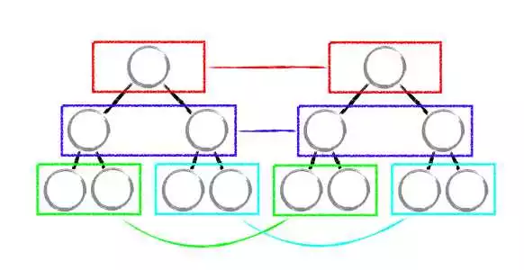
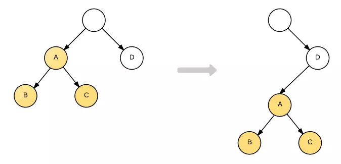
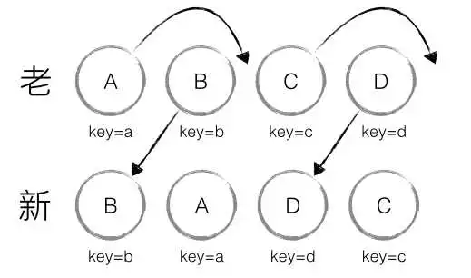
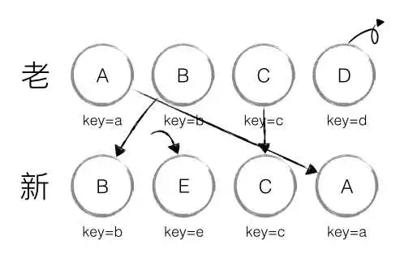
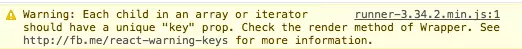
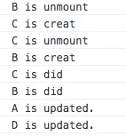

<!-- START doctoc generated TOC please keep comment here to allow auto update -->
<!-- DON'T EDIT THIS SECTION, INSTEAD RE-RUN doctoc TO UPDATE -->
**Table of Contents**  *generated with [DocToc](https://github.com/thlorenz/doctoc)*

- [前言](#%E5%89%8D%E8%A8%80)
- [思想](#%E6%80%9D%E6%83%B3)
  - [React diff优化](#react-diff%E4%BC%98%E5%8C%96)
    - [1. tree diff](#1-tree-diff)
    - [2. component diff](#2-component-diff)
    - [3. element diff](#3-element-diff)
  - [不可小觑的key](#%E4%B8%8D%E5%8F%AF%E5%B0%8F%E8%A7%91%E7%9A%84key)

<!-- END doctoc generated TOC please keep comment here to allow auto update -->

# 前言
React diff算法、
参考：https://juejin.im/post/5b3658f0518825522609e4c0
传统diff算法
参考：https://www.zhihu.com/question/66851503/answer/246766239（知乎）
时间复杂度：O(n^3)

# 思想 
## React diff优化  
diff策略
Web UI 中 DOM 节点跨层级的移动操作特别少，可以忽略不计。【：tree diff】
拥有相同类的两个组件将会生成相似的树形结构，拥有不同类的两个组件将会生成不同的树形结构。【：component diff】
对于同一层级的一组子节点，它们可以通过唯一 id 进行区分。【：element diffd】

### 1. tree diff
忽略跨层级操作
 

跨层级
 

### 2. component diff
React是基于组件构建应用的，对于组件间的比较所采用的策略也是简洁高效。
对于同一类型的组件，根据Virtual DOM是否变化也分两种，可以用shouldComponentUpdate()判断Virtual DOM是否发生了变化，若没有变化就不需要在进行diff，这样可以节省大量时间，若变化了，就对相关节点进行update
对于非同一类的组件，则将该组件判断为 dirty component，从而替换整个组件下的所有子节点。
 
### 3. element diff
节点移动
 

节点新增、删除、移动 

 

## 不可小觑的key
>参考：https://www.jianshu.com/p/fa4ca1fed4cf
 

循环渲染列表时候(map)时候忘记标记key值报的警告,既然是警告,就说明即使没有key的情况下也不会影响程序执行的正确性.其实这个key的存在与否只会影响diff算法的复杂度

加了key的好处 
正确的加上key值还会带来一定程度上的性能优化（我觉得正确的key可以被用来检测 最短编辑距离，见ko中ko.utils.compareArrays）

生命周期里打log的方式展示这里的过程 
 

我们该不该把map的index作为key 
1. 我觉得这里key很关键，如果使用不好，相当于没有使用。但是如果使用的好，可以带来性能优化；
2. 参照ko这里的实现，dom是和数据绑定的，dom的key应该是和关联的数据本身一一对应的，index是数组的属性并不是数据的属性，作为key并不合适。

key值必须唯一且不重复么 
答案是未必,前提条件是是否同一父节点,也就是是否同一data-reactId的节点
 