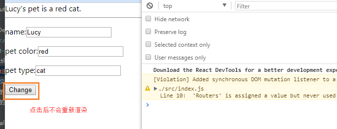

<!-- START doctoc generated TOC please keep comment here to allow auto update -->
<!-- DON'T EDIT THIS SECTION, INSTEAD RE-RUN doctoc TO UPDATE -->
**Table of Contents**  *generated with [DocToc](https://github.com/thlorenz/doctoc)*

- [Context](#context)
  - [用Context作为共享数据的媒介 <br/>](#%E7%94%A8context%E4%BD%9C%E4%B8%BA%E5%85%B1%E4%BA%AB%E6%95%B0%E6%8D%AE%E7%9A%84%E5%AA%92%E4%BB%8B-br)
  - [使用Context开发组件](#%E4%BD%BF%E7%94%A8context%E5%BC%80%E5%8F%91%E7%BB%84%E4%BB%B6)
- [无状态组件 与 类组件](#%E6%97%A0%E7%8A%B6%E6%80%81%E7%BB%84%E4%BB%B6-%E4%B8%8E-%E7%B1%BB%E7%BB%84%E4%BB%B6)
  - [写法](#%E5%86%99%E6%B3%95)
  - [状态和生命周期](#%E7%8A%B6%E6%80%81%E5%92%8C%E7%94%9F%E5%91%BD%E5%91%A8%E6%9C%9F)
  - [性能差别](#%E6%80%A7%E8%83%BD%E5%B7%AE%E5%88%AB)
- [React.PureComponent](#reactpurecomponent)
  - [浅比较特性](#%E6%B5%85%E6%AF%94%E8%BE%83%E7%89%B9%E6%80%A7)
  - [PureComponent + ImmutableJS](#purecomponent--immutablejs)
  - [PureComponent 与  Context](#purecomponent-%E4%B8%8E--context)
  - [PureComponent相关源码](#purecomponent%E7%9B%B8%E5%85%B3%E6%BA%90%E7%A0%81)
- [Hooks](#hooks)

<!-- END doctoc generated TOC please keep comment here to allow auto update -->


# Context
[参考](https://juejin.im/post/5a90e0545188257a63112977)
[新旧contextApi](https://juejin.im/post/5baa1f09f265da0a867c3b78)

Context的作用：跨层级的组件数据传递

Context的应用<br/>
1. 比如react-redux的<Provider />，就是通过Context提供一个全局态的store，
2. 拖拽组件react-dnd，通过Context在组件中分发DOM的Drag和Drop事件，
3. 路由组件react-router通过Context管理路由状态等等。在React组件开发中，如果用好Context，可以让你的组件变得强大，而且灵活

Context的使用基于生产者消费者模式
 
作为React的高级API，React并不推荐我们优先考虑使用Context。<br/>
1. Context目前还处于实验阶段，可能会在后面的发行版本中有大的变化，事实上这种情况已经发生了，所以为了避免给今后升级带来较大影响和麻烦，不建议在App中使用Context。
2. 尽管不建议在App中使用Context，但对于组件而言，由于影响范围小于App，如果可以做到【高内聚】，不破坏组件树的依赖关系，那么还是可以考虑使用Context的。
3. 对于组件之间的数据通信或者状态管理，优先考虑用props或者state解决，然后再考虑用其他第三方成熟库解决的，以上方法都不是最佳选择的时候，那么再考虑使用Context。
4.【 Context的更新需要通过setState()触发，但是这并**不**是可靠的】。Context支持跨组件访问，但是，如果中间的子组件通过一些方法不响应更新，比如shouldComponentUpdate()返回false，那么不能保证Context的更新一定可达使用Context的子组件。因此，Context的可靠性需要关注。不过更新的问题，在新版的API中得以解决。

简而言之，只要你能确保Context是可控的，使用Context并无大碍，甚至如果能够合理的应用，Context其实可以给React组件开发带来很强大的体验。
  
不要随意使用Context  <br/>
1. React App的组件是树状结构，一层一层延伸，父子组件是一对多的线性依赖。
2. 随意的使用Context其实会破坏这种依赖关系，导致组件之间一些不必要的额外依赖，降低组件的复用性，进而可能会影响到App的可维护性
 
## 用Context作为共享数据的媒介 <br/>
1. App级的数据共享：如[react-redux](./react-redux.md)
App根节点组件提供的Context对象可以看成是App级的全局作用域，所以，我们利用App根节点组件提供的Context对象创建一些App级的全局数据
2. 组件级的数据共享：如[react-router](./react-router.md)
如果组件的功能不能单靠组件自身来完成，还需要依赖额外的子组件，那么可以利用Context构建一个由多个子组件组合的组件

## 使用Context开发组件
[参考](https://juejin.im/post/5a90e0545188257a63112977)


# 无状态组件 与 类组件
## 写法
 1. stateless component(无状态组件)
 ```
 const MyStatelessComponent = props => <div>{props.name}</div>;
 ``` 
 
2.  class component (类组件)
```
class MyComponentClass extends React.Component {
  render() {
    return <div>{this.props.name}</div>;
  }
}
```

## 状态和生命周期
无状态组件
1. 优势是打包后体积小，写法清爽，和理论上的性能出色，这部分下面会详细说明
2. 劣势是无状态(state)和生命周期，无法利用生命周期减少render，也就是说只要props发生变化就会重新渲染(这块有解决办法，下面会说到)

类组件
1. 优势是有状态(state)和生命周期
2. 劣势是体积大和理论上的性能差

## 性能差别
渲染10000个无状态组件和类组件，几乎无差别，或者说差别小以至于在生产环境中无需考虑这点.

# React.PureComponent
[参考](https://juejin.im/entry/59ce4591f265da06611f9762)

## 浅比较特性
[代码见](https://github.com/yusongjohn/reactDemo/blob/master/src/pureComputed.js)

**验证1：**<br/>
关键之处<br/>
```
 class Sample extends React.PureComponent
 
 change() {
     this.pet.color = 'green';
     this.setState({
         name:'Lucy',
         pet:this.pet
     });
 }
```

执行结果：不会重新渲染<br/>
<br/>

**验证2/3**<br/>
区别之处<br/>
```
class Sample extends React.Component

//验证2
change() { 
    this.setState({
        name:'Lucy', 
    });
}

//验证3
change() {
    this.pet.color = 'green';
    this.setState({ 
        pet:this.pet
    });
}
```
执行结果：均会重新渲染<br/>
<br/>

**小结**
结论：使用React.PureComponent后，进行一次浅比较<br/>
浅比较的定义：只是比较this.state下的直接属性<br/>
1. 如果属性值是原始类型，值比较
2. 如果是对象：引用比较

## PureComponent + ImmutableJS 
shallowEqual真的就是浅比较，所以对于props、state是复杂数据结构如果使用 PureComponent 往往会导致更新问题

```
class Sample extends React.PureComponent{
  
  constructor(props) {
    super(props);
    this.state = {
      name: 'Lucy',
      pet: Immutable.fromJS({
        type: 'cat',
        color: 'red',
      })
    };
  }
  
  //...
  
  change() {
    this.setState({
      name: this.refs.name.value,
      pet: this.state.pet
              .set('color', this.refs.petColor.value)
              .set('type', this.refs.petType.value)
    }); 
  }
  
  render() {
    const name = this.state.name;
    const petC = this.state.pet.get('color');
    const petT = this.state.pet.get('type');
    
    //...
}
```

## PureComponent 与  Context
在纯组件有子组件的时候，所有基于this.context改变的子组件，在this.context改变时， 将不会重新渲染，除非在父组件(Parent ParentComponent)中声明contextTypes。


## PureComponent相关源码
[Component 与 PureComponent 的区别](https://juejin.im/post/5be83e4d6fb9a049c231f331)
1. React.PureComponent 和 React.Component 几乎相同，区别在于 React.PureComponent 会 浅比较 props、state是否发生变化从而决定是否更新组件
2. 使用 React.Component 定义shouldComponentUpdate生命周期函数来模拟 React.PureComponent


# Hooks