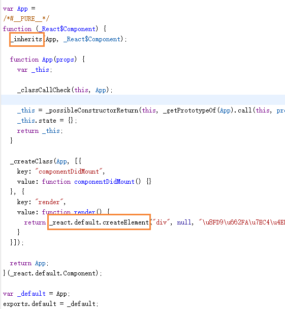
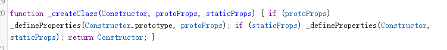
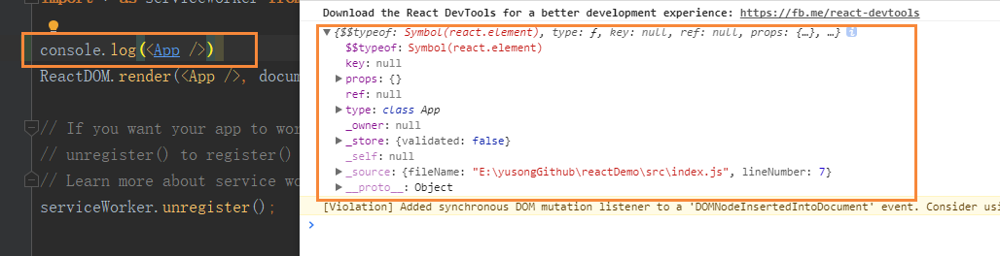
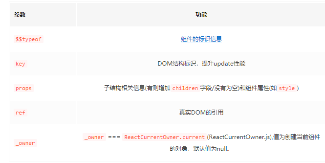
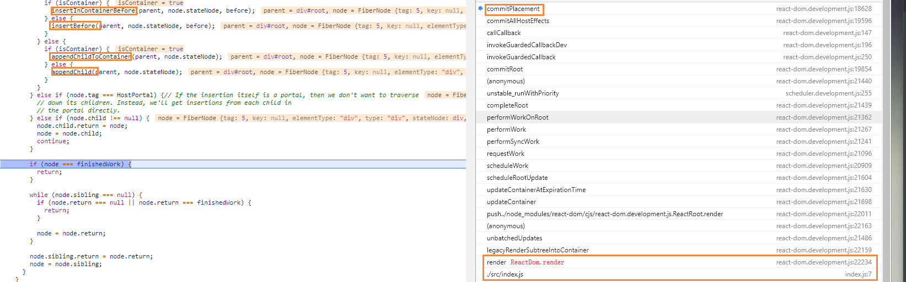

<!-- START doctoc generated TOC please keep comment here to allow auto update -->
<!-- DON'T EDIT THIS SECTION, INSTEAD RE-RUN doctoc TO UPDATE -->
**Table of Contents**  *generated with [DocToc](https://github.com/thlorenz/doctoc)*

- [babel关于extends的实现](#babel%E5%85%B3%E4%BA%8Eextends%E7%9A%84%E5%AE%9E%E7%8E%B0)
- [React.Component](#reactcomponent)
- [组件转换](#%E7%BB%84%E4%BB%B6%E8%BD%AC%E6%8D%A2)
  - [React.createElement](#reactcreateelement)
  - [ReactElement](#reactelement)
- [组件挂载](#%E7%BB%84%E4%BB%B6%E6%8C%82%E8%BD%BD)

<!-- END doctoc generated TOC please keep comment here to allow auto update -->


>参考：https://juejin.im/post/5983dfbcf265da3e2f7f32de
react版本：v16.8.6

# babel关于extends的实现
>node_modules/@babel/runtime/helpers/inherits.js

``` 
function _inherits(subClass, superClass) {
  if (typeof superClass !== "function" && superClass !== null) {
    throw new TypeError("Super expression must either be null or a function");
  }

  subClass.prototype = Object.create(superClass && superClass.prototype, {
    constructor: {
      value: subClass,
      writable: true,
      configurable: true
    }
  });
  if (superClass) setPrototypeOf(subClass, superClass);
}

module.exports = _inherits;
```
1. 通过原型式继承（Object.create）来获得实例方法
2. 通过setPrototypeOf来获得静态方法

# React.Component
>node_modules/react/cjs/react.development.js

```
function Component(props, context, updater) {
    this.props = props;
    this.context = context;
    // If a component has string refs, we will assign a different object later.
    this.refs = emptyObject;
    // We initialize the default updater but the real one gets injected by the
    // renderer.
    this.updater = updater || ReactNoopUpdateQueue;
}

Component.prototype.isReactComponent = {};

Component.prototype.setState = function (partialState, callback) {
    !(typeof partialState === 'object' || typeof partialState === 'function' || partialState == null) ? invariant(false, 'setState(...): takes an object of state variables to update or a function which returns an object of state variables.') : void 0;
    this.updater.enqueueSetState(this, partialState, callback, 'setState');
};

Component.prototype.forceUpdate = function (callback) {
    this.updater.enqueueForceUpdate(this, callback, 'forceUpdate');
};
```

# 组件转换
```
import React from 'react';  

class App extends React.Component {
    constructor(props) {
        super(props);
        this.state = {};
    }

    componentDidMount() {
    }

    render() {
        return <div>这是A组件</div>
    }
}

export default App;

```
babel 7.4.0 官网转换结果


1. 看到extends被转换成 _inherits
2. render以及componentDidMount两个方法作为属性被创建

```
function _createClass(Constructor, protoProps, staticProps) {
    if (protoProps) _defineProperties(Constructor.prototype, protoProps);
    if (staticProps) _defineProperties(Constructor, staticProps);
    return Constructor;
}
```
3. 看到render方法内部调用了React.createElement
>node_modules/react/cjs/react.development.js

## React.createElement
```
var React = {
    //...
    createElement: createElementWithValidation,
    //...
}

//createElementWithValidation
function createElementWithValidation(type, props, children) {
    //...
    var element = createElement.apply(this, arguments);
    //...
}

//createElement
function createElement(type, config, children) {
    //...
    return ReactElement(type, key, ref, self, source, ReactCurrentOwner.current, props);
}
 
``` 

## ReactElement

```
var ReactElement = function (type, key, ref, self, source, owner, props) {
  var element = { 
    $$typeof: REACT_ELEMENT_TYPE, 
    type: type,
    key: key,
    ref: ref,
    props: props, 
    _owner: owner
  };

  { 
    element._store = {}; 
    Object.defineProperty(element._store, 'validated', {
      configurable: false,
      enumerable: false,
      writable: true,
      value: false
    }); 
    Object.defineProperty(element, '_self', {
      configurable: false,
      enumerable: false,
      writable: false,
      value: self
    }); 
    Object.defineProperty(element, '_source', {
      configurable: false,
      enumerable: false,
      writable: false,
      value: source
    });
    if (Object.freeze) {
      Object.freeze(element.props);
      Object.freeze(element);
    }
  }

  return element;
};
```
 
 如果我们通过class关键字声明React组件,那么他们在解析成真实DOM之前一直是ReactElement类型的js对象<br/>
 <br/>
 打印出的属性在ReactElement构造函数中都有所体现：见下图解释<br/>
 <br/>


# 组件挂载
```
ReactDOM.render(<App />, document.getElementById('root'));
```

>node_modules/react-dom/cjs/react-dom.development.js


ReactDOM.render
```
var ReactDOM = {
      render: function (element, container, callback) {
        return legacyRenderSubtreeIntoContainer(null, element, container, false, callback);
      }
}

function legacyRenderSubtreeIntoContainer(parentComponent, children, container, forceHydrate, callback) {
    //...
    root = container._reactRootContainer = legacyCreateRootFromDOMContainer(container, forceHydrate)
    //...
    root.render(children, callback)
    //...
}

function legacyCreateRootFromDOMContainer(container, forceHydrate) {
    //...
    return new ReactRoot(container, isConcurrent, shouldHydrate);
    //... 
}

```

ReactRoot
```
function ReactRoot(container, isConcurrent, hydrate) {
    var root = createContainer(container, isConcurrent, hydrate);
    this._internalRoot = root;
}
ReactRoot.prototype.render = function (children, callback) {};
ReactRoot.prototype.unmount = function (callback) {};
ReactRoot.prototype.legacy_renderSubtreeIntoContainer = function (parentComponent, children, callback) {};
ReactRoot.prototype.createBatch = function () {};
```

ReactRoot.prototype.render
```
ReactRoot.prototype.render = function (children, callback) {
  var root = this._internalRoot;
  var work = new ReactWork();
  callback = callback === undefined ? null : callback;
  {
    warnOnInvalidCallback(callback, 'render');
  }
  if (callback !== null) {
    work.then(callback);
  }
  updateContainer(children, root, null, work._onCommit);
  return work;
};
```

ReactDOM.render调用栈</br>
