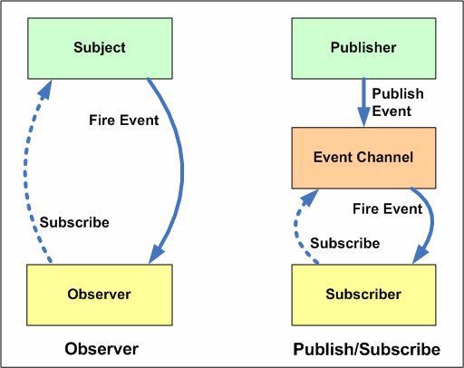
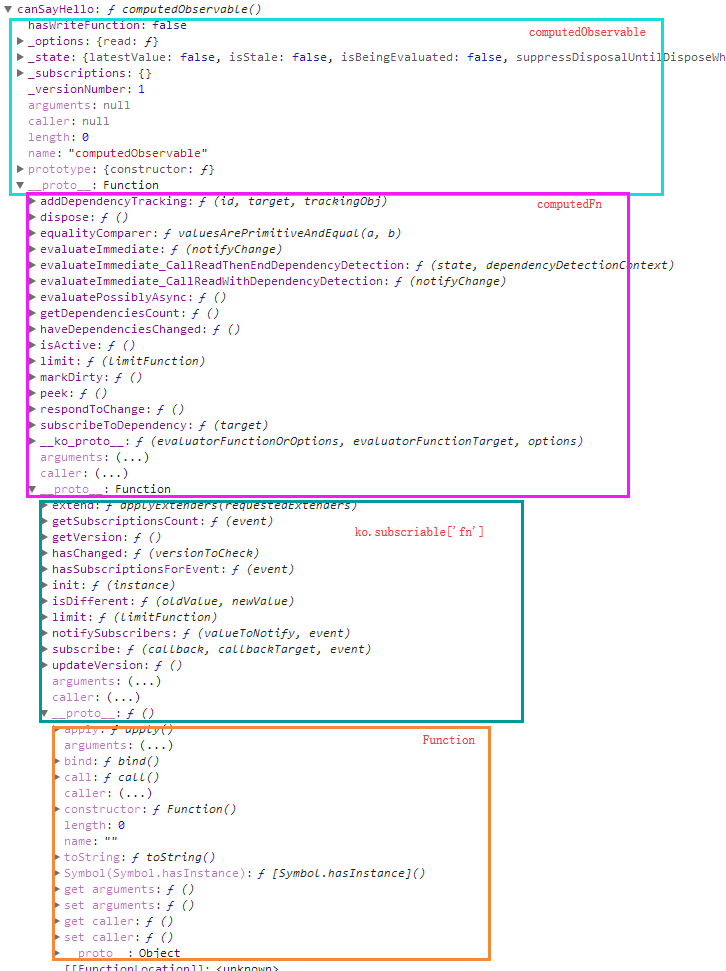
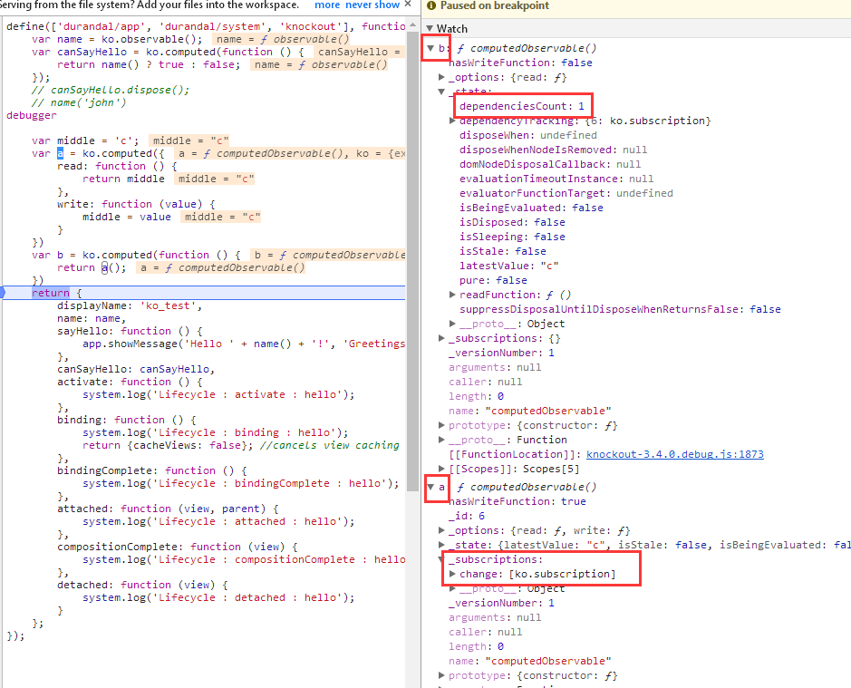

<!-- START doctoc generated TOC please keep comment here to allow auto update -->
<!-- DON'T EDIT THIS SECTION, INSTEAD RE-RUN doctoc TO UPDATE -->
**Table of Contents**  *generated with [DocToc](https://github.com/thlorenz/doctoc)*

- [1 相关知识准备](#1-%E7%9B%B8%E5%85%B3%E7%9F%A5%E8%AF%86%E5%87%86%E5%A4%87)
  - [1.1 观察者模式与发布订阅](#11-%E8%A7%82%E5%AF%9F%E8%80%85%E6%A8%A1%E5%BC%8F%E4%B8%8E%E5%8F%91%E5%B8%83%E8%AE%A2%E9%98%85)
  - [1.2 防抖与节流](#12-%E9%98%B2%E6%8A%96%E4%B8%8E%E8%8A%82%E6%B5%81)
- [2 源码分析](#2-%E6%BA%90%E7%A0%81%E5%88%86%E6%9E%90)
  - [2.1 ko的发布-订阅（系统）](#21-ko%E7%9A%84%E5%8F%91%E5%B8%83-%E8%AE%A2%E9%98%85%E7%B3%BB%E7%BB%9F)
      - [2.1.1.1 observalbe的继承结构](#2111-observalbe%E7%9A%84%E7%BB%A7%E6%89%BF%E7%BB%93%E6%9E%84)
      - [2.1.1.2 observableFn](#2112-observablefn)
      - [2.1.1.3 ko.subscribable['fn']](#2113-kosubscribablefn)
    - [2.1.2 computedObservable对象](#212-computedobservable%E5%AF%B9%E8%B1%A1)
      - [2.1.2.1 computedObservable的继承结构](#2121-computedobservable%E7%9A%84%E7%BB%A7%E6%89%BF%E7%BB%93%E6%9E%84)
      - [2.1.2.2 computedFn](#2122-computedfn)
    - [2.1.3 发布-订阅实现的机制（依赖检测系统）](#213-%E5%8F%91%E5%B8%83-%E8%AE%A2%E9%98%85%E5%AE%9E%E7%8E%B0%E7%9A%84%E6%9C%BA%E5%88%B6%E4%BE%9D%E8%B5%96%E6%A3%80%E6%B5%8B%E7%B3%BB%E7%BB%9F)
      - [2.1.3.1 evaluateImmediate_CallReadWithDependencyDetection](#2131-evaluateimmediate_callreadwithdependencydetection)
      - [2.1.3.2 ko.dependencyDetection管理observable执行环境’](#2132-kodependencydetection%E7%AE%A1%E7%90%86observable%E6%89%A7%E8%A1%8C%E7%8E%AF%E5%A2%83)
      - [2.1.3.3 evaluateImmediate_CallReadThenEndDependencyDetection](#2133-evaluateimmediate_callreadthenenddependencydetection)
      - [2.1.3.4 observable对象的‘读’](#2134-observable%E5%AF%B9%E8%B1%A1%E7%9A%84%E8%AF%BB)
      - [2.1.3.5 ko.dependencyDetection.registerDependency](#2135-kodependencydetectionregisterdependency)
      - [2.1.3.6 订阅：computedObservable 向 observable对象添加订阅](#2136-%E8%AE%A2%E9%98%85computedobservable-%E5%90%91-observable%E5%AF%B9%E8%B1%A1%E6%B7%BB%E5%8A%A0%E8%AE%A2%E9%98%85)
      - [2.1.3.7 computedObservable 添加依赖跟踪](#2137-computedobservable-%E6%B7%BB%E5%8A%A0%E4%BE%9D%E8%B5%96%E8%B7%9F%E8%B8%AA)
      - [2.1.3.8 发布：observable对象发布通知](#2138-%E5%8F%91%E5%B8%83observable%E5%AF%B9%E8%B1%A1%E5%8F%91%E5%B8%83%E9%80%9A%E7%9F%A5)
      - [2.1.3.9 ko_subscribable_fn.notifySubscribers](#2139-ko_subscribable_fnnotifysubscribers)
      - [2.1.3.10 小结](#21310-%E5%B0%8F%E7%BB%93)
    - [2.1.4 销毁：computedObservable.dispose();](#214-%E9%94%80%E6%AF%81computedobservabledispose)
  - [2.2 API:ko.applyBindings](#22-apikoapplybindings)
    - [2.2.1 ko.bindingContext:生成绑定上下文](#221-kobindingcontext%E7%94%9F%E6%88%90%E7%BB%91%E5%AE%9A%E4%B8%8A%E4%B8%8B%E6%96%87)
    - [2.2.2 applyBindingsToNodeAndDescendantsInternal:dom与vm的绑定入口](#222-applybindingstonodeanddescendantsinternaldom%E4%B8%8Evm%E7%9A%84%E7%BB%91%E5%AE%9A%E5%85%A5%E5%8F%A3)
- [补充](#%E8%A1%A5%E5%85%85)
  - [ko.computed options:pure/deferEvaluation](#kocomputed-optionspuredeferevaluation)
    - [options.pure:true](#optionspuretrue)
    - [options.deferEvaluation:true](#optionsdeferevaluationtrue)
  - [父子组件通信](#%E7%88%B6%E5%AD%90%E7%BB%84%E4%BB%B6%E9%80%9A%E4%BF%A1)

<!-- END doctoc generated TOC please keep comment here to allow auto update -->

 
# 1 相关知识准备
## 1.1 观察者模式与发布订阅
>参考：https://www.cnblogs.com/viaiu/p/9939301.html

- 二者的差异

    - 在Observer模式中，Observers知道Subject，同时Subject还保留了Observers的记录。
    - 在Publisher / Subscriber模式中，发布者和订阅者不需要彼此了解。他们只是在消息队列或代理的帮助下进行通信。
    - 在Publisher / Subscriber模式中，组件是松散耦合的，而不是Observer模式。  

- 小结
1. durandal中的event.js属于 发布-订阅模式
2. knokcout中computedObservable对象和observable对象都继承了ko_subscribable_fn模块，从该模块的实现来看属于观察者模式

## 1.2 防抖与节流
举两个案例吧
 
# 2 源码分析
## 2.1 ko的发布-订阅（系统）
> 这一部分是整个ko的基石
### 2.1.1 observable对象
>定义：ko.observable 返回的对象称为observable对象

#### 2.1.1.1 observalbe的继承结构


``` 
ko.observable = function (initialValue) {
    function observable() {
        // 读、写
    }
    //...
    ko.utils.setPrototypeOfOrExtend(observable, observableFn);
    //...
    return observable;
}
```
例
```
var name = ko.observable()
```

 
#### 2.1.1.2 observableFn

```
var observableLatestValue = ko.utils.createSymbolOrString('_latestValue');
```

``` 
var observableFn = {
    'equalityComparer': valuesArePrimitiveAndEqual,
    peek: function() { return this[observableLatestValue]; },
    valueHasMutated: function () { this['notifySubscribers'](this[observableLatestValue]); },
    valueWillMutate: function () { this['notifySubscribers'](this[observableLatestValue], 'beforeChange'); }
};
``` 

- __ko_proto__ 
``` 
var protoProperty = ko.observable.protoProperty = '__ko_proto__';
observableFn[protoProperty] = ko.observable;

ko.hasPrototype = function (instance, prototype) {
    if ((instance === null) || (instance === undefined) || (instance[protoProperty] === undefined)) return false;
    if (instance[protoProperty] === prototype) return true;
    return ko.hasPrototype(instance[protoProperty], prototype); // Walk the prototype chain
};

ko.isObservable = function (instance) {
    return ko.hasPrototype(instance, ko.observable);
}
```

#### 2.1.1.3 ko.subscribable['fn'] 
作用：

```
ko.subscribable['fn'] = ko_subscribable_fn;
```

ko_subscribable_fn结构
```
var ko_subscribable_fn = {
    init: function(instance) {},
    subscribe: function (callback, callbackTarget, event) {},// 关键方法
    notifySubscribers: function (valueToNotify, event) {}, // 关键方法
    getVersion: function () {},
    hasChanged: function (versionToCheck) {},
    updateVersion: function () {},
    limit: function(limitFunction) {},
    hasSubscriptionsForEvent: function(event) {},
    getSubscriptionsCount: function (event) {},
    isDifferent: function(oldValue, newValue) {},
    extend: applyExtenders
};
```

ko_subscribable_fn 继承了 Function.prototype
```
ko.utils.setPrototypeOf(ko_subscribable_fn, Function.prototype);
```
 
### 2.1.2 computedObservable对象
 >定义：ko.computed、ko.dependentObservable 返回的对象称为computedObservable对象
 
 
#### 2.1.2.1 computedObservable的继承结构
 ```
var name = ko.observable();
var canSayHello = ko.computed(function () {
    return name() ? true : false;
});
```

 
 - computedFn 继承 ko.subscribable['fn']
```
 var computedFn = {};
 if (ko.utils.canSetPrototype) {
     ko.utils.setPrototypeOf(computedFn, ko.subscribable['fn']);
 }
```
computedObservable 继承 computedFn
 ``` 
 ko.computed = ko.dependentObservable = function (evaluatorFunctionOrOptions, evaluatorFunctionTarget, options) {
     ...
     function computedObservable() {
        //读、写
     }
     ...  
     ko.utils.setPrototypeOfOrExtend(computedObservable, computedFn);
     
     // 特殊情况下还会有他的继承
     if (options['pure']) {
         state.pure = true; 
         state.isSleeping = true;
         ko.utils.extend(computedObservable, pureComputedOverrides);
     } else if (options['deferEvaluation']) {
         ko.utils.extend(computedObservable, deferEvaluationOverrides);
     }
     //...
     return computedObservable;
 }
 ```
 
#### 2.1.2.2 computedFn
 ```
var computedFn = {
    equalityComparer: valuesArePrimitiveAndEqual,
    getDependenciesCount: function () {},
    addDependencyTracking: function (id, target, trackingObj) {},
    haveDependenciesChanged: function () {},
    markDirty: function () {},
    isActive: function () {},
    respondToChange: function () {},
    subscribeToDependency: function (target) {},
    evaluatePossiblyAsync: function () {},
    evaluateImmediate: function (notifyChange) {},
    evaluateImmediate_CallReadWithDependencyDetection: function (notifyChange) {},
    evaluateImmediate_CallReadThenEndDependencyDetection: function (state, dependencyDetectionContext) {},
    peek: function () {},
    limit: function (limitFunction) {},
    dispose: function () {}
};
```

- __ko_proto__
```
var protoProp = ko.observable.protoProperty; // == "__ko_proto__"
ko.computed[protoProp] = ko.observable;
computedFn[protoProp] = ko.computed;

ko.isComputed = function (instance) {
    return ko.hasPrototype(instance, ko.computed);
};

ko.isPureComputed = function (instance) {
    return ko.hasPrototype(instance, ko.computed)
        && instance[computedState] && instance[computedState].pure;
};
```

### 2.1.3 发布-订阅实现的机制（依赖检测系统）
```
var name = ko.observable();
var canSayHello = ko.computed(function () { 
    return name() ? true : false;
});
```
上例：canSayHello（computedObservable对象）会向 name（observable对象）添加订阅 

ko.computed() -> evaluateImmediate -> evaluateImmediate_CallReadWithDependencyDetection -> evaluateImmediate_CallReadThenEndDependencyDetection

#### 2.1.3.1 evaluateImmediate_CallReadWithDependencyDetection

``` 
evaluateImmediate_CallReadWithDependencyDetection: function (notifyChange) {
    //...
    dependencyDetectionContext = {
            computedObservable: computedObservable,
            disposalCandidates: state.dependencyTracking,
            disposalCount: state.dependenciesCount
        };

    ko.dependencyDetection.begin({
        callbackTarget: dependencyDetectionContext,
        callback: computedBeginDependencyDetectionCallback, //该函数被优化到外层作用域了（作为共享函数，以避免创建不必要的函数实例）
        computed: computedObservable,
        isInitial: isInitial
    });
    var newValue = this.evaluateImmediate_CallReadThenEndDependencyDetection(state, dependencyDetectionContext);
    //...
}
```


#### 2.1.3.2 ko.dependencyDetection管理observable执行环境’


> ko.dependencyDetection 是依赖检测双方的连接点
- ko.dependencyDetection结构，通过outerFrames（栈）用来管理‘observable执行环境’
    - 注意：ko.dependencyDetection.begin\end总是成对出现
    - 称 currentFrame 为‘当前observable执行环境’

```
ko.computedContext = ko.dependencyDetection = (function () {
    var outerFrames = [],
        currentFrame,
        lastId = 0;

    function getId() {}

    function begin(options) {
        outerFrames.push(currentFrame);
        currentFrame = options;  // 关键：使得ko.dependencyDetection的其他方法都在当前options的‘环境’下执行
    }

    function end() {
        currentFrame = outerFrames.pop();
    }

    return {
        begin: begin,
        end: end,
        registerDependency: function (subscribable) { },
        ignore: function (callback, callbackTarget, callbackArgs) {},
        getDependenciesCount: function () {},
        isInitial: function () {}
    };
})();
```
    
    
    
    

#### 2.1.3.3 evaluateImmediate_CallReadThenEndDependencyDetection

```
evaluateImmediate_CallReadThenEndDependencyDetection: function (state, dependencyDetectionContext) {
    try {
        var readFunction = state.readFunction;  
        return state.evaluatorFunctionTarget ? readFunction.call(state.evaluatorFunctionTarget) : readFunction();
    } finally {
        ko.dependencyDetection.end(); // 弹出当前的‘observable执行环境’
        //...
    }
}
```
- 上面的readFunction（ko.computed的参数）
``` 
function () { 
    return name() ? true : false;
}
```

#### 2.1.3.4 observable对象的‘读’

``` 
function observable() {
    if (arguments.length > 0) {
        // 写 
    }
    else {
        // 读
        ko.dependencyDetection.registerDependency(observable); // 关键
        return observable[observableLatestValue];
    }
}
```

#### 2.1.3.5 ko.dependencyDetection.registerDependency

```
registerDependency: function (subscribable) { // 参数：observable对象，即案例中的 name
    if (currentFrame) {
        if (!ko.isSubscribable(subscribable))
            throw new Error("Only subscribable things can act as dependencies");
        currentFrame.callback.call(currentFrame.callbackTarget, subscribable, subscribable._id || (subscribable._id = getId()));
    }
},
```
- 这里的 currentFrame还记得吗？就是 2.1.3.1 中 ko.dependencyDetection.begin 的参数

computedBeginDependencyDetectionCallback.call(currentFrame.callbackTarget,xxxx,xxx)

``` 
function computedBeginDependencyDetectionCallback(subscribable, id) { // subscribable:name ；computedObservable:canSayHello
    var computedObservable = this.computedObservable, // this指向 evaluateImmediate_CallReadWithDependencyDetection 中的 dependencyDetectionContext
        state = computedObservable[computedState]; 
    if (!state.isDisposed) {
        if (this.disposalCount && this.disposalCandidates[id]) {
            //...
        } else if (!state.dependencyTracking[id]) { 
            computedObservable.addDependencyTracking(id, subscribable, state.isSleeping ? { _target: subscribable } : computedObservable.subscribeToDependency(subscribable));
        }
    }
}
```

state.isSleeping通常为false，特殊情况下true，这种特殊留在后面部分说。因此这里会去执行  computedObservable.subscribeToDependency(subscribable)


#### 2.1.3.6 订阅：computedObservable 向 observable对象添加订阅
> computedObservable对象向observable对象添加订阅
``` 
var computedFn = {
    subscribeToDependency: function (target) { // target是observable对象（案例中的 name）
        if (target._deferUpdates && !this[computedState].disposeWhenNodeIsRemoved) {
            //...
        } else {
            return target.subscribe(this.evaluatePossiblyAsync, this); // 注意这里的回调函数：this.evaluatePossiblyAsync
        }
    },
}
```

ko_subscribable_fn.subscribe
``` 
var defaultEvent = "change";

var ko_subscribable_fn = { 
    subscribe: function (callback, callbackTarget, event) {
        var self = this;
        event = event || defaultEvent;
        var boundCallback = callbackTarget ? callback.bind(callbackTarget) : callback;
        var subscription = new ko.subscription(self, boundCallback, function () { // disposeCallback
            ko.utils.arrayRemoveItem(self._subscriptions[event], subscription);
            if (self.afterSubscriptionRemove)
                self.afterSubscriptionRemove(event);
        });
        //...
        self._subscriptions[event].push(subscription);
        return subscription; //返回了subscription
    },
}
```

- ko.subscription 
``` 
ko.subscription = function (target, callback, disposeCallback) {
    this._target = target; 
    this.callback = callback;
    this.disposeCallback = disposeCallback;
    this.isDisposed = false;
    ko.exportProperty(this, 'dispose', this.dispose);
};

ko.subscription.prototype.dispose = function () {
    this.isDisposed = true;
    this.disposeCallback();
};
```
#### 2.1.3.7 computedObservable 添加依赖跟踪
记录所有的订阅，将computedObservable对象添加的订阅记录下来，computedObservable向谁添加订阅其实可以理解为依赖谁，这里就是用来记录所有的依赖
``` 
var computedFn = {
    addDependencyTracking: function (id, target, trackingObj) {
        //...
        this[computedState].dependencyTracking[id] = trackingObj;
        trackingObj._order = this[computedState].dependenciesCount++;
        trackingObj._version = target.getVersion();
    },
}
```            

#### 2.1.3.8 发布：observable对象发布通知
```
name('john')
```
- observable
``` 
function observable() {
    if (arguments.length > 0) { // 写 
        if (observable.isDifferent(observable[observableLatestValue], arguments[0])) {
            observable.valueWillMutate();  // 触发 'beforeChange' 
            observable[observableLatestValue] = arguments[0];
            observable.valueHasMutated();  // 触发 'change' ，调用ko_subscribable_fn.notifySubscribers
        }
        return this;  
    }
    else {
        // 读
    }
}
```
在2.1.1.1小节中说到observable继承了observableFn，observableFn对具体结构见2.1.1.2
并且observableFn 继承了 ko.subscribable['fn']（即ko_subscribable_fn）

#### 2.1.3.9 ko_subscribable_fn.notifySubscribers
``` 
var ko_subscribable_fn = {
    "notifySubscribers": function (valueToNotify, event) {
        event = event || defaultEvent;
        if (event === defaultEvent) {
            this.updateVersion();
        }
        if (this.hasSubscriptionsForEvent(event)) {
            try {
                ko.dependencyDetection.begin(); // 关键：抑制依赖性检测
                for (var a = this._subscriptions[event].slice(0), i = 0, subscription; subscription = a[i]; ++i) {  // 触发在2.1.3.6添加的订阅
                    if (!subscription.isDisposed)
                        subscription.callback(valueToNotify);
                }
            } finally {
                ko.dependencyDetection.end(); 
            }
        }
    }, 
}
```

这里抑制依赖性检测的作用：observable的写并不会添加依赖和订阅，即下例是不会构成依赖关系的
```
var name = ko.observable();
var canSayHello = ko.computed(function () {
    name('john') ;// 因为是写操作，抑制依赖性检测
    return 1;
});
```


#### 2.1.3.10 小结
- 观察者模式
    - computedObservable对象可以理解为Observer，observable对象可以理解为Subject
        - 整个2.1章节都是以此为例，但并不总是这样（：computedObservalbe也可以作为Subject，但是observable对象不能作为Observe）
        ``` 
        var middle = 'c';
        var a = ko.computed({
            read: function () {
                return middle
            },
            write: function (value) {
                middle = value
            }
        })
        var b = ko.computed(function () {
            return a();
        })
        ```
          
        
    - computedObservable对象（canSayHello）是如何向observable对象（name）添加依赖的呢？
        
    - 为什么观察者只能是computedObservable？
        - 因为只有ko.computed/ko.dependentObservable才会创建新的ko.dependencyDetection中的currentFrame
        
- 依赖 与 订阅
    -  Observer 对 Subject 有依赖所有才添加订阅
    - 就像require.js中的模块的依赖一样，父模块依赖子模块，所有向子模块添加订阅（订阅子模块的defined事件）
    
   
 
### 2.1.4 销毁：computedObservable.dispose();
在 2.1.3.7 小节中说到 computedObservable 将所有的依赖订阅添加到 state.dependencyTracking 中
``` 
var computedFn = {
    dispose: function () {
        var state = this[computedState];
        if (!state.isSleeping && state.dependencyTracking) {
            ko.utils.objectForEach(state.dependencyTracking, function (id, dependency) { // 这里的 dependency 就是 ko.subscription 对象
                if (dependency.dispose)
                    dependency.dispose(); // 执行 disposeCallback ， 参考：2.1.3.6小节:ko_subscribable_fn.subscribe
            });
        }
        if (state.disposeWhenNodeIsRemoved && state.domNodeDisposalCallback) {
            ko.utils.domNodeDisposal.removeDisposeCallback(state.disposeWhenNodeIsRemoved, state.domNodeDisposalCallback);
        }
        state.dependencyTracking = null;
        state.dependenciesCount = 0;
        state.isDisposed = true;
        state.isStale = false;
        state.isSleeping = false;
        state.disposeWhenNodeIsRemoved = null;
    } 
}
```

ko_subscribable_fn.subscribe中的disposeCallback
``` 
// disposeCallback
function () { 
    ko.utils.arrayRemoveItem(self._subscriptions[event], subscription); 
    if (self.afterSubscriptionRemove)
        self.afterSubscriptionRemove(event);
}
```
- disposeCallback的作用？
2.1.3.6中说到 computedObservable 向 observable 对象添加订阅，那么当computedObservable销毁的时候，是不是应该将这个订阅移除呢？这里就是这个作用


## 2.2 API:ko.applyBindings 
> 该api的作用：将参数中的viewModel绑定到指定的dom节点中
``` 
ko.applyBindings = function (viewModelOrBindingContext, rootNode) {
    //...
    rootNode = rootNode || window.document.body; // 默认绑定到body节点
    applyBindingsToNodeAndDescendantsInternal(getBindingContext(viewModelOrBindingContext), rootNode, true);
};
```

### 2.2.1 ko.bindingContext:生成绑定上下文
getBindingContext -> ko.bindingContext 
```
ko.bindingContext = function(dataItemOrAccessor, parentContext, dataItemAlias, extendCallback) {
    function updateContext() {
        var dataItemOrObservable = isFunc ? dataItemOrAccessor() : dataItemOrAccessor,
            dataItem = ko.utils.unwrapObservable(dataItemOrObservable);

        //... 父子绑定上下文的处理，在父子组件通信章节再说
        self['$parents'] = [];
        self['$root'] = dataItem;
        self['ko'] = ko;
        
        self['$rawData'] = dataItemOrObservable;
        self['$data'] = dataItem; 

        return self['$data'];
    }
    function disposeWhen() { // computedObservable对象销毁的时机
        return nodes && !ko.utils.anyDomNodeIsAttachedToDocument(nodes); // 所有绑定的节点都已经从document中移除了
    }

    var self = this,
        isFunc = typeof(dataItemOrAccessor) == "function" && !ko.isObservable(dataItemOrAccessor),
        nodes,
        subscribable = ko.dependentObservable(updateContext, null, { disposeWhen: disposeWhen, disposeWhenNodeIsRemoved: true });

    if (subscribable.isActive()) { 
        self._subscribable = subscribable;
        
        subscribable['equalityComparer'] = null;

        nodes = [];
        subscribable._addNode = function(node) {
            nodes.push(node);
            ko.utils.domNodeDisposal.addDisposeCallback(node, function(node) {
                ko.utils.arrayRemoveItem(nodes, node);
                if (!nodes.length) {
                    subscribable.dispose();
                    self._subscribable = subscribable = undefined;
                }
            });
        };
    }
}
```
参数dataItemOrAccessor可以分为两种情况：observable对象、普通对象
#### 2.2.1.1 dataItemOrAccessor是普通对象的情况
此时对于的有效代码只有下面部分有效，即保存当前的vm
``` 
self['$parents'] = [];
self['$root'] = dataItem;
self['ko'] = ko;

self['$rawData'] = dataItemOrObservable;
self['$data'] = dataItem;
```

#### 2.2.1.2 dataItemOrAccessor是observable对象的情况
情况略复杂些，当dataItemOrAccessor是observable对象时，subscribable会向dataItemOrAccessor添加订阅，subscribable.isActive()为true
``` 
subscribable = ko.dependentObservable(updateContext, null, { disposeWhen: disposeWhen, disposeWhenNodeIsRemoved: true }); // 返回的subscriable是computedObservalbe对象
```    
- subscribable.isActive()的计算
    在2.1.2computedObservble继承结构说到computedObservble继承了computedFn
    ```
    var computedFn = {
        isActive: function () {  // isStale用来表示是不是脏状态
            return this[computedState].isStale || this[computedState].dependenciesCount > 0;  
        },
    }
    ```
    - 关于 this[computedState].isStale
        ko.computed()参数的options中如果pure和deferEvaluation有其一为ture的话，this[computedState].isStale为true，否则为false （即已经完成值的计算，不是脏数据）
        1. options.pure = true：这种情况是针对‘纯函数’的情况
        2. options.deferEvaluation = true，表示computedObservable的值是需要延迟计算的
        3. 在补充部分介绍这两种情况
        
        ``` 
        ko.computed = ko.dependentObservable = function (evaluatorFunctionOrOptions, evaluatorFunctionTarget, options) {
            //...
            var state = { 
                isStale: true, // 默认为脏状态，即尚未计算computedObservable的值
                //...
            };
            if (options['pure']) { 
                state.isSleeping = true;  
            }
            //...
            if (!state.isSleeping && !options['deferEvaluation']) { // 那么 则不会进行估算
                computedObservable.evaluateImmediate();
            } 
        }
        ```
    - 关于 this[computedState].dependenciesCount    
        2.1.3.7 小节中看到添加Observer向Subject添加订阅后，也会在自身的状态属性上记录下依赖的数量（每添加一个订阅，就多一个依赖）
    
    
    
    
    

### 2.2.2 applyBindingsToNodeAndDescendantsInternal:dom与vm的绑定入口


# 补充
## ko.computed options:pure/deferEvaluation
### options.pure:true
### options.deferEvaluation:true
deferUpdates 与 deferEvaluation 的区别

## 父子组件通信