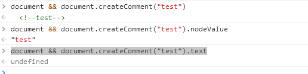
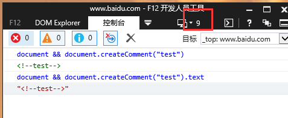
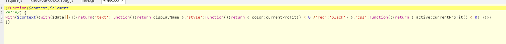

<!-- START doctoc generated TOC please keep comment here to allow auto update -->
<!-- DON'T EDIT THIS SECTION, INSTEAD RE-RUN doctoc TO UPDATE -->
**Table of Contents**  *generated with [DocToc](https://github.com/thlorenz/doctoc)*

- [1 相关知识准备](#1-%E7%9B%B8%E5%85%B3%E7%9F%A5%E8%AF%86%E5%87%86%E5%A4%87)
  - [1.1 观察者模式与发布订阅](#11-%E8%A7%82%E5%AF%9F%E8%80%85%E6%A8%A1%E5%BC%8F%E4%B8%8E%E5%8F%91%E5%B8%83%E8%AE%A2%E9%98%85)
  - [1.2 防抖与节流](#12-%E9%98%B2%E6%8A%96%E4%B8%8E%E8%8A%82%E6%B5%81)
- [2 源码分析](#2-%E6%BA%90%E7%A0%81%E5%88%86%E6%9E%90)
  - [2.1 ko的发布-订阅（系统）](#21-ko%E7%9A%84%E5%8F%91%E5%B8%83-%E8%AE%A2%E9%98%85%E7%B3%BB%E7%BB%9F)
    - [2.1.1 observable对象](#211-observable%E5%AF%B9%E8%B1%A1)
      - [2.1.1.1 observalbe的继承结构](#2111-observalbe%E7%9A%84%E7%BB%A7%E6%89%BF%E7%BB%93%E6%9E%84)
      - [2.1.1.2 observableFn](#2112-observablefn)
      - [2.1.1.3 ko.subscribable['fn']](#2113-kosubscribablefn)
    - [2.1.2 computedObservable对象](#212-computedobservable%E5%AF%B9%E8%B1%A1)
      - [2.1.2.1 computedObservable的继承结构](#2121-computedobservable%E7%9A%84%E7%BB%A7%E6%89%BF%E7%BB%93%E6%9E%84)
      - [2.1.2.2 computedFn](#2122-computedfn)
    - [2.1.3 发布-订阅实现的机制（依赖检测系统）](#213-%E5%8F%91%E5%B8%83-%E8%AE%A2%E9%98%85%E5%AE%9E%E7%8E%B0%E7%9A%84%E6%9C%BA%E5%88%B6%E4%BE%9D%E8%B5%96%E6%A3%80%E6%B5%8B%E7%B3%BB%E7%BB%9F)
      - [2.1.3.1 evaluateImmediate_CallReadWithDependencyDetection](#2131-evaluateimmediate_callreadwithdependencydetection)
      - [2.1.3.2 ko.dependencyDetection管理observable执行环境’](#2132-kodependencydetection%E7%AE%A1%E7%90%86observable%E6%89%A7%E8%A1%8C%E7%8E%AF%E5%A2%83)
      - [2.1.3.3 evaluateImmediate_CallReadThenEndDependencyDetection](#2133-evaluateimmediate_callreadthenenddependencydetection)
      - [2.1.3.4 observable对象的‘读’](#2134-observable%E5%AF%B9%E8%B1%A1%E7%9A%84%E8%AF%BB)
      - [2.1.3.5 ko.dependencyDetection.registerDependency](#2135-kodependencydetectionregisterdependency)
      - [2.1.3.6 订阅：computedObservable 向 observable对象添加订阅](#2136-%E8%AE%A2%E9%98%85computedobservable-%E5%90%91-observable%E5%AF%B9%E8%B1%A1%E6%B7%BB%E5%8A%A0%E8%AE%A2%E9%98%85)
      - [2.1.3.7 computedObservable 添加依赖跟踪](#2137-computedobservable-%E6%B7%BB%E5%8A%A0%E4%BE%9D%E8%B5%96%E8%B7%9F%E8%B8%AA)
      - [2.1.3.8 发布：observable对象发布通知](#2138-%E5%8F%91%E5%B8%83observable%E5%AF%B9%E8%B1%A1%E5%8F%91%E5%B8%83%E9%80%9A%E7%9F%A5)
      - [2.1.3.9 ko_subscribable_fn.notifySubscribers](#2139-ko_subscribable_fnnotifysubscribers)
      - [2.1.3.10 小结](#21310-%E5%B0%8F%E7%BB%93)
    - [2.1.4 销毁：computedObservable.dispose();](#214-%E9%94%80%E6%AF%81computedobservabledispose)
  - [2.2 API:ko.applyBindings](#22-apikoapplybindings)
    - [2.2.1 ko.bindingContext:生成绑定上下文](#221-kobindingcontext%E7%94%9F%E6%88%90%E7%BB%91%E5%AE%9A%E4%B8%8A%E4%B8%8B%E6%96%87)
      - [2.2.1.1 dataItemOrAccessor是普通对象的情况](#2211-dataitemoraccessor%E6%98%AF%E6%99%AE%E9%80%9A%E5%AF%B9%E8%B1%A1%E7%9A%84%E6%83%85%E5%86%B5)
      - [2.2.1.2 dataItemOrAccessor是observable对象的情况](#2212-dataitemoraccessor%E6%98%AFobservable%E5%AF%B9%E8%B1%A1%E7%9A%84%E6%83%85%E5%86%B5)
    - [2.2.2 applyBindingsToNodeAndDescendantsInternal:dom与vm的绑定入口](#222-applybindingstonodeanddescendantsinternaldom%E4%B8%8Evm%E7%9A%84%E7%BB%91%E5%AE%9A%E5%85%A5%E5%8F%A3)
    - [2.2.3 applyBindingsToNodeInternal（dom与vm绑定的核心方法）](#223-applybindingstonodeinternaldom%E4%B8%8Evm%E7%BB%91%E5%AE%9A%E7%9A%84%E6%A0%B8%E5%BF%83%E6%96%B9%E6%B3%95)
      - [2.2.3.1 判断当前节点是否进行过ko绑定](#2231-%E5%88%A4%E6%96%AD%E5%BD%93%E5%89%8D%E8%8A%82%E7%82%B9%E6%98%AF%E5%90%A6%E8%BF%9B%E8%A1%8C%E8%BF%87ko%E7%BB%91%E5%AE%9A)
      - [2.2.3.2 获取'绑定字符串对象'](#2232-%E8%8E%B7%E5%8F%96%E7%BB%91%E5%AE%9A%E5%AD%97%E7%AC%A6%E4%B8%B2%E5%AF%B9%E8%B1%A1)
      - [2.2.3.3  获取关联的绑定处理器，执行每个绑定处理器（核心过程）](#2233--%E8%8E%B7%E5%8F%96%E5%85%B3%E8%81%94%E7%9A%84%E7%BB%91%E5%AE%9A%E5%A4%84%E7%90%86%E5%99%A8%E6%89%A7%E8%A1%8C%E6%AF%8F%E4%B8%AA%E7%BB%91%E5%AE%9A%E5%A4%84%E7%90%86%E5%99%A8%E6%A0%B8%E5%BF%83%E8%BF%87%E7%A8%8B)
        - [2.2.3.3.1 当vm是observable对象时，子节点是如何添加订阅的](#22331-%E5%BD%93vm%E6%98%AFobservable%E5%AF%B9%E8%B1%A1%E6%97%B6%E5%AD%90%E8%8A%82%E7%82%B9%E6%98%AF%E5%A6%82%E4%BD%95%E6%B7%BB%E5%8A%A0%E8%AE%A2%E9%98%85%E7%9A%84)
    - [2.2.4 applyBindingsToDescendantsInternal](#224-applybindingstodescendantsinternal)
- [3 ko.bindingHandlers（绑定处理器）](#3-kobindinghandlers%E7%BB%91%E5%AE%9A%E5%A4%84%E7%90%86%E5%99%A8)
  - [3.1 value:双向绑定](#31-value%E5%8F%8C%E5%90%91%E7%BB%91%E5%AE%9A)
    - [3.1.1 input[type='checkbox']、input[type='radio']说sourceBindings的作用](#311-inputtypecheckboxinputtyperadio%E8%AF%B4sourcebindings%E7%9A%84%E4%BD%9C%E7%94%A8)
  - [3.2 template](#32-template)
  - [3.3 foreach](#33-foreach)
  - [3.4 component](#34-component)
    - [3.4.1 父子组件通信](#341-%E7%88%B6%E5%AD%90%E7%BB%84%E4%BB%B6%E9%80%9A%E4%BF%A1)
- [4 工具类介绍](#4-%E5%B7%A5%E5%85%B7%E7%B1%BB%E4%BB%8B%E7%BB%8D)
  - [4.1 ko.virtualElements](#41-kovirtualelements)
    - [4.1.1 hasBindingValue](#411-hasbindingvalue)
    - [4.1.2 normaliseVirtualElementDomStructure](#412-normalisevirtualelementdomstructure)
  - [4.2 ko.bindingProvider['instance']](#42-kobindingproviderinstance)
    - [4.2.1 nodeHasBindings](#421-nodehasbindings)
    - [4.2.3 getBindingAccessors](#423-getbindingaccessors)
      - [4.2.3.1 getBindingsString 获取绑定字符串两种情况](#4231-getbindingsstring-%E8%8E%B7%E5%8F%96%E7%BB%91%E5%AE%9A%E5%AD%97%E7%AC%A6%E4%B8%B2%E4%B8%A4%E7%A7%8D%E6%83%85%E5%86%B5)
      - [4.2.3.2 parseBindingsString](#4232-parsebindingsstring)
  - [4.3 ko.expressionRewriting](#43-koexpressionrewriting)
    - [4.3.1 parseObjectLiteral：解析绑定字符串](#431-parseobjectliteral%E8%A7%A3%E6%9E%90%E7%BB%91%E5%AE%9A%E5%AD%97%E7%AC%A6%E4%B8%B2)
    - [3.3.2 preProcessBindings](#332-preprocessbindings)
- [5 补充](#5-%E8%A1%A5%E5%85%85)
  - [5.1 案例代码](#51-%E6%A1%88%E4%BE%8B%E4%BB%A3%E7%A0%81)
    - [5.1.1](#511)
  - [ko.computed options:pure/deferEvaluation](#kocomputed-optionspuredeferevaluation)
    - [options.pure:true](#optionspuretrue)
    - [options.deferEvaluation:true](#optionsdeferevaluationtrue)

<!-- END doctoc generated TOC please keep comment here to allow auto update -->

 
# 1 相关知识准备
## 1.1 观察者模式与发布订阅
>参考：https://www.cnblogs.com/viaiu/p/9939301.html

- 二者的差异

    - 在Observer模式中，Observers知道Subject，同时Subject还保留了Observers的记录。
    - 在Publisher / Subscriber模式中，发布者和订阅者不需要彼此了解。他们只是在消息队列或代理的帮助下进行通信。
    - 在Publisher / Subscriber模式中，组件是松散耦合的，而不是Observer模式。  

- 小结
1. durandal中的event.js属于 发布-订阅模式
2. knokcout中computedObservable对象和observable对象都继承了ko_subscribable_fn模块，从该模块的实现来看属于观察者模式

## 1.2 防抖与节流
举两个案例吧
 
# 2 源码分析
>关于兼容性问题尤其是ie低版本的问题，直接略过

## 2.1 ko的发布-订阅（系统）
> 这一部分是整个ko的基石

### 2.1.1 observable对象
>**定义**：ko.observable 返回的对象称为observable对象

#### 2.1.1.1 observalbe的继承结构


``` 
ko.observable = function (initialValue) {
    function observable() {
        // 读、写
    }
    //...
    ko.utils.setPrototypeOfOrExtend(observable, observableFn);
    //...
    return observable;
}
```
例
```
var name = ko.observable()
```

 
#### 2.1.1.2 observableFn

```
var observableLatestValue = ko.utils.createSymbolOrString('_latestValue');
```

``` 
var observableFn = {
    'equalityComparer': valuesArePrimitiveAndEqual,
    peek: function() { return this[observableLatestValue]; },
    valueHasMutated: function () { this['notifySubscribers'](this[observableLatestValue]); },
    valueWillMutate: function () { this['notifySubscribers'](this[observableLatestValue], 'beforeChange'); }
};
``` 

- __ko_proto__ 
``` 
var protoProperty = ko.observable.protoProperty = '__ko_proto__';
observableFn[protoProperty] = ko.observable;

ko.hasPrototype = function (instance, prototype) {
    if ((instance === null) || (instance === undefined) || (instance[protoProperty] === undefined)) return false;
    if (instance[protoProperty] === prototype) return true;
    return ko.hasPrototype(instance[protoProperty], prototype); // Walk the prototype chain
};

ko.isObservable = function (instance) {
    return ko.hasPrototype(instance, ko.observable);
}
```

#### 2.1.1.3 ko.subscribable['fn'] 
作用：

```
ko.subscribable['fn'] = ko_subscribable_fn;
```

ko_subscribable_fn结构
```
var ko_subscribable_fn = {
    init: function(instance) {},
    subscribe: function (callback, callbackTarget, event) {},// 关键方法
    notifySubscribers: function (valueToNotify, event) {}, // 关键方法
    getVersion: function () {},
    hasChanged: function (versionToCheck) {},
    updateVersion: function () {},
    limit: function(limitFunction) {},
    hasSubscriptionsForEvent: function(event) {},
    getSubscriptionsCount: function (event) {},
    isDifferent: function(oldValue, newValue) {},
    extend: applyExtenders
};
```

ko_subscribable_fn 继承了 Function.prototype
```
ko.utils.setPrototypeOf(ko_subscribable_fn, Function.prototype);
```
 
### 2.1.2 computedObservable对象
 >**定义**：ko.computed、ko.dependentObservable 返回的对象称为computedObservable对象
 
 
#### 2.1.2.1 computedObservable的继承结构
 ```
var name = ko.observable();
var canSayHello = ko.computed(function () {
    return name() ? true : false;
});
```

 
 - computedFn 继承 ko.subscribable['fn']
```
 var computedFn = {};
 if (ko.utils.canSetPrototype) {
     ko.utils.setPrototypeOf(computedFn, ko.subscribable['fn']);
 }
```
computedObservable 继承 computedFn
 ``` 
 ko.computed = ko.dependentObservable = function (evaluatorFunctionOrOptions, evaluatorFunctionTarget, options) {
     ...
     function computedObservable() {
        //读、写
     }
     ...  
     ko.utils.setPrototypeOfOrExtend(computedObservable, computedFn);
     
     // 特殊情况下还会有他的继承
     if (options['pure']) {
         state.pure = true; 
         state.isSleeping = true;
         ko.utils.extend(computedObservable, pureComputedOverrides);
     } else if (options['deferEvaluation']) {
         ko.utils.extend(computedObservable, deferEvaluationOverrides);
     }
     //...
     return computedObservable;
 }
 ```
 
#### 2.1.2.2 computedFn
 ```
var computedFn = {
    equalityComparer: valuesArePrimitiveAndEqual,
    getDependenciesCount: function () {},
    addDependencyTracking: function (id, target, trackingObj) {},
    haveDependenciesChanged: function () {},
    markDirty: function () {},
    isActive: function () {},
    respondToChange: function () {},
    subscribeToDependency: function (target) {},
    evaluatePossiblyAsync: function () {},
    evaluateImmediate: function (notifyChange) {},
    evaluateImmediate_CallReadWithDependencyDetection: function (notifyChange) {},
    evaluateImmediate_CallReadThenEndDependencyDetection: function (state, dependencyDetectionContext) {},
    peek: function () {},
    limit: function (limitFunction) {},
    dispose: function () {}
};
```

- __ko_proto__
```
var protoProp = ko.observable.protoProperty; // == "__ko_proto__"
ko.computed[protoProp] = ko.observable;
computedFn[protoProp] = ko.computed;

ko.isComputed = function (instance) {
    return ko.hasPrototype(instance, ko.computed);
};

ko.isPureComputed = function (instance) {
    return ko.hasPrototype(instance, ko.computed)
        && instance[computedState] && instance[computedState].pure;
};
```

### 2.1.3 发布-订阅实现的机制（依赖检测系统）
```
var name = ko.observable();
var canSayHello = ko.computed(function () { 
    return name() ? true : false;
});
```
上例：canSayHello（computedObservable对象）会向 name（observable对象）添加订阅 

ko.computed() -> evaluateImmediate -> evaluateImmediate_CallReadWithDependencyDetection -> evaluateImmediate_CallReadThenEndDependencyDetection

#### 2.1.3.1 evaluateImmediate_CallReadWithDependencyDetection

``` 
evaluateImmediate_CallReadWithDependencyDetection: function (notifyChange) {
    //...
    dependencyDetectionContext = {
            computedObservable: computedObservable,
            disposalCandidates: state.dependencyTracking,
            disposalCount: state.dependenciesCount
        };

    ko.dependencyDetection.begin({
        callbackTarget: dependencyDetectionContext,
        callback: computedBeginDependencyDetectionCallback, //该函数被优化到外层作用域了（作为共享函数，以避免创建不必要的函数实例）
        computed: computedObservable,
        isInitial: isInitial
    });
    var newValue = this.evaluateImmediate_CallReadThenEndDependencyDetection(state, dependencyDetectionContext);
    //...
}
```


#### 2.1.3.2 ko.dependencyDetection管理observable执行环境’


> ko.dependencyDetection 是依赖检测双方的连接点
- ko.dependencyDetection结构，通过outerFrames（栈）用来管理‘observable执行环境’
    - 注意：ko.dependencyDetection.begin\end总是成对出现
    - 称 currentFrame 为‘当前observable执行环境’

```
ko.computedContext = ko.dependencyDetection = (function () {
    var outerFrames = [],
        currentFrame,
        lastId = 0;

    function getId() {}

    function begin(options) {
        outerFrames.push(currentFrame);
        currentFrame = options;  // 关键：使得ko.dependencyDetection的其他方法都在当前options的‘环境’下执行
    }

    function end() {
        currentFrame = outerFrames.pop();
    }

    return {
        begin: begin,
        end: end,
        registerDependency: function (subscribable) { },
        ignore: function (callback, callbackTarget, callbackArgs) {},
        getDependenciesCount: function () {},
        isInitial: function () {}
    };
})();
```
    
    
    
    

#### 2.1.3.3 evaluateImmediate_CallReadThenEndDependencyDetection

```
evaluateImmediate_CallReadThenEndDependencyDetection: function (state, dependencyDetectionContext) {
    try {
        var readFunction = state.readFunction;  
        return state.evaluatorFunctionTarget ? readFunction.call(state.evaluatorFunctionTarget) : readFunction();
    } finally {
        ko.dependencyDetection.end(); // 弹出当前的‘observable执行环境’
        //...
    }
}
```
- 上面的readFunction（ko.computed的参数）
``` 
function () { 
    return name() ? true : false;
}
```

#### 2.1.3.4 observable对象的‘读’

``` 
function observable() {
    if (arguments.length > 0) {
        // 写 
    }
    else {
        // 读
        ko.dependencyDetection.registerDependency(observable); // 关键
        return observable[observableLatestValue];
    }
}
```

#### 2.1.3.5 ko.dependencyDetection.registerDependency

```
registerDependency: function (subscribable) { // 参数：observable对象，即案例中的 name
    if (currentFrame) {
        if (!ko.isSubscribable(subscribable))
            throw new Error("Only subscribable things can act as dependencies");
        currentFrame.callback.call(currentFrame.callbackTarget, subscribable, subscribable._id || (subscribable._id = getId()));
    }
},
```
- 这里的 currentFrame还记得吗？就是 2.1.3.1 中 ko.dependencyDetection.begin 的参数

computedBeginDependencyDetectionCallback.call(currentFrame.callbackTarget,xxxx,xxx)

``` 
function computedBeginDependencyDetectionCallback(subscribable, id) { // subscribable:name ；computedObservable:canSayHello
    var computedObservable = this.computedObservable, // this指向 evaluateImmediate_CallReadWithDependencyDetection 中的 dependencyDetectionContext
        state = computedObservable[computedState]; 
    if (!state.isDisposed) {
        if (this.disposalCount && this.disposalCandidates[id]) {
            //...
        } else if (!state.dependencyTracking[id]) { 
            computedObservable.addDependencyTracking(id, subscribable, state.isSleeping ? { _target: subscribable } : computedObservable.subscribeToDependency(subscribable));
        }
    }
}
```

state.isSleeping通常为false，特殊情况下true，这种特殊留在后面部分说。因此这里会去执行  computedObservable.subscribeToDependency(subscribable)


#### 2.1.3.6 订阅：computedObservable 向 observable对象添加订阅
> computedObservable对象向observable对象添加订阅
``` 
var computedFn = {
    subscribeToDependency: function (target) { // target是observable对象（案例中的 name）
        if (target._deferUpdates && !this[computedState].disposeWhenNodeIsRemoved) {
            //...
        } else {
            return target.subscribe(this.evaluatePossiblyAsync, this); // 注意这里的回调函数：this.evaluatePossiblyAsync
        }
    },
}
```

ko_subscribable_fn.subscribe
``` 
var defaultEvent = "change";

var ko_subscribable_fn = { 
    subscribe: function (callback, callbackTarget, event) {
        var self = this;
        event = event || defaultEvent;
        var boundCallback = callbackTarget ? callback.bind(callbackTarget) : callback;
        var subscription = new ko.subscription(self, boundCallback, function () { // disposeCallback
            ko.utils.arrayRemoveItem(self._subscriptions[event], subscription);
            if (self.afterSubscriptionRemove)
                self.afterSubscriptionRemove(event);
        });
        //...
        self._subscriptions[event].push(subscription);
        return subscription; //返回了subscription
    },
}
```

- ko.subscription 
``` 
ko.subscription = function (target, callback, disposeCallback) {
    this._target = target; 
    this.callback = callback;
    this.disposeCallback = disposeCallback;
    this.isDisposed = false;
    ko.exportProperty(this, 'dispose', this.dispose);
};

ko.subscription.prototype.dispose = function () {
    this.isDisposed = true;
    this.disposeCallback();
};
```
#### 2.1.3.7 computedObservable 添加依赖跟踪
记录所有的订阅，将computedObservable对象添加的订阅记录下来，computedObservable向谁添加订阅其实可以理解为依赖谁，这里就是用来记录所有的依赖
``` 
var computedFn = {
    addDependencyTracking: function (id, target, trackingObj) {
        //...
        this[computedState].dependencyTracking[id] = trackingObj;
        trackingObj._order = this[computedState].dependenciesCount++;
        trackingObj._version = target.getVersion();
    },
}
```            

#### 2.1.3.8 发布：observable对象发布通知
```
name('john')
```
- observable
``` 
function observable() {
    if (arguments.length > 0) { // 写 
        if (observable.isDifferent(observable[observableLatestValue], arguments[0])) {
            observable.valueWillMutate();  // 触发 'beforeChange' 
            observable[observableLatestValue] = arguments[0];
            observable.valueHasMutated();  // 触发 'change' ，调用ko_subscribable_fn.notifySubscribers
        }
        return this;  
    }
    else {
        // 读
    }
}
```
在2.1.1.1小节中说到observable继承了observableFn，observableFn对具体结构见2.1.1.2
并且observableFn 继承了 ko.subscribable['fn']（即ko_subscribable_fn）

#### 2.1.3.9 ko_subscribable_fn.notifySubscribers
``` 
var ko_subscribable_fn = {
    "notifySubscribers": function (valueToNotify, event) {
        event = event || defaultEvent;
        if (event === defaultEvent) {
            this.updateVersion();
        }
        if (this.hasSubscriptionsForEvent(event)) {
            try {
                ko.dependencyDetection.begin(); // 关键：抑制依赖性检测
                for (var a = this._subscriptions[event].slice(0), i = 0, subscription; subscription = a[i]; ++i) {  // 触发在2.1.3.6添加的订阅
                    if (!subscription.isDisposed)
                        subscription.callback(valueToNotify);
                }
            } finally {
                ko.dependencyDetection.end(); 
            }
        }
    }, 
}
```

这里抑制依赖性检测的作用：observable的写并不会添加依赖和订阅，即下例是不会构成依赖关系的
```
var name = ko.observable();
var canSayHello = ko.computed(function () {
    name('john') ;// 因为是写操作，抑制依赖性检测
    return 1;
});
```


#### 2.1.3.10 小结
- 观察者模式
    - computedObservable对象可以理解为Observer，observable对象可以理解为Subject
        - 整个2.1章节都是以此为例，但并不总是这样（：computedObservalbe也可以作为Subject，但是observable对象不能作为Observe）
        ``` 
        var middle = 'c';
        var a = ko.computed({
            read: function () {
                return middle
            },
            write: function (value) {
                middle = value
            }
        })
        var b = ko.computed(function () {
            return a();
        })
        ```
          
        
    - computedObservable对象（canSayHello）是如何向observable对象（name）添加依赖的呢？
        
    - 为什么观察者只能是computedObservable？
        - 因为只有ko.computed/ko.dependentObservable才会创建新的ko.dependencyDetection中的currentFrame
        
- 依赖 与 订阅
    -  Observer 对 Subject 有依赖所有才添加订阅
    - 就像require.js中的模块的依赖一样，父模块依赖子模块，所有向子模块添加订阅（订阅子模块的defined事件）
    
    
- 关于代码的优化
    1. evaluateImmediate_CallReadThenEndDependencyDetection、evaluateImmediate_CallReadWithDependencyDetection
    > Factoring it out means that evaluateImmediate_CallReadWithDependencyDetection（、evaluateImmediate_CallReadThenEndDependencyDetection） 
      can be independent of try/finally blocks, which contributes to saving about 40% off the CPU 
      overhead of computed evaluation (on V8 at least).
    2. computedBeginDependencyDetectionCallback
    > This function gets called each time a dependency is detected while evaluating a computed. 
      It's factored out as a shared function to avoid creating unnecessary function instances during evaluation.
       
 
### 2.1.4 销毁：computedObservable.dispose();
在 2.1.3.7 小节中说到 computedObservable 将所有的依赖订阅添加到 state.dependencyTracking 中
``` 
var computedFn = {
    dispose: function () {
        var state = this[computedState];
        if (!state.isSleeping && state.dependencyTracking) {
            ko.utils.objectForEach(state.dependencyTracking, function (id, dependency) { // 这里的 dependency 就是 ko.subscription 对象
                if (dependency.dispose)
                    dependency.dispose(); // 执行 disposeCallback ， 参考：2.1.3.6小节:ko_subscribable_fn.subscribe
            });
        }
        if (state.disposeWhenNodeIsRemoved && state.domNodeDisposalCallback) {
            ko.utils.domNodeDisposal.removeDisposeCallback(state.disposeWhenNodeIsRemoved, state.domNodeDisposalCallback);
        }
        state.dependencyTracking = null;
        state.dependenciesCount = 0;
        state.isDisposed = true;
        state.isStale = false;
        state.isSleeping = false;
        state.disposeWhenNodeIsRemoved = null;
    } 
}
```

ko_subscribable_fn.subscribe中的disposeCallback
``` 
// disposeCallback
function () { 
    ko.utils.arrayRemoveItem(self._subscriptions[event], subscription); 
    if (self.afterSubscriptionRemove)
        self.afterSubscriptionRemove(event);
}
```
- disposeCallback的作用？
2.1.3.6中说到 computedObservable 向 observable 对象添加订阅，那么当computedObservable销毁的时候，是不是应该将这个订阅移除呢？这里就是这个作用


## 2.2 API:ko.applyBindings 
> 该api的作用：将参数中的viewModel绑定到指定的dom节点中

**提示：**本届所有截图均基于以下案例代码，如有不同会备注
```
//html
<div data-bind="text: displayName,style: { color: currentProfit() < 0 ? 'red' : 'black' },css: { active: currentProfit() < 0 }"></div>
//js
 var currentProfit = ko.observable();
```

- ko.applyBindings
``` 
ko.applyBindings = function (viewModelOrBindingContext, rootNode) {
    //...
    rootNode = rootNode || window.document.body; // 默认绑定到body节点
    applyBindingsToNodeAndDescendantsInternal(getBindingContext(viewModelOrBindingContext), rootNode, true);
};
```

### 2.2.1 ko.bindingContext:生成绑定上下文
getBindingContext -> ko.bindingContext 
```
ko.bindingContext = function(dataItemOrAccessor, parentContext, dataItemAlias, extendCallback) {
    function updateContext() {
        var dataItemOrObservable = isFunc ? dataItemOrAccessor() : dataItemOrAccessor,
            dataItem = ko.utils.unwrapObservable(dataItemOrObservable);

        //... 父子绑定上下文的处理，在父子组件通信章节再说
        self['$parents'] = [];
        self['$root'] = dataItem;
        self['ko'] = ko;
        
        self['$rawData'] = dataItemOrObservable;
        self['$data'] = dataItem; 

        return self['$data'];
    }
    function disposeWhen() { // computedObservable对象销毁的时机
        return nodes && !ko.utils.anyDomNodeIsAttachedToDocument(nodes); // 所有绑定的节点都已经从document中移除了
    }

    var self = this,
        isFunc = typeof(dataItemOrAccessor) == "function" && !ko.isObservable(dataItemOrAccessor),
        nodes,
        subscribable = ko.dependentObservable(updateContext, null, { disposeWhen: disposeWhen, disposeWhenNodeIsRemoved: true });

    if (subscribable.isActive()) { 
        self._subscribable = subscribable;
        
        subscribable['equalityComparer'] = null;

        nodes = [];
        subscribable._addNode = function(node) {
            nodes.push(node);
            ko.utils.domNodeDisposal.addDisposeCallback(node, function(node) {
                ko.utils.arrayRemoveItem(nodes, node);
                if (!nodes.length) {
                    subscribable.dispose();
                    self._subscribable = subscribable = undefined;
                }
            });
        };
    }
}
```
- 参数介绍
    - [parentContext, dataItemAlias, extendCallback] 这三个参数的作用：构建父子绑定上下文，用于父子绑定上下文的通信 
    - dataItemOrAccessor：就是viewModel；参数dataItemOrAccessor可以分为两种情况：observable对象、普通对象

#### 2.2.1.1 dataItemOrAccessor是普通对象的情况
此时对于的有效代码只有下面部分有效，即保存当前的vm
``` 
self['$parents'] = [];
self['$root'] = dataItem;
self['ko'] = ko;

self['$rawData'] = dataItemOrObservable;
self['$data'] = dataItem;
```

#### 2.2.1.2 dataItemOrAccessor是observable对象的情况
情况略复杂些，当dataItemOrAccessor是observable对象时，subscribable会向dataItemOrAccessor添加订阅（即subscribable依赖dataItemOrAccessor），subscribable.isActive()为true
``` 
subscribable = ko.dependentObservable(updateContext, null, { disposeWhen: disposeWhen, disposeWhenNodeIsRemoved: true }); // 返回的subscriable是computedObservalbe对象
```    
- subscribable.isActive()的计算
    在2.1.2computedObservble继承结构说到computedObservble继承了computedFn
    ```
    var computedFn = {
        isActive: function () {  // isStale用来表示是不是脏状态
            return this[computedState].isStale || this[computedState].dependenciesCount > 0;  
        },
    }
    ```
    - 关于 this[computedState].isStale
        - ko.computed()参数的options中如果pure和deferEvaluation有其一为ture的话，this[computedState].isStale为true，
        - 这里一定为为false （即已经完成值的计算，不是脏数据，参考方法computedFn.evaluateImmediate_CallReadThenEndDependencyDetection），因为调用过程中没有传递这个选项
         
        ``` 
        ko.computed = ko.dependentObservable = function (evaluatorFunctionOrOptions, evaluatorFunctionTarget, options) {
            //...
            var state = { 
                isStale: true, // 默认为脏状态，即尚未计算computedObservable的值
                //...
            };
            if (options['pure']) { 
                state.isSleeping = true;  
            }
            //...
            if (!state.isSleeping && !options['deferEvaluation']) { // 那么 则不会进行估算，因此isStale仍为true
                computedObservable.evaluateImmediate();
            } 
        }
        ```
    - 关于 this[computedState].dependenciesCount
        - 2.1.3.7 小节中看到Observer向Subject添加订阅后，也会在自身的状态属性上记录下依赖的数量（每添加一个订阅，就多一个依赖）
        - 因此，如果dataItemOrAccessor是observable对象的话，当在updateContext中执行时，便会添加订阅，作为subscribable的依赖，因此这种情况下为 this[computedState].dependenciesCount = 1;

    因此，在这种情况下，subscribable.isActive()为true，在2.2.1.1的基础上添加了以下属性
    ```
    ko.bindingContext = function(dataItemOrAccessor, parentContext, dataItemAlias, extendCallback) {
        //...
        if (subscribable.isActive()) {
            self._subscribable = subscribable; 
            subscribable['equalityComparer'] = null;  
            nodes = [];
            subscribable._addNode = function(node) {
                nodes.push(node);
                ko.utils.domNodeDisposal.addDisposeCallback(node, function(node) {
                    ko.utils.arrayRemoveItem(nodes, node);
                    if (!nodes.length) {
                        subscribable.dispose();
                        self._subscribable = subscribable = undefined;
                    }
                });
            };
        }
    }
    ```
    - subscribable._addNode的作用？
    >  We need to be able to dispose of this computed observable when it's no longer needed. 
    This would be easy if we had a single node to watch, but binding contexts can be used by many different nodes, 
    and  we cannot assume that those nodes have any relation to each other. So instead we track any node that the context is attached to, 
    and dispose the computed when all of those nodes have been cleaned.<br/>
    其实注释说的很清楚了：我们需要能够销毁这里创建的subscribable。
    
    - 为什么要销毁创建的subscribable呢？为了避免内存泄漏，当节点从document移除时，需要清理相关的数据（订阅等）
    1. 由于当前vm是一个observable对象，每个子节点在执行绑定处理器时都会去执行这个vm去获取数据，并且这个这个执行过程是在 ko.dependentObservable(ko.bindingHandlers.update)下执行的，因此会添加订阅
    2. 这个过程有点复杂：2.2.3.3.4：当vm是observable对象时，子节点是如何添加订阅的    

### 2.2.2 applyBindingsToNodeAndDescendantsInternal:dom与vm的绑定入口
> **绑定关键字**的两种情况在：ko.bindingProvider['instance']['nodeHasBindings']，见3.2.1

``` 
function applyBindingsToNodeAndDescendantsInternal (bindingContext, nodeVerified, bindingContextMayDifferFromDomParentElement) {
    var shouldBindDescendants = true; 
    
    // 兼容下处理，纠正dom树结构,...
    
    var shouldApplyBindings = (isElement && bindingContextMayDifferFromDomParentElement) // Case (1)
        || ko.bindingProvider['instance']['nodeHasBindings'](nodeVerified);              // Case (2)
    if (shouldApplyBindings)
        shouldBindDescendants = applyBindingsToNodeInternal(nodeVerified, null, bindingContext, bindingContextMayDifferFromDomParentElement)['shouldBindDescendants'];

    if (shouldBindDescendants && !bindingDoesNotRecurseIntoElementTypes[ko.utils.tagNameLower(nodeVerified)]) { 
        applyBindingsToDescendantsInternal(bindingContext, nodeVerified, /* bindingContextsMayDifferFromDomParentElement: */ !isElement);
    }
}
```

- 参数bindingContextMayDifferFromDomParentElement：用来表示当前节点的绑定上下文和父节点的上下文是否一致

- shouldApplyBindings：用来控制是否需要进行绑定，两种情况需要进行绑定（这里属于优化部分）
    - 当前dom的绑定上下文和父节点的绑定上下文不一致
    - 当前的节点具有绑定关键字，即该dom必须进行绑定
    - 反过来看，也就是当前节点没有绑定关键字并且和父节点的绑定上下文一致，从优化的角度考虑，没必要进行绑定

- shouldBindDescendants：用来控制是否需要对当前节点的孩子节点进行绑定，这取决于当前节点的 绑定处理器的init的返回值
    >**定义**：绑定处理器指定义在ko.bindingHandlers对象上的属性，比如系统提供的：text,value,foreach等，当然你也可以自定义，通常包含init,update两个属性
    ```
    ko.bindingHandlers['submit'] = {
      'init': function (element, valueAccessor, allBindings, viewModel, bindingContext) {},
      'update': function (element, valueAccessor, allBindings, viewModel, bindingContext) {}
    }
    ```
    - 如果返回 controlsDescendantBindings:true ，那么则不进行孩子节点的绑定，会在后面说到
 

### 2.2.3 applyBindingsToNodeInternal（dom与vm绑定的核心方法）
> 单个dom节点的绑定过程

```
function applyBindingsToNodeInternal(node, sourceBindings, bindingContext, bindingContextMayDifferFromDomParentElement) {
将该部分拆分为以下几个部分
    1. 判断当前节点是否进行过ko绑定
    2. 获取'绑定字符串对象'（绑定字符串转为对象）
    3. 获取关联的绑定处理器，执行每个绑定处理器（核心过程）
}
```
- 参数说明
    - 除了第二个参数sourceBindings其他参数含义很明显，通常dom节点的绑定字符串都写在dom节点的data-bind属性中，但是也可以通过编码的形式指定'绑定字符串',sourceBindings就是这个含义（见3.1.1）
     

 #### 2.2.3.1 判断当前节点是否进行过ko绑定
```
var boundElementDomDataKey = ko.utils.domData.nextKey(); //生成一个唯一标识，用于存储节点绑定与否
function applyBindingsToNodeInternal(node, sourceBindings, bindingContext, bindingContextMayDifferFromDomParentElement) {
    var alreadyBound = ko.utils.domData.get(node, boundElementDomDataKey);
    if (!sourceBindings) {
        if (alreadyBound) { //如果没有指定sourceBindings，则不能进行多次绑定
            throw Error("You cannot apply bindings multiple times to the same element.");
        }
        ko.utils.domData.set(node, boundElementDomDataKey, true);
    }

    // 优化操作：如果当前节点的绑定上下文和父节点一致，则可以通过扫描父节点来获取当前节点的上下文（这里的父节点不包含注释节点-虚拟节点）
    // 如果没有绑定过并且当前节点和父节点的绑定上下文不一致才去存储当前节点的绑定上下文
    if (!alreadyBound && bindingContextMayDifferFromDomParentElement)
        ko.storedBindingContextForNode(node, bindingContext);
 
    //... 
}
```
- storedBindingContextForNode：保存绑定上下文
``` 
var storedBindingContextDomDataKey = ko.utils.domData.nextKey(); //生成唯一标识，用于存储节点的绑定上下文
ko.storedBindingContextForNode = function (node, bindingContext) {
    if (arguments.length == 2) {
        ko.utils.domData.set(node, storedBindingContextDomDataKey, bindingContext);
        if (bindingContext._subscribable)  
            bindingContext._subscribable._addNode(node); // 见 2.2.1.2 
    } else {
        return ko.utils.domData.get(node, storedBindingContextDomDataKey);
    }
}
```
 
#### 2.2.3.2 获取'绑定字符串对象'
> 这部分作用就是来获得bindings 和 bindingsUpdater

 ``` 
function applyBindingsToNodeInternal(node, sourceBindings, bindingContext, bindingContextMayDifferFromDomParentElement) {
    //...
    var bindings;
    if (sourceBindings && typeof sourceBindings !== 'function') { // 见 3.1.1
        bindings = sourceBindings;
    } else {
        var provider = ko.bindingProvider['instance'],
            getBindings = provider['getBindingAccessors'] || getBindingsAndMakeAccessors; //见 4.2.3 
 
        var bindingsUpdater = ko.dependentObservable(
            function() {
                bindings = sourceBindings ? sourceBindings(bindingContext, node) : getBindings.call(provider, node, bindingContext); 
                if (bindings && bindingContext._subscribable) // 注册一个依赖，用于支持vm是observable对象的情况，见 2.2.1.2
                    bindingContext._subscribable(); 
                return bindings;
            },
            null, { disposeWhenNodeIsRemoved: node }
        );

        if (!bindings || !bindingsUpdater.isActive()) // 如果binding不存在，或者bindingsUpdater没有添加任何依赖
            bindingsUpdater = null;
    }
    //...
}
```
1. sourceBindings是字符串的情况见3.1.1 ，从代码来看这里显然是支持函数形式的，再发散下sourceBindings可能是observable对象，好吧，后面这两种情形（函数、observabled对象）有兴趣的同学可以自己看下，本文就不啰嗦了
2. 通过ko.bindingProvider['instance'].getBindingAccessors获取bindings，具体过程见 4.2.3 
3. 当viewModel是observable对象（见2.2.1.2），那么此时会注册一个依赖：即bindingsUpdater依赖bindingContext._subscribable，2.2.1.2小节说到bindingContext._subscribable依赖viewModel（形成了一个依赖链）
    因此，这种情况下当viewModel变化时会触发bindingContext._subscribable更新，进而触发bindingsUpdater更新
    
小节：这里执行完会有三种情况
    1. bindings、bindingsUpdater均不存在
    2. bindings存在，bindingsUpdater不存在（viewModel是普通对象：如 ko.applyBindings({xxx},node) ）
    3. bindings、bindingsUpdater均存在（即viewModel是observable对象：如 ko.applyBindings(ko.observable({xxx}),node) ）
 
 - bindings长什么样呢？
 
 
#### 2.2.3.3  获取关联的绑定处理器，执行每个绑定处理器（核心过程）

这部分内容较多，分为两部分
##### 2.2.3.3.1 参数准备
```
function applyBindingsToNodeInternal(node, sourceBindings, bindingContext, bindingContextMayDifferFromDomParentElement) {
    //...
    var getValueAccessor = bindingsUpdater
        ? function(bindingKey) {
            return function() {
                return evaluateValueAccessor(bindingsUpdater()[bindingKey]);
            };
        } : function(bindingKey) {
            return bindings[bindingKey];
        };

    function allBindings() {
        return ko.utils.objectMap(bindingsUpdater ? bindingsUpdater() : bindings, evaluateValueAccessor);
    }
    allBindings['get'] = function(key) {
        return bindings[key] && evaluateValueAccessor(getValueAccessor(key));
    };
    allBindings['has'] = function(key) {
        return key in bindings;
    };
    //...
}
```


##### 2.2.3.3.2 绑定处理器的执行
```
function applyBindingsToNodeInternal(node, sourceBindings, bindingContext, bindingContextMayDifferFromDomParentElement) {
    //...
    var orderedBindings = topologicalSortBindings(bindings); 
    ko.utils.arrayForEach(orderedBindings, function(bindingKeyAndHandler) {
        var handlerInitFn = bindingKeyAndHandler.handler["init"],
            handlerUpdateFn = bindingKeyAndHandler.handler["update"],
            bindingKey = bindingKeyAndHandler.key;

        if (node.nodeType === 8) {
            validateThatBindingIsAllowedForVirtualElements(bindingKey);
        }

        try {
            if (typeof handlerInitFn == "function") {
                ko.dependencyDetection.ignore(function() {
                    var initResult = handlerInitFn(node, getValueAccessor(bindingKey), allBindings, bindingContext['$data'], bindingContext);
                    if (initResult && initResult['controlsDescendantBindings']) {
                        if (bindingHandlerThatControlsDescendantBindings !== undefined)
                            throw new Error("Multiple bindings (" + bindingHandlerThatControlsDescendantBindings + " and " + bindingKey + ") are trying to control descendant bindings of the same element. You cannot use these bindings together on the same element.");
                        bindingHandlerThatControlsDescendantBindings = bindingKey;
                    }
                });
            }
            if (typeof handlerUpdateFn == "function") {
                ko.dependentObservable(
                    function() {
                        handlerUpdateFn(node, getValueAccessor(bindingKey), allBindings, bindingContext['$data'], bindingContext);
                    },
                    null,
                    { disposeWhenNodeIsRemoved: node }
                );
            }
        } catch (ex) {
            ex.message = "Unable to process binding \"" + bindingKey + ": " + bindings[bindingKey] + "\"\nMessage: " + ex.message;
            throw ex;
        }
    });
    
    return {
        'shouldBindDescendants': bindingHandlerThatControlsDescendantBindings === undefined
    };
            
```

- 获取orderedBindings，作用：存储关联的绑定处理器
 
 
- 执行绑定处理器，两个步骤
    - init
    - update 


##### 2.2.3.3.3 topologicalSortBindings

```
function topologicalSortBindings(bindings) { //深度优先遍历
    // Depth-first sort
    var result = [],                // The list of key/handler pairs that we will return
        bindingsConsidered = {},    // A temporary record of which bindings are already in 'result'
        cyclicDependencyStack = []; // Keeps track of a depth-search so that, if there's a cycle, we know which bindings caused it
    ko.utils.objectForEach(bindings, function pushBinding(bindingKey) {
        if (!bindingsConsidered[bindingKey]) {
            var binding = ko['getBindingHandler'](bindingKey);
            if (binding) {
                // First add dependencies (if any) of the current binding
                if (binding['after']) {
                    cyclicDependencyStack.push(bindingKey);
                    ko.utils.arrayForEach(binding['after'], function(bindingDependencyKey) {
                        if (bindings[bindingDependencyKey]) {
                            if (ko.utils.arrayIndexOf(cyclicDependencyStack, bindingDependencyKey) !== -1) {
                                throw Error("Cannot combine the following bindings, because they have a cyclic dependency: " + cyclicDependencyStack.join(", "));
                            } else {
                                pushBinding(bindingDependencyKey);
                            }
                        }
                    });
                    cyclicDependencyStack.length--;
                }
                // Next add the current binding
                result.push({ key: bindingKey, handler: binding });
            }
            bindingsConsidered[bindingKey] = true;
        }
    });

    return result;
}
```


##### 2.2.3.3.4 当vm是observable对象时，子节点是如何添加订阅的


### 2.2.4 applyBindingsToDescendantsInternal
hhh


# 3 ko.bindingHandlers（绑定处理器）
## 3.1 value:双向绑定
### 3.1.1 input[type='checkbox']、input[type='radio']说sourceBindings的作用


## 3.2 template

## 3.3 foreach

## 3.4 component
### 3.4.1 父子组件通信

# 4 工具类介绍 
## 4.1 ko.virtualElements
- 虚拟元素意义是什么？
1. The point of all this is to support containerless templates (e.g., <!-- ko foreach:someCollection -->blah<!-- /ko -->)
    
``` 
ko.virtualElements = {
    allowedBindings: {},
    childNodes: function(node) {},
    emptyNode: function(node) {},
    setDomNodeChildren: function(node, childNodes) {},
    prepend: function(containerNode, nodeToPrepend) {},
    insertAfter: function(containerNode, nodeToInsert, insertAfterNode) {},
    firstChild: function(node) {},
    nextSibling: function(node) {},
    hasBindingValue: isStartComment,
    virtualNodeBindingValue: function(node) {},
    normaliseVirtualElementDomStructure: function(elementVerified) {}
};
```

### 4.1.1 hasBindingValue
作用：用来判断注释节点是否具有绑定关键字
``` 
var commentNodesHaveTextProperty = document && document.createComment("test").text === "<!--test-->";
var startCommentRegex = commentNodesHaveTextProperty ? /^<!--\s*ko(?:\s+([\s\S]+))?\s*-->$/ : /^\s*ko(?:\s+([\s\S]+))?\s*$/;

function isStartComment(node) {
    return (node.nodeType == 8) && startCommentRegex.test(commentNodesHaveTextProperty ? node.text : node.nodeValue);
}
```
- commentNodesHaveTextProperty的作用：兼容ie9不能通过nodeValue获取注释节点的值



- 正向预查：(?:pattern) 和 (?=pattern)的异同点
    - 相同点：均不会获取匹配结果
    - 差异：是否消耗字符
        - (?:pattern) 消耗字符，下一字符匹配会从已匹配后的位置开始。 
        - (?=pattern) 不消耗字符，下一字符匹配会从预查之前的位置开始。 
这里其实没必要使用正向预查
  
  
### 4.1.2 normaliseVirtualElementDomStructure
>IE <= 8 or IE 9 quirks mode parses your HTML weirdly, treating closing </li> tags as if they don't exist <br/>
作用：在IE <= 8 或者 IE 9 怪异模式下，会忽略 </li>，因此需要做兼容处理即纠正dom树的结构 
- [案例参考](https://segmentfault.com/q/1010000004277806/a-1020000004279979)  
``` 
<ul id="ul1">
   <a href="#">li之前的a标签</a>
   <span>li之前的span标签</span>
   <li></li>
   <li></li>
   <span>li之前的span标签</span><!-- IE7下无法识别这个span标签，不知道为啥 -->
   <li></li>
   <span>li之后的span标签</span><!-- IE7下无法识别这个span标签，不知道为啥 -->
   <a href="#">li之后的a标签</a><!-- IE7下无法识别这个a标签，不知道为啥 -->
   2222
</ul>
```

- knockout-issue：https://github.com/knockout/knockout/issues/155
> IE7 will not allow anything but <li> as children of an <ul> 

## 4.2 ko.bindingProvider['instance']
// 单例模式
```
(function() {
    var defaultBindingAttributeName = "data-bind";
    ko.bindingProvider = function() {};
    ko.utils.extend(ko.bindingProvider.prototype, {
        'nodeHasBindings': function(node) {},
        'getBindings': function(node, bindingContext) {},
        'getBindingAccessors': function(node, bindingContext) {},
        'getBindingsString': function(node, bindingContext) {},
        'parseBindingsString': function(bindingsString, bindingContext, node, options) {}
    });
    ko.bindingProvider['instance'] = new ko.bindingProvider(); 
    function createBindingsStringEvaluatorViaCache(bindingsString, cache, options) {}
    function createBindingsStringEvaluator(bindingsString, options) {}
})(); 
```
### 4.2.1 nodeHasBindings
作用：用来判断节点是否具有绑定关键字
``` 
function(node) {
    switch (node.nodeType) {
        case 1: // Element
            return node.getAttribute(defaultBindingAttributeName) != null || ko.components['getComponentNameForNode'](node);
        case 8: // Comment node
            return ko.virtualElements.hasBindingValue(node);
        default: return false;
    }
}
```
- dom节点：<div data-bind=''></div>
- 注释：<!-- ko foreach: xxx -->  
### 4.2.3 getBindingAccessors
> 获取绑定访问器

```
'getBindingAccessors': function(node, bindingContext) {
    var bindingsString = this['getBindingsString'](node, bindingContext),
        parsedBindings = bindingsString ? this['parseBindingsString'](bindingsString, bindingContext, node, { 'valueAccessors': true }) : null;
    return ko.components.addBindingsForCustomElement(parsedBindings, node, bindingContext, /* valueAccessors */ true);
},
```
调用栈：
getBindingAccessors 
-> parseBindingsString （4.2.3.2）
-> createBindingsStringEvaluator （4.2.3.2）
-> ko.expressionRewriting.preProcessBindings （4.3.2 ）
-> ko.expressionRewriting.parseObjectLiteral（4.3.1 ）

#### 4.2.3.1 getBindingsString 获取绑定字符串两种情况
    - dom[nodeType=1]
    - dom[nodeType=8]即注释
    
#### 4.2.3.2 parseBindingsString
``` 
'parseBindingsString': function(bindingsString, bindingContext, node, options) {
    var bindingFunction = createBindingsStringEvaluatorViaCache(bindingsString, this.bindingCache, options);
    return bindingFunction(bindingContext, node);
    //...
}
``` 
 
- createBindingsStringEvaluatorViaCache -> createBindingsStringEvaluator -> createBindingsStringEvaluator
``` 
function createBindingsStringEvaluator(bindingsString, options) { 
    var rewrittenBindings = ko.expressionRewriting.preProcessBindings(bindingsString, options), //见3.3.1
        functionBody = "with($context){with($data||{}){return{" + rewrittenBindings + "}}}";
    var funInst = new Function("$context", "$element", functionBody);
    return funInst
    }
```


 


## 4.3 ko.expressionRewriting
``` 
ko.expressionRewriting = (function () { 
    return {
        bindingRewriteValidators: [],
        twoWayBindings: twoWayBindings,
        parseObjectLiteral: parseObjectLiteral,
        preProcessBindings: preProcessBindings,
        keyValueArrayContainsKey: function(keyValueArray, key) {}, 
        writeValueToProperty: function(property, allBindings, key, value, checkIfDifferent) {}
    };
})();
```
### 4.3.1 parseObjectLiteral：解析绑定字符串
1. 代码编译的第一个阶段通常是通过词法，语法的分析来判断代码本身是否存在词法或者语法上的问题，parseObjectLiteral的作用有点类似于这个作用；
2. 方法名也暗示了该方法的作用：合法的装换为对象；这里是需要讲绑定字符串转换为对象


### 3.3.2 preProcessBindings

```
"'text':function(){return displayName },'style':function(){return { color:currentProfit() < 0 ?'red':'black'} },'css':function(){return { active:currentProfit() < 0} }"
```


# 5 补充
## 5.1 案例代码
### 5.1.1

## ko.computed options:pure/deferEvaluation
### options.pure:true
### options.deferEvaluation:true
deferUpdates 与 deferEvaluation 的区别
 


