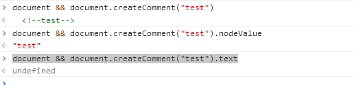
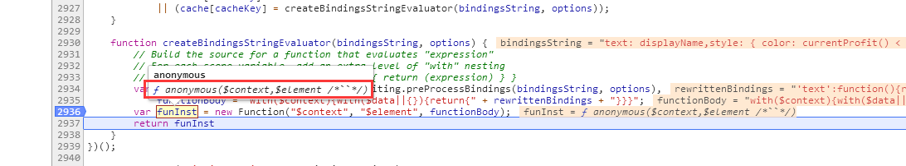
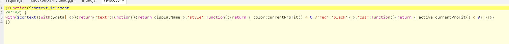
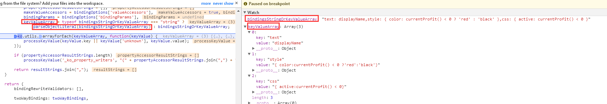
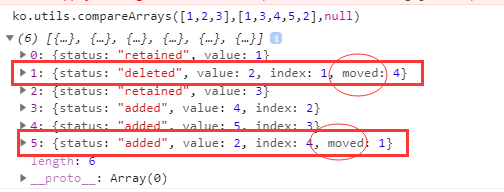

<!-- START doctoc generated TOC please keep comment here to allow auto update -->
<!-- DON'T EDIT THIS SECTION, INSTEAD RE-RUN doctoc TO UPDATE -->
**Table of Contents**  *generated with [DocToc](https://github.com/thlorenz/doctoc)*

- [1 ko.virtualElements](#1-kovirtualelements)
  - [1.1 hasBindingValue](#11-hasbindingvalue)
  - [1.2 normaliseVirtualElementDomStructure](#12-normalisevirtualelementdomstructure)
- [2 ko.bindingProvider['instance']](#2-kobindingproviderinstance)
  - [2.1 nodeHasBindings](#21-nodehasbindings)
  - [2.3 getBindingAccessors](#23-getbindingaccessors)
    - [2.3.1 getBindingsString 获取绑定字符串两种情况](#231-getbindingsstring-%E8%8E%B7%E5%8F%96%E7%BB%91%E5%AE%9A%E5%AD%97%E7%AC%A6%E4%B8%B2%E4%B8%A4%E7%A7%8D%E6%83%85%E5%86%B5)
    - [2.3.2 parseBindingsString](#232-parsebindingsstring)
- [3 ko.expressionRewriting](#3-koexpressionrewriting)
  - [3.1 parseObjectLiteral：解析绑定字符串](#31-parseobjectliteral%E8%A7%A3%E6%9E%90%E7%BB%91%E5%AE%9A%E5%AD%97%E7%AC%A6%E4%B8%B2)
  - [3.2 preProcessBindings](#32-preprocessbindings)
- [4 ko.utils](#4-koutils)
  - [4.1 fixUpContinuousNodeArray](#41-fixupcontinuousnodearray)
  - [4.2 compareArrays](#42-comparearrays)
- [5 replaceDomNodes](#5-replacedomnodes)
- [6 ko.templateRewriting](#6-kotemplaterewriting)
  - [6.1 ensureTemplateIsRewritten](#61-ensuretemplateisrewritten)
- [7 ko.templateSources](#7-kotemplatesources)
- [8 ko.memoization](#8-komemoization)
  - [8.1 memoize](#81-memoize)
  - [8.2 unmemoize](#82-unmemoize)
  - [8.3 unmemoizeDomNodeAndDescendants](#83-unmemoizedomnodeanddescendants)
- [9 ko.tasks](#9-kotasks)

<!-- END doctoc generated TOC please keep comment here to allow auto update -->
 
# 1 ko.virtualElements
- 虚拟元素意义是什么？
1. The point of all this is to support containerless templates (e.g., <!-- ko foreach:someCollection -->blah<!-- /ko -->)
2. 作用类似于 React.Fragment
    
``` 
ko.virtualElements = {
    allowedBindings: {},
    childNodes: function(node) {},
    emptyNode: function(node) {},
    setDomNodeChildren: function(node, childNodes) {},
    prepend: function(containerNode, nodeToPrepend) {},
    insertAfter: function(containerNode, nodeToInsert, insertAfterNode) {},
    firstChild: function(node) {},
    nextSibling: function(node) {},
    hasBindingValue: isStartComment,
    virtualNodeBindingValue: function(node) {},
    normaliseVirtualElementDomStructure: function(elementVerified) {}
};
```

## 1.1 hasBindingValue
作用：用来判断注释节点是否具有绑定关键字
``` 
var commentNodesHaveTextProperty = document && document.createComment("test").text === "<!--test-->";
var startCommentRegex = commentNodesHaveTextProperty ? /^<!--\s*ko(?:\s+([\s\S]+))?\s*-->$/ : /^\s*ko(?:\s+([\s\S]+))?\s*$/;

function isStartComment(node) {
    return (node.nodeType == 8) && startCommentRegex.test(commentNodesHaveTextProperty ? node.text : node.nodeValue);
}
```
- commentNodesHaveTextProperty的作用：兼容ie9不能通过nodeValue获取注释节点的值



- 正向预查：(?:pattern) 和 (?=pattern)的异同点
    - 相同点：均不会获取匹配结果
    - 差异：是否消耗字符
        - (?:pattern) 消耗字符，下一字符匹配会从已匹配后的位置开始。 
        - (?=pattern) 不消耗字符，下一字符匹配会从预查之前的位置开始。 
这里其实没必要使用正向预查
  
  
## 1.2 normaliseVirtualElementDomStructure
>IE <= 8 or IE 9 quirks mode parses your HTML weirdly, treating closing </li> tags as if they don't exist <br/>
作用：在IE <= 8 或者 IE 9 怪异模式下，会忽略 </li>，因此需要做兼容处理即纠正dom树的结构 
- [案例参考](https://segmentfault.com/q/1010000004277806/a-1020000004279979)  
``` 
<ul id="ul1">
   <a href="#">li之前的a标签</a>
   <span>li之前的span标签</span>
   <li></li>
   <li></li>
   <span>li之前的span标签</span><!-- IE7下无法识别这个span标签，不知道为啥 -->
   <li></li>
   <span>li之后的span标签</span><!-- IE7下无法识别这个span标签，不知道为啥 -->
   <a href="#">li之后的a标签</a><!-- IE7下无法识别这个a标签，不知道为啥 -->
   2222
</ul>
```

- knockout-issue：https://github.com/knockout/knockout/issues/155
> IE7 will not allow anything but <li> as children of an <ul> 

# 2 ko.bindingProvider['instance']
// 单例模式
```
(function() {
    var defaultBindingAttributeName = "data-bind";
    ko.bindingProvider = function() {};
    ko.utils.extend(ko.bindingProvider.prototype, {
        'nodeHasBindings': function(node) {},
        'getBindings': function(node, bindingContext) {},
        'getBindingAccessors': function(node, bindingContext) {},
        'getBindingsString': function(node, bindingContext) {},
        'parseBindingsString': function(bindingsString, bindingContext, node, options) {}
    });
    ko.bindingProvider['instance'] = new ko.bindingProvider(); 
    function createBindingsStringEvaluatorViaCache(bindingsString, cache, options) {}
    function createBindingsStringEvaluator(bindingsString, options) {}
})(); 
```
## 2.1 nodeHasBindings
作用：用来判断节点是否具有绑定关键字
``` 
function(node) {
    switch (node.nodeType) {
        case 1: // Element
            return node.getAttribute(defaultBindingAttributeName) != null || ko.components['getComponentNameForNode'](node);
        case 8: // Comment node
            return ko.virtualElements.hasBindingValue(node);
        default: return false;
    }
}
```
- dom节点：<div data-bind=''></div>
- 注释：<!-- ko foreach: xxx -->  
## 2.3 getBindingAccessors
> 获取绑定访问器

```
'getBindingAccessors': function(node, bindingContext) {
    var bindingsString = this['getBindingsString'](node, bindingContext),
        parsedBindings = bindingsString ? this['parseBindingsString'](bindingsString, bindingContext, node, { 'valueAccessors': true }) : null;
    return ko.components.addBindingsForCustomElement(parsedBindings, node, bindingContext, /* valueAccessors */ true);
},
```
调用栈：
getBindingAccessors 
-> parseBindingsString （4.2.3.2）
-> createBindingsStringEvaluator （4.2.3.2）
-> ko.expressionRewriting.preProcessBindings （4.3.2 ）
-> ko.expressionRewriting.parseObjectLiteral（4.3.1 ）

### 2.3.1 getBindingsString 获取绑定字符串两种情况
    - dom[nodeType=1]
    - dom[nodeType=8]即注释
    
### 2.3.2 parseBindingsString
``` 
'parseBindingsString': function(bindingsString, bindingContext, node, options) {
    var bindingFunction = createBindingsStringEvaluatorViaCache(bindingsString, this.bindingCache, options);
    return bindingFunction(bindingContext, node);
    //...
}
``` 
 
- createBindingsStringEvaluatorViaCache -> createBindingsStringEvaluator -> createBindingsStringEvaluator
``` 
function createBindingsStringEvaluator(bindingsString, options) { 
    var rewrittenBindings = ko.expressionRewriting.preProcessBindings(bindingsString, options), //见3.3.1
        functionBody = "with($context){with($data||{}){return{" + rewrittenBindings + "}}}";
    var funInst = new Function("$context", "$element", functionBody);
    return funInst
    }
```


 


# 3 ko.expressionRewriting
``` 
ko.expressionRewriting = (function () { 
    return {
        bindingRewriteValidators: [],
        twoWayBindings: twoWayBindings,
        parseObjectLiteral: parseObjectLiteral,
        preProcessBindings: preProcessBindings,
        keyValueArrayContainsKey: function(keyValueArray, key) {}, 
        writeValueToProperty: function(property, allBindings, key, value, checkIfDifferent) {}
    };
})();
```
## 3.1 parseObjectLiteral：解析绑定字符串
1. 代码编译的第一个阶段通常是通过词法，语法的分析来判断代码本身是否存在词法或者语法上的问题，parseObjectLiteral的作用有点类似于这个作用；
2. 方法名也暗示了该方法的作用：合法的装换为对象；这里是需要讲绑定字符串转换为对象



## 3.2 preProcessBindings

```
"'text':function(){return displayName },'style':function(){return { color:currentProfit() < 0 ?'red':'black'} },'css':function(){return { active:currentProfit() < 0} }"
```

# 4 ko.utils

## 4.1 fixUpContinuousNodeArray

 
## 4.2 compareArrays
>Levenshtein 距离，又称编辑距离

作用：由一个转换成另一个所需的最少编辑操作次数，（替换，插入，删除）

案例
```
ko.utils.compareArrays([1,2,3],[1,3,4,5,2],null)
```



# 5 replaceDomNodes


# 6 ko.templateRewriting
## 6.1 ensureTemplateIsRewritten


# 7 ko.templateSources

# 8 ko.memoization
``` 
ko.memoization = (function () { 
    return {
        memoize: function (callback) {},
        unmemoize: function (memoId, callbackParams) {},
        unmemoizeDomNodeAndDescendants: function (domNode, extraCallbackParamsArray) {},
        parseMemoText: function (memoText) {}
    };
})();
```
## 8.1 memoize
``` 
memoize: function (callback) {
    if (typeof callback != "function")
        throw new Error("You can only pass a function to ko.memoization.memoize()");
    var memoId = generateRandomId();
    memos[memoId] = callback;
    return "<!--[ko_memo:" + memoId + "]-->";
}
```
作用：通过生成一个注释元素，记录函数（显然该函数作为一个闭包存在）

## 8.2 unmemoize

## 8.3 unmemoizeDomNodeAndDescendants


# 9 ko.tasks 