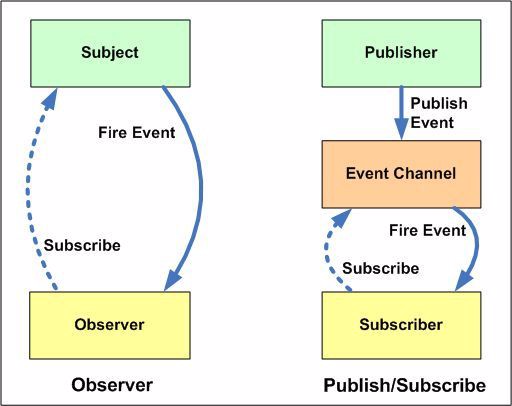

<!-- START doctoc generated TOC please keep comment here to allow auto update -->
<!-- DON'T EDIT THIS SECTION, INSTEAD RE-RUN doctoc TO UPDATE -->
**Table of Contents**  *generated with [DocToc](https://github.com/thlorenz/doctoc)*

- [1. 观察者模式与发布订阅模式](#1-%E8%A7%82%E5%AF%9F%E8%80%85%E6%A8%A1%E5%BC%8F%E4%B8%8E%E5%8F%91%E5%B8%83%E8%AE%A2%E9%98%85%E6%A8%A1%E5%BC%8F)
  - [二者的差异](#%E4%BA%8C%E8%80%85%E7%9A%84%E5%B7%AE%E5%BC%82)
  - [小结](#%E5%B0%8F%E7%BB%93)
- [2. 策略模式](#2-%E7%AD%96%E7%95%A5%E6%A8%A1%E5%BC%8F)
  - [优点](#%E4%BC%98%E7%82%B9)
  - [knockout中模板引擎模块](#knockout%E4%B8%AD%E6%A8%A1%E6%9D%BF%E5%BC%95%E6%93%8E%E6%A8%A1%E5%9D%97)
- [3. 单例模式](#3-%E5%8D%95%E4%BE%8B%E6%A8%A1%E5%BC%8F)
  - [ko中的单例模式](#ko%E4%B8%AD%E7%9A%84%E5%8D%95%E4%BE%8B%E6%A8%A1%E5%BC%8F)
- [4. 防抖与节流](#4-%E9%98%B2%E6%8A%96%E4%B8%8E%E8%8A%82%E6%B5%81)
- [5. 最小编辑距离](#5-%E6%9C%80%E5%B0%8F%E7%BC%96%E8%BE%91%E8%B7%9D%E7%A6%BB)

<!-- END doctoc generated TOC please keep comment here to allow auto update -->

# 1. 观察者模式与发布订阅模式
>[区别](https://www.cnblogs.com/viaiu/p/9939301.html)，[观察者模式](http://c.biancheng.net/view/1390.html)

## 二者的差异
  
观察者模式：Observer向Subject添加订阅，Observer知道Subject是存在的，并且Subject会保留所有的Observer，是一对多的关系，二者之间的沟通是直接的
发布订阅中模式：Subscriber和Publisher之间的沟通是通过 "Event Channel"(消息代理) 进行通信，Subscriber不需要知道Publisher是否存在，二者之间的沟通是间接的

## 小结
1. durandal中的event.js属于发布订阅模式
2. knokcout中computedObservable对象和observable对象都继承了ko_subscribable_fn模块，属于观察者模式
3. require.js中关于defined事件的订阅发布，属于观察者模式 

# 2. 策略模式
>[策略模式](http://c.biancheng.net/view/1378.html)

## 优点
1. 以把算法族的公共代码转移到父类里面，从而避免重复的代码
2. 不修改原代码的情况下，灵活增加新算法

## knockout中模板引擎模块
jqueryTmplTemplateEngine、nativeTemplateEngine 这两个模板引擎都是继承于templateEngine

ko.nativeTemplateEngine
```
ko.nativeTemplateEngine.prototype = new ko.templateEngine();
ko.nativeTemplateEngine.prototype.constructor = ko.nativeTemplateEngine;
```

ko.jqueryTmplTemplateEngine
```
ko.jqueryTmplTemplateEngine.prototype = new ko.templateEngine();
ko.jqueryTmplTemplateEngine.prototype.constructor = ko.jqueryTmplTemplateEngine;

```

设置默认的模板引擎（选择合适的策略）
```
ko.nativeTemplateEngine.instance = new ko.nativeTemplateEngine();
ko.setTemplateEngine(ko.nativeTemplateEngine.instance);

// 如果引用了jquery.tmpl
if (jqueryTmplTemplateEngineInstance.jQueryTmplVersion > 0)
    ko.setTemplateEngine(jqueryTmplTemplateEngineInstance);
```

# 3. 单例模式
## ko中的单例模式
ko.utils.domData
```
ko.utils.domData = new (function () { 
    return { 
    };
})();
```

ko.utils.domNodeDisposal
```
ko.utils.domNodeDisposal = new (function () { 
    return { 
    };
})();
```

# 4. 防抖与节流
[防抖和节流的应用场景和实现](https://www.codercto.com/a/35263.html)

## 防抖
>防抖就是将一段时间内连续的多次触发转化为一次触发。

最后一次触发为准，这件事儿需要等待，如果你反复催促，我就重新计时
```
// ko
function debounce(callback, timeout) {
    var timeoutInstance;
    return function () {
        clearTimeout(timeoutInstance);
        timeoutInstance = ko.utils.setTimeout(callback, timeout);
    };
}
```


## 节流
>指定时间间隔内只会执行一次任务，将减少一段时间内触发的频率。

第一次触发为准
```
// ko 
function throttle(callback, timeout) {
    var timeoutInstance;
    return function () {
        if (!timeoutInstance) {
            timeoutInstance = ko.utils.setTimeout(function () {
                timeoutInstance = undefined;
                callback();
            }, timeout); 
        }
    };
}
```

## 小结
1. 防抖和节流的目的都是为了减少不必要的计算，不浪费资源，只在适合的时候再进行触发计算
2. 应用场景判断，回调是希望**一段时间内**的第一次触发就调用还是最后一次触发调用？？ 


# 5. 最小编辑距离