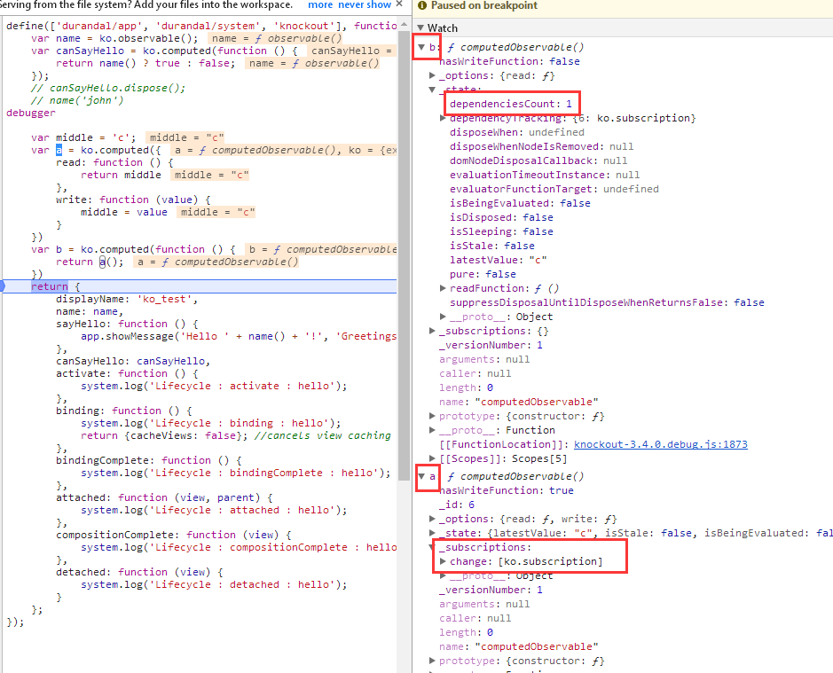

<!-- START doctoc generated TOC please keep comment here to allow auto update -->
<!-- DON'T EDIT THIS SECTION, INSTEAD RE-RUN doctoc TO UPDATE -->
**Table of Contents**  *generated with [DocToc](https://github.com/thlorenz/doctoc)*

- [2.1.3 发布-订阅实现的机制（依赖检测系统）](#213-%E5%8F%91%E5%B8%83-%E8%AE%A2%E9%98%85%E5%AE%9E%E7%8E%B0%E7%9A%84%E6%9C%BA%E5%88%B6%E4%BE%9D%E8%B5%96%E6%A3%80%E6%B5%8B%E7%B3%BB%E7%BB%9F)
  - [2.1.3.1 evaluateImmediate_CallReadWithDependencyDetection](#2131-evaluateimmediate_callreadwithdependencydetection)
  - [2.1.3.2 ko.dependencyDetection 管理observable执行环境’](#2132-kodependencydetection-%E7%AE%A1%E7%90%86observable%E6%89%A7%E8%A1%8C%E7%8E%AF%E5%A2%83)
    - [2.1.3.2.1 begin、end](#21321-beginend)
    - [2.1.3.2.2 ignore：抑制依赖性检测](#21322-ignore%E6%8A%91%E5%88%B6%E4%BE%9D%E8%B5%96%E6%80%A7%E6%A3%80%E6%B5%8B)
  - [2.1.3.3 evaluateImmediate_CallReadThenEndDependencyDetection](#2133-evaluateimmediate_callreadthenenddependencydetection)
  - [2.1.3.4 observable对象的‘读’](#2134-observable%E5%AF%B9%E8%B1%A1%E7%9A%84%E8%AF%BB)
  - [2.1.3.5 ko.dependencyDetection.registerDependency](#2135-kodependencydetectionregisterdependency)
  - [2.1.3.6 订阅：computedObservable 向 observable对象添加订阅](#2136-%E8%AE%A2%E9%98%85computedobservable-%E5%90%91-observable%E5%AF%B9%E8%B1%A1%E6%B7%BB%E5%8A%A0%E8%AE%A2%E9%98%85)
  - [2.1.3.7 computedObservable 添加依赖跟踪](#2137-computedobservable-%E6%B7%BB%E5%8A%A0%E4%BE%9D%E8%B5%96%E8%B7%9F%E8%B8%AA)
  - [2.1.3.8 发布：observable对象发布通知](#2138-%E5%8F%91%E5%B8%83observable%E5%AF%B9%E8%B1%A1%E5%8F%91%E5%B8%83%E9%80%9A%E7%9F%A5)
  - [2.1.3.9 ko_subscribable_fn.notifySubscribers](#2139-ko_subscribable_fnnotifysubscribers)
  - [2.1.3.10 小结](#21310-%E5%B0%8F%E7%BB%93)
- [2.1.4 销毁：computedObservable.dispose();](#214-%E9%94%80%E6%AF%81computedobservabledispose)

<!-- END doctoc generated TOC please keep comment here to allow auto update -->

# 1. 示例代码
```
var name = ko.observable();
var canSayHello = ko.computed(function () { 
    return name() ? true : false;
});
```
结论
1. canSayHello（computedObservable对象）会向 name（observable对象）添加订阅
2. canSayHello会记录其所有的依赖，_state.dependencyTracking
3. name会保持所有添加的订阅，观察者模式中Subject会记录所有的Subscriber
4. ko的依赖检测基于ko.computed(fn)/ko.dependentObservalbe(fn)，当fn中存在observable对象、computedObservable对象的读取操作时，便会发生依赖检测

# 2. ko依赖检测机制的实现 
ko.computed(fn)：fn称为readFunction 
-> evaluateImmediate 
-> evaluateImmediate_CallReadWithDependencyDetection 
-> evaluateImmediate_CallReadThenEndDependencyDetection

## 2.1 依赖检测环境准备

``` 
evaluateImmediate_CallReadWithDependencyDetection: function (notifyChange) {
    //...
    dependencyDetectionContext = {
            computedObservable: computedObservable,
            disposalCandidates: state.dependencyTracking,
            disposalCount: state.dependenciesCount
        };

    ko.dependencyDetection.begin({ // 关键：依赖检测环境准备
        callbackTarget: dependencyDetectionContext,
        callback: computedBeginDependencyDetectionCallback, //该函数被优化到外层作用域了（作为共享函数，以避免创建不必要的函数实例）
        computed: computedObservable,
        isInitial: isInitial
    });
    var newValue = this.evaluateImmediate_CallReadThenEndDependencyDetection(state, dependencyDetectionContext);
    //...
}
```
 
## 2.2 依赖检测环境的管理 

ko.dependencyDetection结构，通过outerFrames（栈）用来管理依赖检测的执行环境
1. 注意：ko.dependencyDetection.begin\end总是成对出现
2. 称 currentFrame 为当前依赖检测的执行环境

ko.dependencyDetection的结构
```
ko.computedContext = ko.dependencyDetection = (function () {
    var outerFrames = [],
        currentFrame,
        lastId = 0;

    function getId() {}

    function begin(options) {
        outerFrames.push(currentFrame);
        currentFrame = options;  // 关键：使得ko.dependencyDetection的其他方法都在当前options的‘环境’下执行
    }

    function end() {
        currentFrame = outerFrames.pop();
    }

    return {
        begin: begin,
        end: end,
        registerDependency: function (subscribable) { },
        ignore: function (callback, callbackTarget, callbackArgs) {},
        getDependenciesCount: function () {},
        isInitial: function () {}
    };
})();
```

### 2.2.1 begin、end


### 2.2.2 ignore：抑制依赖性检测
``` 
ignore: function (callback, callbackTarget, callbackArgs) {
    try {
        begin();
        return callback.apply(callbackTarget, callbackArgs || []);
    } finally {
        end();
    }
},
```    
       
## 2.3 执行 state.readFunction

```
evaluateImmediate_CallReadThenEndDependencyDetection: function (state, dependencyDetectionContext) {
    try {
        var readFunction = state.readFunction;  
        return state.evaluatorFunctionTarget ? readFunction.call(state.evaluatorFunctionTarget) : readFunction();
    } finally {
        ko.dependencyDetection.end(); // 弹出当前的‘observable执行环境’
        //...
    }
}
```

执行readFunction，即下面函数
``` 
function () { 
    return name() ? true : false;
}
```

## 2.4 observable对象的读

``` 
function observable() {
    if (arguments.length > 0) {
        // 写 
    }
    else {
        // 读
        ko.dependencyDetection.registerDependency(observable); // 关键
        return observable[observableLatestValue];
    }
}
```

## 2.5 ko.dependencyDetection.registerDependency

```
registerDependency: function (subscribable) { // 参数：observable对象，即案例中的 name
    if (currentFrame) {
        if (!ko.isSubscribable(subscribable))
            throw new Error("Only subscribable things can act as dependencies");
        currentFrame.callback.call(currentFrame.callbackTarget, subscribable, subscribable._id || (subscribable._id = getId()));
    }
},
```

1. 这里的 currentFrame还记得吗？就是 2.1 中 ko.dependencyDetection.begin 的参数
2. currentFrame.callback即computedBeginDependencyDetectionCallback 
``` 
function computedBeginDependencyDetectionCallback(subscribable, id) { // subscribable:name ；computedObservable:canSayHello
    var computedObservable = this.computedObservable, // this指向 evaluateImmediate_CallReadWithDependencyDetection 中的 dependencyDetectionContext
        state = computedObservable[computedState]; 
    if (!state.isDisposed) {
        if (this.disposalCount && this.disposalCandidates[id]) {
            //...
        } else if (!state.dependencyTracking[id]) { 
            computedObservable.addDependencyTracking(id, subscribable, state.isSleeping ? { _target: subscribable } : computedObservable.subscribeToDependency(subscribable));
        }
    }
}
```

state.isSleeping通常为false，特殊情况下true，这种特殊留在后面部分说。因此这里会去执行  computedObservable.subscribeToDependency(subscribable)


#### 2.1.3.6 订阅：computedObservable 向 observable对象添加订阅
> computedObservable对象向observable对象添加订阅


``` 
var computedFn = {
    subscribeToDependency: function (target) { // target是observable对象（案例中的 name）
        if (target._deferUpdates && !this[computedState].disposeWhenNodeIsRemoved) {
            //...
        } else {
            return target.subscribe(this.evaluatePossiblyAsync, this); // 注意这里的回调函数：this.evaluatePossiblyAsync
        }
    },
}
```

ko_subscribable_fn.subscribe

``` 
var defaultEvent = "change";

var ko_subscribable_fn = { 
    subscribe: function (callback, callbackTarget, event) {
        var self = this;
        event = event || defaultEvent;
        var boundCallback = callbackTarget ? callback.bind(callbackTarget) : callback;
        var subscription = new ko.subscription(self, boundCallback, function () { // disposeCallback
            ko.utils.arrayRemoveItem(self._subscriptions[event], subscription);
            if (self.afterSubscriptionRemove)
                self.afterSubscriptionRemove(event);
        });
        //...
        self._subscriptions[event].push(subscription);
        return subscription; //返回了subscription
    },
}
```


- ko.subscription 

``` 
ko.subscription = function (target, callback, disposeCallback) {
    this._target = target; 
    this.callback = callback;
    this.disposeCallback = disposeCallback;
    this.isDisposed = false;
    ko.exportProperty(this, 'dispose', this.dispose);
};

ko.subscription.prototype.dispose = function () {
    this.isDisposed = true;
    this.disposeCallback();
};
```

#### 2.1.3.7 computedObservable 添加依赖跟踪

记录所有的订阅，将computedObservable对象添加的订阅记录下来，computedObservable向谁添加订阅其实可以理解为依赖谁，这里就是用来记录所有的依赖

``` 
var computedFn = {
    addDependencyTracking: function (id, target, trackingObj) {
        //...
        this[computedState].dependencyTracking[id] = trackingObj;
        trackingObj._order = this[computedState].dependenciesCount++;
        trackingObj._version = target.getVersion();
    },
}
```            

#### 2.1.3.8 发布：observable对象发布通知

```
name('john')
```


- observable


``` 
function observable() {
    if (arguments.length > 0) { // 写 
        if (observable.isDifferent(observable[observableLatestValue], arguments[0])) {
            observable.valueWillMutate();  // 触发 'beforeChange' 
            observable[observableLatestValue] = arguments[0];
            observable.valueHasMutated();  // 触发 'change' ，调用ko_subscribable_fn.notifySubscribers
        }
        return this;  
    }
    else {
        // 读
    }
}
```

在2.1.1.1小节中说到observable继承了observableFn，observableFn对具体结构见2.1.1.2
并且observableFn 继承了 ko.subscribable['fn']（即ko_subscribable_fn）

#### 2.1.3.9 ko_subscribable_fn.notifySubscribers


``` 
var ko_subscribable_fn = {
    "notifySubscribers": function (valueToNotify, event) {
        event = event || defaultEvent;
        if (event === defaultEvent) {
            this.updateVersion();
        }
        if (this.hasSubscriptionsForEvent(event)) {
            try {
                ko.dependencyDetection.begin(); // 关键：抑制依赖性检测
                for (var a = this._subscriptions[event].slice(0), i = 0, subscription; subscription = a[i]; ++i) {  // 触发在2.1.3.6添加的订阅
                    if (!subscription.isDisposed)
                        subscription.callback(valueToNotify);
                }
            } finally {
                ko.dependencyDetection.end(); 
            }
        }
    }, 
}
```


这里抑制依赖性检测的作用：observable的写并不会添加依赖和订阅，即下例是不会构成依赖关系的


```
var name = ko.observable();
var canSayHello = ko.computed(function () {
    name('john') ;// 因为是写操作，抑制依赖性检测
    return 1;
});
```


#### 2.1.3.10 小结


- 观察者模式
    - computedObservable对象可以理解为Observer，observable对象可以理解为Subject
        - 整个2.1章节都是以此为例，但并不总是这样（：computedObservalbe也可以作为Subject，但是observable对象不能作为Observe）
        ``` 
        var middle = 'c';
        var a = ko.computed({
            read: function () {
                return middle
            },
            write: function (value) {
                middle = value
            }
        })
        var b = ko.computed(function () {
            return a();
        })
        ```
          
        
    - computedObservable对象（canSayHello）是如何向observable对象（name）添加依赖的呢？
        
    - 为什么观察者只能是computedObservable？
        - 因为只有ko.computed/ko.dependentObservable才会创建新的ko.dependencyDetection中的currentFrame
        
- 依赖 与 订阅
    -  Observer 对 Subject 有依赖所有才添加订阅
    - 就像require.js中的模块的依赖一样，父模块依赖子模块，所有向子模块添加订阅（订阅子模块的defined事件）
    
    
- 关于代码的优化
    1. evaluateImmediate_CallReadThenEndDependencyDetection、evaluateImmediate_CallReadWithDependencyDetection
    > Factoring it out means that evaluateImmediate_CallReadWithDependencyDetection（、evaluateImmediate_CallReadThenEndDependencyDetection） 
      can be independent of try/finally blocks, which contributes to saving about 40% off the CPU 
      overhead of computed evaluation (on V8 at least).
      
    2. computedBeginDependencyDetectionCallback
    > This function gets called each time a dependency is detected while evaluating a computed. 
      It's factored out as a shared function to avoid creating unnecessary function instances during evaluation.
       
 
### 2.1.4 销毁：computedObservable.dispose();

在 2.1.3.7 小节中说到 computedObservable 将所有的依赖订阅添加到 state.dependencyTracking 中


``` 
var computedFn = {
    dispose: function () {
        var state = this[computedState];
        if (!state.isSleeping && state.dependencyTracking) {
            ko.utils.objectForEach(state.dependencyTracking, function (id, dependency) { // 这里的 dependency 就是 ko.subscription 对象
                if (dependency.dispose)
                    dependency.dispose(); // 执行 disposeCallback ， 参考：2.1.3.6小节:ko_subscribable_fn.subscribe
            });
        }
        if (state.disposeWhenNodeIsRemoved && state.domNodeDisposalCallback) {
            ko.utils.domNodeDisposal.removeDisposeCallback(state.disposeWhenNodeIsRemoved, state.domNodeDisposalCallback);
        }
        state.dependencyTracking = null;
        state.dependenciesCount = 0;
        state.isDisposed = true;
        state.isStale = false;
        state.isSleeping = false;
        state.disposeWhenNodeIsRemoved = null;
    } 
}
```

ko_subscribable_fn.subscribe中的disposeCallback


``` 
// disposeCallback
function () { 
    ko.utils.arrayRemoveItem(self._subscriptions[event], subscription); 
    if (self.afterSubscriptionRemove)
        self.afterSubscriptionRemove(event);
}
```


- disposeCallback的作用？
2.1.3.6中说到 computedObservable 向 observable 对象添加订阅，那么当computedObservable销毁的时候，是不是应该将这个订阅移除呢？这里就是这个作用

