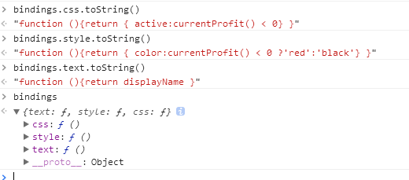
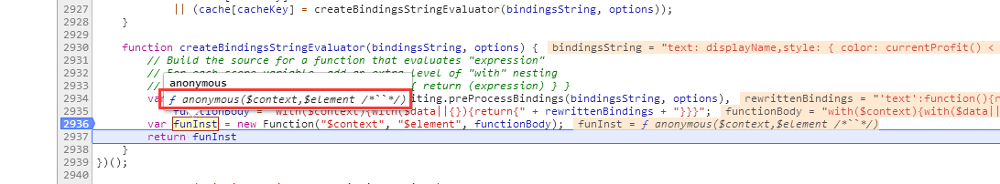

## 2.2 API:ko.applyBindings 
> 该api的作用：将参数中的viewModel绑定到指定的dom节点中

**提示：**本届所有截图均基于以下案例代码，如有不同会备注


```
//html
<div data-bind="text: displayName,style: { color: currentProfit() < 0 ? 'red' : 'black' },css: { active: currentProfit() < 0 }"></div>
//js
 var currentProfit = ko.observable();
```


- ko.applyBindings


``` 
ko.applyBindings = function (viewModelOrBindingContext, rootNode) {
    //...
    rootNode = rootNode || window.document.body; // 默认绑定到body节点
    applyBindingsToNodeAndDescendantsInternal(getBindingContext(viewModelOrBindingContext), rootNode, true);
};
```

### 2.2.1 ko.bindingContext:生成绑定上下文


getBindingContext -> ko.bindingContext 


```
ko.bindingContext = function(dataItemOrAccessor, parentContext, dataItemAlias, extendCallback) {
    function updateContext() {
        var dataItemOrObservable = isFunc ? dataItemOrAccessor() : dataItemOrAccessor,
            dataItem = ko.utils.unwrapObservable(dataItemOrObservable);

        //... 父子绑定上下文的处理，在父子组件通信章节再说
        self['$parents'] = [];
        self['$root'] = dataItem;
        self['ko'] = ko;
        
        self['$rawData'] = dataItemOrObservable;
        self['$data'] = dataItem; 

        return self['$data'];
    }
    function disposeWhen() { // computedObservable对象销毁的时机
        return nodes && !ko.utils.anyDomNodeIsAttachedToDocument(nodes); // 所有绑定的节点都已经从document中移除了
    }

    var self = this,
        isFunc = typeof(dataItemOrAccessor) == "function" && !ko.isObservable(dataItemOrAccessor),
        nodes,
        subscribable = ko.dependentObservable(updateContext, null, { disposeWhen: disposeWhen, disposeWhenNodeIsRemoved: true });

    if (subscribable.isActive()) { 
        self._subscribable = subscribable;
        
        subscribable['equalityComparer'] = null;

        nodes = [];
        subscribable._addNode = function(node) {
            nodes.push(node);
            ko.utils.domNodeDisposal.addDisposeCallback(node, function(node) {
                ko.utils.arrayRemoveItem(nodes, node);
                if (!nodes.length) {
                    subscribable.dispose();
                    self._subscribable = subscribable = undefined;
                }
            });
        };
    }
}
```
- 参数介绍
    - [parentContext, dataItemAlias, extendCallback] 这三个参数的作用：构建父子绑定上下文，用于父子绑定上下文的通信 
    - dataItemOrAccessor：就是viewModel；参数dataItemOrAccessor可以分为两种情况：observable对象、普通对象

#### 2.2.1.1 dataItemOrAccessor是普通对象的情况

此时对于的有效代码只有下面部分有效，即保存当前的vm

``` 
self['$parents'] = [];
self['$root'] = dataItem;
self['ko'] = ko;

self['$rawData'] = dataItemOrObservable;
self['$data'] = dataItem;
```

#### 2.2.1.2 dataItemOrAccessor是observable对象的情况
情况略复杂些，当dataItemOrAccessor是observable对象时，subscribable会向dataItemOrAccessor添加订阅（即subscribable依赖dataItemOrAccessor），subscribable.isActive()为true

``` 
subscribable = ko.dependentObservable(updateContext, null, { disposeWhen: disposeWhen, disposeWhenNodeIsRemoved: true }); // 返回的subscriable是computedObservalbe对象
```    

- subscribable.isActive()的计算
    在2.1.2computedObservble继承结构说到computedObservble继承了computedFn
    ```
    var computedFn = {
        isActive: function () {  // isStale用来表示是不是脏状态
            return this[computedState].isStale || this[computedState].dependenciesCount > 0;  
        },
    }
    ```
    - 关于 this[computedState].isStale
        - ko.computed()参数的options中如果pure和deferEvaluation有其一为ture的话，this[computedState].isStale为true，
        - 这里一定为为false （即已经完成值的计算，不是脏数据，参考方法computedFn.evaluateImmediate_CallReadThenEndDependencyDetection），因为调用过程中没有传递这个选项
         
        ``` 
        ko.computed = ko.dependentObservable = function (evaluatorFunctionOrOptions, evaluatorFunctionTarget, options) {
            //...
            var state = { 
                isStale: true, // 默认为脏状态，即尚未计算computedObservable的值
                //...
            };
            if (options['pure']) { 
                state.isSleeping = true;  
            }
            //...
            if (!state.isSleeping && !options['deferEvaluation']) { // 那么 则不会进行估算，因此isStale仍为true
                computedObservable.evaluateImmediate();
            } 
        }
        ```
    - 关于 this[computedState].dependenciesCount
        - 2.1.3.7 小节中看到Observer向Subject添加订阅后，也会在自身的状态属性上记录下依赖的数量（每添加一个订阅，就多一个依赖）
        - 因此，如果dataItemOrAccessor是observable对象的话，当在updateContext中执行时，便会添加订阅，作为subscribable的依赖，因此这种情况下为 this[computedState].dependenciesCount = 1;

    因此，在这种情况下，subscribable.isActive()为true，在2.2.1.1的基础上添加了以下属性
    ```
    ko.bindingContext = function(dataItemOrAccessor, parentContext, dataItemAlias, extendCallback) {
        //...
        if (subscribable.isActive()) {
            self._subscribable = subscribable; 
            subscribable['equalityComparer'] = null;  
            nodes = [];
            subscribable._addNode = function(node) {
                nodes.push(node);
                ko.utils.domNodeDisposal.addDisposeCallback(node, function(node) {
                    ko.utils.arrayRemoveItem(nodes, node);
                    if (!nodes.length) {
                        subscribable.dispose();
                        self._subscribable = subscribable = undefined;
                    }
                });
            };
        }
    }
    ```
    - subscribable._addNode的作用？
    >  We need to be able to dispose of this computed observable when it's no longer needed. 
    This would be easy if we had a single node to watch, but binding contexts can be used by many different nodes, 
    and  we cannot assume that those nodes have any relation to each other. So instead we track any node that the context is attached to, 
    and dispose the computed when all of those nodes have been cleaned.<br/>
    其实注释说的很清楚了：我们需要能够销毁这里创建的subscribable。
    
    - 为什么要销毁创建的subscribable呢？为了避免内存泄漏，需要销毁subscribable，但是销毁的前提是该节点的子节点都从document中移除了
    - 那为什么前提是这个呢？
    1. 2.2.3.2小节说到：bindingsUpdater依赖bindingContext._subscribable， bindingContext._subscribable依赖viewModel
    2. 2.2.3.3.1小节关于getValueAccessor说到： ko.bindingHandlers[xxx].update 依赖  bindingsUpdater
    3. 所以由（1 + 2）得出，该节点及其孩子节点都是依赖 viewMoldel（observable对象）的。如果不考虑子节点是否在document中，直接把subscribable销毁会使得依赖链断掉，也就是说当viewModel更新时不会触发节点的更新
    

### 2.2.2 applyBindingsToNodeAndDescendantsInternal:dom与vm的绑定入口
> **绑定关键字**的两种情况在：ko.bindingProvider['instance']['nodeHasBindings']，见3.2.1


``` 
function applyBindingsToNodeAndDescendantsInternal (bindingContext, nodeVerified, bindingContextMayDifferFromDomParentElement) {
    var shouldBindDescendants = true; 
    
    // 兼容下处理，纠正dom树结构,...
    
    var shouldApplyBindings = (isElement && bindingContextMayDifferFromDomParentElement) // Case (1)
        || ko.bindingProvider['instance']['nodeHasBindings'](nodeVerified);              // Case (2)
    if (shouldApplyBindings)
        shouldBindDescendants = applyBindingsToNodeInternal(nodeVerified, null, bindingContext, bindingContextMayDifferFromDomParentElement)['shouldBindDescendants'];

    if (shouldBindDescendants && !bindingDoesNotRecurseIntoElementTypes[ko.utils.tagNameLower(nodeVerified)]) { 
        applyBindingsToDescendantsInternal(bindingContext, nodeVerified, /* bindingContextsMayDifferFromDomParentElement: */ !isElement);
    }
}
```

- 参数bindingContextMayDifferFromDomParentElement：用来表示当前节点的绑定上下文和父节点的上下文是否一致

- shouldApplyBindings：用来控制是否需要进行绑定，两种情况需要进行绑定（这里属于优化部分）
    - 当前dom的绑定上下文和父节点的绑定上下文不一致
    - 当前的节点具有绑定关键字，即该dom必须进行绑定
    - 反过来看，也就是当前节点没有绑定关键字并且和父节点的绑定上下文一致，从优化的角度考虑，没必要进行绑定

- shouldBindDescendants：用来控制是否需要对当前节点的孩子节点进行绑定，这取决于当前节点的 绑定处理器的init的返回值
    >**定义**：绑定处理器指定义在ko.bindingHandlers对象上的属性，比如系统提供的：text,value,foreach等，当然你也可以自定义，通常包含init,update两个属性
    
    
    ```
    ko.bindingHandlers['submit'] = {
      'init': function (element, valueAccessor, allBindings, viewModel, bindingContext) {},
      'update': function (element, valueAccessor, allBindings, viewModel, bindingContext) {}
    }
    ```
    - 如果返回 controlsDescendantBindings:true ，那么则不进行孩子节点的绑定，会在后面说到
 

### 2.2.3 applyBindingsToNodeInternal（dom与vm绑定的核心方法）
> 单个dom节点的绑定过程；单向绑定（从viewModel -> dom的更新）


```
function applyBindingsToNodeInternal(node, sourceBindings, bindingContext, bindingContextMayDifferFromDomParentElement) {
将该部分拆分为以下几个部分
    1. 判断当前节点是否进行过ko绑定
    2. 获取'绑定字符串对象'（绑定字符串转为对象）
    3. 获取关联的绑定处理器，执行每个绑定处理器（核心过程）
}
```


- 参数说明
    - 除了第二个参数sourceBindings其他参数含义很明显，通常dom节点的绑定字符串都写在dom节点的data-bind属性中，但是也可以通过编码的形式指定'绑定字符串',sourceBindings就是这个含义（见3.1.1）
     

 #### 2.2.3.1 判断当前节点是否进行过ko绑定
 
 
```
var boundElementDomDataKey = ko.utils.domData.nextKey(); //生成一个唯一标识，用于存储节点绑定与否
function applyBindingsToNodeInternal(node, sourceBindings, bindingContext, bindingContextMayDifferFromDomParentElement) {
    var alreadyBound = ko.utils.domData.get(node, boundElementDomDataKey);
    if (!sourceBindings) {
        if (alreadyBound) { //如果没有指定sourceBindings，则不能进行多次绑定
            throw Error("You cannot apply bindings multiple times to the same element.");
        }
        ko.utils.domData.set(node, boundElementDomDataKey, true);
    }

    // 优化操作：如果当前节点的绑定上下文和父节点一致，则可以通过扫描父节点来获取当前节点的上下文（这里的父节点不包含注释节点-虚拟节点）
    // 如果没有绑定过并且当前节点和父节点的绑定上下文不一致才去存储当前节点的绑定上下文
    if (!alreadyBound && bindingContextMayDifferFromDomParentElement)
        ko.storedBindingContextForNode(node, bindingContext);
 
    //... 
}
```


- storedBindingContextForNode：保存绑定上下文


``` 
var storedBindingContextDomDataKey = ko.utils.domData.nextKey(); //生成唯一标识，用于存储节点的绑定上下文
ko.storedBindingContextForNode = function (node, bindingContext) {
    if (arguments.length == 2) {
        ko.utils.domData.set(node, storedBindingContextDomDataKey, bindingContext);
        if (bindingContext._subscribable)  
            bindingContext._subscribable._addNode(node); // 见 2.2.1.2 
    } else {
        return ko.utils.domData.get(node, storedBindingContextDomDataKey);
    }
}
```
 
#### 2.2.3.2 获取'绑定字符串对象'
> 这部分作用就是来获得bindings 和 bindingsUpdater


 ``` 
function applyBindingsToNodeInternal(node, sourceBindings, bindingContext, bindingContextMayDifferFromDomParentElement) {
    //...
    var bindings;
    if (sourceBindings && typeof sourceBindings !== 'function') { // 见 3.1.1
        bindings = sourceBindings;
    } else {
        var provider = ko.bindingProvider['instance'],
            getBindings = provider['getBindingAccessors'] || getBindingsAndMakeAccessors; //见 4.2.3 
 
        var bindingsUpdater = ko.dependentObservable(
            function() {
                bindings = sourceBindings ? sourceBindings(bindingContext, node) : getBindings.call(provider, node, bindingContext); 
                if (bindings && bindingContext._subscribable) // 注册一个依赖，用于支持vm是observable对象的情况，见 2.2.1.2
                    bindingContext._subscribable(); 
                return bindings;
            },
            null, { disposeWhenNodeIsRemoved: node }
        );

        if (!bindings || !bindingsUpdater.isActive()) // 如果binding不存在，或者bindingsUpdater没有添加任何依赖
            bindingsUpdater = null;
    }
    //...
}
```


1. sourceBindings是字符串的情况见3.1.1 ，从代码来看这里显然是支持函数形式的，再发散下sourceBindings可能是observable对象，好吧，后面这两种情形（函数、observabled对象）有兴趣的同学可以自己看下，本文就不啰嗦了
2. 通过ko.bindingProvider['instance'].getBindingAccessors获取bindings，具体过程见 4.2.3 
3. 当viewModel是observable对象（见2.2.1.2），那么此时会注册一个依赖：即bindingsUpdater依赖bindingContext._subscribable，2.2.1.2小节说到bindingContext._subscribable依赖viewModel（形成了一个依赖链）
    因此，这种情况下当viewModel变化时会触发bindingContext._subscribable更新，进而触发bindingsUpdater更新
     
 - bindings长什么样呢？
 
 1. 其实你看到的只是表象，本质见下面两图：通过with改变了作用域（链）
 >关于with的作用可以参考：你不知道的js-上卷
 
 
  
 
- bindingsUpdater的作用？这对于viewModel是observable的情况意义非凡
1. 变量名暗示了该变量的作用：更新bindings 
2. getBindingAccessors调用栈中会生成匿名函数，并通过with绑定绑定上下文，对于viewModel是普通对象时，这个绑定上下文是不会变化的，但是如果viewModel是observable对象时，这个绑定上下文是会变化的
3. 那么，绑定上下文的变化，这里生成的匿名函数的绑定上下文也应该要变更到最新才对，也就是这里返回的bindings是需要根据viewModel更新的
    
小节：这里执行完会有三种情况
    1. bindings、bindingsUpdater均不存在
    2. bindings存在，bindingsUpdater不存在（viewModel是普通对象：如 ko.applyBindings({xxx},node) ）
    3. bindings、bindingsUpdater均存在（即viewModel是observable对象：如 ko.applyBindings(ko.observable({xxx}),node) ）

 
#### 2.2.3.3  获取关联的绑定处理器，执行每个绑定处理器（核心过程）
分为两部分


##### 2.2.3.3.1 参数准备


```
function applyBindingsToNodeInternal(node, sourceBindings, bindingContext, bindingContextMayDifferFromDomParentElement) {
    //...
    var getValueAccessor = bindingsUpdater
        ? function(bindingKey) {
            return function() {
                return evaluateValueAccessor(bindingsUpdater()[bindingKey]);
            };
        } : function(bindingKey) {
            return bindings[bindingKey];
        };

    function allBindings() {
        return ko.utils.objectMap(bindingsUpdater ? bindingsUpdater() : bindings, evaluateValueAccessor);
    }
    allBindings['get'] = function(key) {
        return bindings[key] && evaluateValueAccessor(getValueAccessor(key));
    };
    allBindings['has'] = function(key) {
        return key in bindings;
    };
    //...
}
```

- 既然说到参数准备，那么这里的参数是为谁准备的呢？

- getValueAccessor 获取viewModel的取值器函数 （ko.bindingHandlers[xxx].update/init参数之一:valueAccessor)
    - 对于viewModel是observable的情况，bindingsUpdater的值是变化的，因此这里要通过闭包的形式以便能获取最新的bindings（bindingsUpdater用来获取bindings的，见2.2.3.2关于bindingsUpdater作用的介绍）
    并且bindingsUpdater的执行是需要在ko.bindingHandlers[xxx].update/init中执行才有意义，这样才能使得ko.bindingHandlers[xxx].update对bindingsUpdater添加订阅，当bindingsUpdater更新时会触发ko.bindingHandlers[xxx].update更新
    > 因此viewModel是observable的情况，getValueAccessor的作用：1. 最新的bindings（主要是with作用生成的绑定上下文的更新） 2.在ko.bindingHandlers[xxx].update中注册依赖<br/>
    > 这段描述能够解释：如果viewModel是observable对象是，当viewModel更新时会触发 ko.bindingHandlers[xxx].update （这个过程涉及了一堆computedObservable对象，他们之间形成了依赖链）
   - 如果viewModel是普通对象，就简单很多了（因为不涉及到更新的问题）

- allBindings也是 ko.bindingHandlers[xxx].update/init 参数之一

##### 2.2.3.3.2 绑定处理器（ko.bindingHandlers[xxx]）的执行


```
function applyBindingsToNodeInternal(node, sourceBindings, bindingContext, bindingContextMayDifferFromDomParentElement) {
    //...
    var orderedBindings = topologicalSortBindings(bindings); 
    ko.utils.arrayForEach(orderedBindings, function(bindingKeyAndHandler) {
        var handlerInitFn = bindingKeyAndHandler.handler["init"],
            handlerUpdateFn = bindingKeyAndHandler.handler["update"],
            bindingKey = bindingKeyAndHandler.key;

        if (node.nodeType === 8) { // 如果是注释元素，则需要验证注释元素的绑定处理器是否允许执行
            validateThatBindingIsAllowedForVirtualElements(bindingKey);
        }

        try {
            if (typeof handlerInitFn == "function") {
                // ko.bindingHandlers[xxx].init()
            }
            if (typeof handlerUpdateFn == "function") {
                 // ko.bindingHandlers[xxx].update() 
            }
        } catch (ex) {
            ex.message = "Unable to process binding \"" + bindingKey + ": " + bindings[bindingKey] + "\"\nMessage: " + ex.message;
            throw ex;
        }
    });
    
    return {
        'shouldBindDescendants': bindingHandlerThatControlsDescendantBindings === undefined
    };
```

1. 获取orderedBindings，作用：存储关联的绑定处理器
 
 
2. 执行绑定处理器，两个步骤
2.1 ko.bindingHandlers[xxx].init()：单纯的初始化
> ko.dependencyDetection.ignore抑制依赖性检测，单纯的执行的 ko.bindingHandlers[xxx].init()，不订阅不依赖，单纯的初始化


```
ko.dependencyDetection.ignore(function() {
    var initResult = handlerInitFn(node, getValueAccessor(bindingKey), allBindings, bindingContext['$data'], bindingContext);
    if (initResult && initResult['controlsDescendantBindings']) {
        if (bindingHandlerThatControlsDescendantBindings !== undefined)
            throw new Error("Multiple bindings (" + bindingHandlerThatControlsDescendantBindings + " and " + bindingKey + ") are trying to control descendant bindings of the same element. You cannot use these bindings together on the same element.");
        bindingHandlerThatControlsDescendantBindings = bindingKey;
    }
});
```
- initResult['controlsDescendantBindings']的作用？
控制是否继续绑定孩子节点
    
2.2 ko.bindingHandlers[xxx].update()：
```
ko.dependentObservable( 
    function() {
        handlerUpdateFn(node, getValueAccessor(bindingKey), allBindings, bindingContext['$data'], bindingContext); 
    }, 
    null, { disposeWhenNodeIsRemoved: node }
);
```

- 如果在handlerUpdateFn中执行了observable对象的读取操作会发生什么：添加订阅、注册依赖
- 这里有一个闭包，你看到了吗？ ko.dependentObservable会返回一个computedObservable函数，computedObservable有一个属性state，state.readFunction就是上面传递的函数，即


```
function() {
    handlerUpdateFn(node, getValueAccessor(bindingKey), allBindings, bindingContext['$data'], bindingContext);
}
```

1. 这个函数是一个**闭包**：handlerUpdateFn(node, getValueAccessor(bindingKey), allBindings, bindingContext['$data'], bindingContext);这里面的参数全部被记录下来了；
2. 为什么要在这里强调下闭包呢？好，我问个问题哈：当由于依赖更新导致handlerUpdateFn被执行，那么这些参数都指向谁？如果这里不是闭包，会有什么样的后果呢？
3. 这里得出：dom节点是如何与绑定的observable对象进行绑定的，observable对象的更新又是如何更新dom节点的

- 因为这里比较重要，下面案例验证下闭包
```
//html
<div data-bind="text: displayName"></div>
//js
var name = ko.observable('init-value');
setTimeout(function () {
    name('update-john')

     }, 1000)
```


        

##### 2.2.3.3.3 topologicalSortBindings


```
function topologicalSortBindings(bindings) { //深度优先遍历
    // Depth-first sort
    var result = [],                // The list of key/handler pairs that we will return
        bindingsConsidered = {},    // A temporary record of which bindings are already in 'result'
        cyclicDependencyStack = []; // Keeps track of a depth-search so that, if there's a cycle, we know which bindings caused it
    ko.utils.objectForEach(bindings, function pushBinding(bindingKey) {
        if (!bindingsConsidered[bindingKey]) {
            var binding = ko['getBindingHandler'](bindingKey);
            if (binding) {
                // First add dependencies (if any) of the current binding
                if (binding['after']) {
                    cyclicDependencyStack.push(bindingKey);
                    ko.utils.arrayForEach(binding['after'], function(bindingDependencyKey) {
                        if (bindings[bindingDependencyKey]) {
                            if (ko.utils.arrayIndexOf(cyclicDependencyStack, bindingDependencyKey) !== -1) {
                                throw Error("Cannot combine the following bindings, because they have a cyclic dependency: " + cyclicDependencyStack.join(", "));
                            } else {
                                pushBinding(bindingDependencyKey);
                            }
                        }
                    });
                    cyclicDependencyStack.length--;
                }
                // Next add the current binding
                result.push({ key: bindingKey, handler: binding });
            }
            bindingsConsidered[bindingKey] = true;
        }
    });

    return result;
}
```


##### 2.2.3.3.4 validateThatBindingIsAllowedForVirtualElements


```
function validateThatBindingIsAllowedForVirtualElements(bindingName) {
    var validator = ko.virtualElements.allowedBindings[bindingName];
    if (!validator)
        throw new Error("The binding '" + bindingName + "' cannot be used with virtual elements")
}
```
 

### 2.2.4 applyBindingsToDescendantsInternal
递归 -> applyBindingsToNodeAndDescendantsInternal（2.2.2）

注意 ko.bindingProvider.instance.preprocessNode 的执行