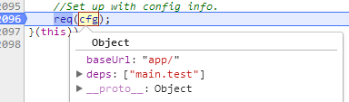

<!-- START doctoc generated TOC please keep comment here to allow auto update -->
<!-- DON'T EDIT THIS SECTION, INSTEAD RE-RUN doctoc TO UPDATE -->
**Table of Contents**  *generated with [DocToc](https://github.com/thlorenz/doctoc)*

- [1 相关知识预备](#1-%E7%9B%B8%E5%85%B3%E7%9F%A5%E8%AF%86%E9%A2%84%E5%A4%87)
  - [1.2 seaJs[CMD]与requireJs[AMD]](#12-seajscmd%E4%B8%8Erequirejsamd)
  - [1.3 LABjs](#13-labjs)
  - [1.4 CMD规范 \ AMD规范](#14-cmd%E8%A7%84%E8%8C%83-%5C-amd%E8%A7%84%E8%8C%83)
    - [1.4.1 CMD规范](#141-cmd%E8%A7%84%E8%8C%83)
    - [1.4.2 AMD规范](#142-amd%E8%A7%84%E8%8C%83)
  - [1.5 node 和 es6 的模块化](#15-node-%E5%92%8C-es6-%E7%9A%84%E6%A8%A1%E5%9D%97%E5%8C%96)
    - [1.5.1 es6](#151-es6)
    - [1.5.2 node](#152-node)
- [2 源码分析](#2-%E6%BA%90%E7%A0%81%E5%88%86%E6%9E%90)
  - [2.1初始化（首次加载完执行）](#21%E5%88%9D%E5%A7%8B%E5%8C%96%E9%A6%96%E6%AC%A1%E5%8A%A0%E8%BD%BD%E5%AE%8C%E6%89%A7%E8%A1%8C)
    - [2.1.1 newContext 结构](#211-newcontext-%E7%BB%93%E6%9E%84)
    - [2.1.2 define函数](#212-define%E5%87%BD%E6%95%B0)
    - [2.1.4 初始化[启动]配置项（cfg）](#214-%E5%88%9D%E5%A7%8B%E5%8C%96%E5%90%AF%E5%8A%A8%E9%85%8D%E7%BD%AE%E9%A1%B9cfg)
    - [2.1.3 main.js文件的加载](#213-mainjs%E6%96%87%E4%BB%B6%E7%9A%84%E5%8A%A0%E8%BD%BD)
  - [2.2 模块的加载过程](#22-%E6%A8%A1%E5%9D%97%E7%9A%84%E5%8A%A0%E8%BD%BD%E8%BF%87%E7%A8%8B)
    - [2.2.1 makeRequire与localRequire](#221-makerequire%E4%B8%8Elocalrequire)
      - [1. intakeDefines takeGlobalQueue](#1-intakedefines-takeglobalqueue)
        - [takeGlobalQueue](#takeglobalqueue)
        - [intakeDefines：定义moduleMap，并添加到 context.registry](#intakedefines%E5%AE%9A%E4%B9%89modulemap%E5%B9%B6%E6%B7%BB%E5%8A%A0%E5%88%B0-contextregistry)
      - [2. callGetModule](#2-callgetmodule)
- [补充](#%E8%A1%A5%E5%85%85)
  - [context.require = localRequire （闭包）, 为什么这里要这么做呢？](#contextrequire--localrequire-%E9%97%AD%E5%8C%85-%E4%B8%BA%E4%BB%80%E4%B9%88%E8%BF%99%E9%87%8C%E8%A6%81%E8%BF%99%E4%B9%88%E5%81%9A%E5%91%A2)
  - [localRequire中的context.nextTick的作用？](#localrequire%E4%B8%AD%E7%9A%84contextnexttick%E7%9A%84%E4%BD%9C%E7%94%A8)
  - [useInteractive 的作用](#useinteractive-%E7%9A%84%E4%BD%9C%E7%94%A8)
  - [makeModuleMap](#makemodulemap)
  - [context.nextTick:setTimeout ，为什么要异步？](#contextnextticksettimeout-%E4%B8%BA%E4%BB%80%E4%B9%88%E8%A6%81%E5%BC%82%E6%AD%A5)

<!-- END doctoc generated TOC please keep comment here to allow auto update -->

# 1 相关知识预备
> 模块化的几种规范：node（commonjs规范）、es6独有的规范、cmd规范、amd规范
## 1.1 script标签:async \ defer 

> 参考：<BR/>
> https://www.cnblogs.com/jiasm/p/7683930.html<br/>
> http://es6.ruanyifeng.com/#docs/module-loader

总结：
1. 二者都是异步加载脚本。如果没有设置这两个属性，脚本是按顺序同步加载的； 
2. defer与async的区别<BR/>
    1. defer要等到整个页面在内存中正常渲染结束（DOM结构完全生成，以及其他脚本执行完成），才会执行；<BR/>
    2. async一旦下载完，渲染引擎就会中断渲染，执行这个脚本以后，再继续渲染;<BR/>
    3. 一句话，defer是“渲染完再执行”，async是“下载完就执行”。另外，如果有多个defer脚本，会按照它们在页面出现的顺序加载，而多个async脚本是不能保证加载顺序的。

## 1.2 seaJs[CMD]与requireJs[AMD]
> 参考：https://blog.csdn.net/sinat_17775997/article/details/68483565

主要差异：
1. requireJs的做法是并行加载并执行所有的依赖模块
2. seaJs一样是并行加载所有依赖的模块, 但不会立即执行模块, 等到真正需要(require)的时候才开始解析, 在执行代码的过程中去同步执行依赖模块
3. 注意：加载(脚本的加载)和执行(模块定义的执行)是两个阶段
4. 同步和异步体现在哪：
    1. 脚本的执行阶段而不是脚本的加载阶段，脚本都是异步并行加载的
    2. 下例中的执行结果看出cmd是同步执行结果，但是amd的执行结果看出是由异步执行的不确定导致的<BR/>
    
总结：加载都是并行加载的，区别在于模块【模块的真正定义是在回调中】执行的时机；requireJs:"预执行"即提前执行，seaJs:"懒执行"即用到时才执行

```
//这是cmd的规范写法，require.js也支持
define(function(require, exports, module) {  
    console.log('require module: main');  
    //对于cmd来说是同步加载，代码同步执行，对于amd来说，该模块实际已经加载完成了
    var mod1 = require('./mod1');  
    mod1.hello();  
    var mod2 = require('./mod2');  
    mod2.hello();  
    return {  
        hello: function() {  
            console.log('hello main');  
        }  
    };  
});
```

```
//seajs的执行结果：严格按照模块的顺序执行的，但是脚本是会被提前加载的
require module: main
require module: mod1
hello mod1
require module: mod2
hello mod2
hello main

//reuqirejs执行结果：所有的依赖模块都会被提前加载并执行
//requirejs支持cmd写法，并在代码中提取所有依赖数组（见源码中define函数）
//按照amd方式加载执行
require module: mod1
require module: mod2
require module: main
hello mod1
hello mod2
hello main
```

## 1.3 LABjs
1. Loading 指异步并行加载，Blocking 是指同步等待执行。LABjs 通过优雅的语法（script 和 wait）实现了这两大特性，核心价值是性能优化。LABjs 是一个文件加载器。
2. RequireJS 和 SeaJS 则是模块加载器，倡导的是一种模块化开发理念，核心价值是让 JavaScript 的模块化开发变得更简单自然。
备注：text + requirejs

## 1.4 CMD规范 \ AMD规范
### 1.4.1 CMD规范
> https://github.com/cmdjs/specification/blob/master/draft/module.md
#### 1.4.1.1 定义
1. Modules are singletons.
2. New free variables within the module scope should not be introduced.
3. Execution must be lazy.（懒执行）
#### 1.4.1.2 API

```
// 1. define；factory的参数是固定的：require, exports, module
define(function(require, exports, module) {
  // The module code goes here
  //模块的对象添加到exports中
});

//2. require
var module = require('moduleName');
require.async(['mod1','mod2'],funcation(mod1,mod2){

})

//exports 
//module 
module = {
    uri:'',
    dependencies:[],
    exports:''
}

//moduleName 规则：
// 1. 字符串，
// 2. dash-joined string 
// 3. 没有文件名后缀 
// 4. 可以是相对路径
```


### 1.4.2 AMD规范
> https://github.com/amdjs/amdjs-api/blob/master/AMD.md

```
define(id?, dependencies?, factory);
 
define.amd = {
    jQuery: true
};
```


## 1.5 node 和 es6 的模块化
### 1.5.1 es6
独立的模块化结构：export / import / import()
1. ES6 模块的设计思想是尽量的静态化(静态执行,静态分析阶段)，使得编译时就能确定模块的依赖关系，以及输入和输出的变量
2. export语句输出的接口，与其对应的值是动态绑定关系，即通过该接口，可以取到模块内部实时的值。
3. import和export命令只能在模块的顶层，不能在代码块之中（比如，在if代码块之中，或在函数之中）。这样的设计，固然有利于编译器提高效率，但也导致无法在运行时加载模块。在语法上，条件加载就不可能实现。 => import()动态加载  

```
阮一峰 \ es6入门 \ Module 的语法
在 ES6 之前，社区制定了一些模块加载方案，最主要的有 CommonJS 和 AMD 两种。前者用于服务器，后者用于浏览器。ES6 在语言标准的层面上，实现了模块功能，而且实现得相当简单，完全可以取代 CommonJS 和 AMD 规范
```

### 1.5.2 node
采用的commonJs规范，同步方式加载模块，用于服务端，文件都在本地，即使卡住对主线程影响不大

# 2 源码分析
## 2.1初始化（首次加载完执行）

### 2.1.1 newContext 结构
```
function newContext(contextName) {
    var inCheckLoaded, Module, context, handlers,
        checkLoadedTimeoutId,
        config = {
            waitSeconds: 7,
            baseUrl: './',
            paths: {},
            bundles: {},
            pkgs: {},
            shim: {},
            config: {}
        },
        registry = {},
        enabledRegistry = {},
        undefEvents = {},
        defQueue = [],
        defined = {},
        urlFetched = {},
        bundlesMap = {},
        requireCounter = 1,
        unnormalizedCounter = 1;

    //trimDots、normalize、removeScript、hasPathFallback、splitPrefix、makeModuleMap、getModule、on、 onError、takeGlobalQueue
    
    // cleanRegistry、breakCycle、 checkLoaded

    handlers = {
        // 'require'  'exports'  'module'
    };
    
    Module = function (map) {
        this.events = getOwn(undefEvents, map.id) || {};
        this.map = map;
        this.shim = getOwn(config.shim, map.id);
        this.depExports = [];
        this.depMaps = [];
        this.depMatched = [];
        this.pluginMaps = {};
        this.depCount = 0;
    };

    Module.prototype = {
        // init、defineDep、fetch、load、check、 callPlugin、enable、on、emit
    };
    // callGetModule、 removeListener、getScriptData、intakeDefines
    context = {
        config: config,
        contextName: contextName,
        registry: registry,
        defined: defined,
        urlFetched: urlFetched,
        defQueue: defQueue,
        Module: Module,
        makeModuleMap: makeModuleMap,
        nextTick: req.nextTick,
        onError: onError,

        // configure、makeShimExports、makeRequire、enable、completeLoad、nameToUrl、load、execCb、onScriptLoad、onScriptError
    };

    context.require = context.makeRequire(); // 关键 => context.require = localRequire （闭包）
    return context;
}
```

### 2.1.2 define函数
>amd规范模块的定义方法
```
 define = function (name, deps, callback) {
        var node, context;

        //Allow for anonymous modules
        if (typeof name !== 'string') {
            //Adjust args appropriately
            callback = deps;
            deps = name;
            name = null;
        }

        //This module may not have dependencies
        if (!isArray(deps)) {
            callback = deps;
            deps = null;
        }
         
         // 满足下面条件则认为是cmd规范脚本，那么利用正则从脚本中匹配出所有的依赖模块，放到deps中
         // 还是以amd的方式处理
        if (!deps && isFunction(callback)) {
            deps = []; 
            if (callback.length) {
                callback
                    .toString()
                    .replace(commentRegExp, '') // 防止注释字符串中包含require等关键字，因此过滤掉
                    .replace(cjsRequireRegExp, function (match, dep) {
                        deps.push(dep);
                    });
                
                // 参考上面cmd规范，回调中可能会引用相关变量（require, exports, module）
                // 比如该js只是依赖其他模块，本身不需要导出对象，因此可能只要依赖require，所以此时参数中可能只有require （起码代码来看是这么回事）
                deps = (callback.length === 1 ? ['require'] : ['require', 'exports', 'module']).concat(deps);
            }
        }
        
        // 兼容IE6/8相关代码：useInteractive
 
        // 对于非IE6/8的浏览器，这里会push到globalDefQueue中
        // ** globalDefQueue **
        (context ? context.defQueue : globalDefQueue).push([name, deps, callback]); 
    };
```

### 2.1.3 默认上下文的创建
> 这里的默认上下文真的只是默认上下文并不是唯一上下文，因为这里的上下是可以创建多个的，require.js支持多版本功能

> 多版本的关键在于 newContext 函数，函数作用域保证了函数内所有变量的私有特性。虽然没有使用'类'，但功能上来看几乎等价于‘类’，甚至比类更加‘简单’

```
var defContextName = '_', 
```

```
req = requirejs = function (deps, callback, errback, optional) {

    //Find the right context, use default
    var context, config,
        contextName = defContextName;

    //纠正参数，各就其位...
    
    context = getOwn(contexts, contextName);
    if (!context) { //首次执行会创建一个名为 '_' 的上下文
        // 返回了 newContext() 内部核心变量 context 
        // 可以把 newContext 看成构造函数，而返回的 context 就是该构造函数的实例
        context = contexts[contextName] = req.s.newContext(contextName); 
    }
    
   if (config) {
       context.configure(config);
   }
    return context.require(deps, callback, errback); //闭包函数：localRequire
};
```

创建默认上下文的入口 

```javascript
//Create default context.
req({});
```
 
### 2.1.4 初始化[启动]配置项（cfg）

>我把cfg称为启动配置项，是因为cfg配置项的目的是为了加载 main.js，而该文件是使用require进行模块化管理的应用程序的入口，所以称之为‘启动’
 
1. 启动配置项变量定义
```
var cfg //顶层变量
```
2. 根据script[data-main]标签设置cfg的baseUrl,deps属性
 
```
// 寻找script[data-main]元素，配置baseUrl
if (isBrowser && !cfg.skipDataMain) {
    // 遍历有所有的script标签
    eachReverse(scripts(), function (script) {
        //Set the 'head' where we can append children by
        //using the script's parent.
        if (!head) {
            head = script.parentNode;
        }

        dataMain = script.getAttribute('data-main');
        if (dataMain) {
            //Preserve dataMain in case it is a path (i.e. contains '?')
            mainScript = dataMain;
            
            if (!cfg.baseUrl) { // 如果没有之前没有配置baseUrl，则将data-main的路径作为baseUrl
                src = mainScript.split('/');
                mainScript = src.pop();
                subPath = src.length ? src.join('/')  + '/' : './';

                cfg.baseUrl = subPath;
            }

            //...
            
            
            cfg.deps = cfg.deps ? cfg.deps.concat(mainScript) : [mainScript];

            return true;
        }
    });
}
```

### 2.1.3 main.js文件的加载
```
//Set up with config info.
req(cfg);
```


## 2.2 模块的加载过程
>以test.html为例

```
//main.test.js
define(['durandal/indexTest', 'text!../test.json', '../nextTickTest','bootstrap'], 
    function (indexTest, json, nextTickTest) {
        console.log(indexTest, json, nextTickTest)
});
```

- 模块加载的模式可以分为两类
    - 被动加载：作为依赖的模块（比如加载main.test.js时，定义模块的同时指定了依赖模块
    - 主动加载：使用require方法加载模块，如 app/main.test.js，该文件作为data-main入口，由requirejs使用require方法主动加载（见2.1.2、2.1.3）
>durandal使用的system.acquire()就是直接调用require方法主动加载模块

### 2.2.1 makeRequire与localRequire
>对于模块的主动加载其实际的加载入口是：localRequire（闭包）

req(cfg), cfg.deps = ['main.test']

```
makeRequire: function (relMap, options) {
    options = options || {};

    function localRequire(deps, callback, errback) {
        var id, map, requireMod;

        if (typeof deps === 'string') {}
        intakeDefines(); 
        
        context.nextTick(function () {
            intakeDefines(); // 收集异步期间定义的模块
            requireMod = getModule(makeModuleMap(null, relMap));
            requireMod.skipMap = options.skipMap;
            requireMod.init(deps, callback, errback, {enabled: true});
            checkLoaded();
        });

        return localRequire;
    }

    mixin(localRequire, {
        // isBrowser、toUrl、defined、specified 
    });

    if (!relMap) {
        localRequire.undef = function (id) { };
    }

    return localRequire;
}
``` 
#### 1. intakeDefines、takeGlobalQueue
##### takeGlobalQueue
还记得define方法中的globalDefQueue变量吗？ 每当define时都会将模块的配置（名称，依赖，回调）保存起来（参考define函数的定义），takeGlobalQueue将globalDefQueue中的配置迁移到defQueue中
>globalDefQueue是requirejs脚本中最外层作用域的变量（作用域链），defQueue则是newContext函数的私有变量
```
function takeGlobalQueue() { 
    if (globalDefQueue.length) { 
        apsp.apply(defQueue,  [defQueue.length, 0].concat(globalDefQueue));
        globalDefQueue = [];
    }
}
```

##### intakeDefines


```
function intakeDefines() {
    takeGlobalQueue();
    while (defQueue.length) {
        args = defQueue.shift();
        //...
        callGetModule(args);
    }
}
``` 

##### callGetModule
注意后面的 init
```
function callGetModule(args) { 
    if (!hasProp(defined, args[0])) {
        getModule(makeModuleMap(args[0], null, true)).init(args[1], args[2]); 
    }
}
```

getModule：注册到registry中
```
function getModule(depMap) {
    var id = depMap.id,
        mod = getOwn(registry, id);

    if (!mod) {
        mod = registry[id] = new context.Module(depMap);
    }

    return mod;
}
```

#### 2. context.nextTick回调
- 主动加载模块的一个特点就是 context.nextTick中会生成一个 内部名称(internal name: '_@r' + number) 的模块，其作用是啥呢？
    - 该匿名模块会将require的deps参数作为其依赖，然后启动该模块的加载
    - 当这些依赖的模块加载完成后，标志着生成的 '内部模块' 加载完成
    - 得出：该内部模块的作用就是用来检测主动加载模块的什么时候加载完成？
    
req(cfg) 

    


 

# 补充 
## context.require = localRequire （闭包）, 为什么这里要这么做呢？

```
context = {
    //...
    makeRequire: function (relMap, options) {
        options = options || {};
        
        function localRequire(deps, callback, errback) {  }

        return localRequire;
    },
    //...
}
```
 
## useInteractive 的作用

## makeModuleMap
moduleName的类型：require调用，define调用


## context.nextTick:setTimeout ，为什么要异步？
>保证同步的代码块中的define被执行
```
req.nextTick = typeof setTimeout !== 'undefined' ? function (fn) {
    setTimeout(fn, 4);
} : function (fn) { fn(); };

// 改为 
req.nextTick = function (fn) { fn(); }
```

当加载下面nextTickTest.js时，则会报错
```
require(['a1'], function (a) {
    console.log(a,'----')
});

define('a1', [], function () {
    return {
        a: 'yus'
    }
}) ;
```
### 执行结果


1. 报错的原因
    因为执行require语句的时候不知道还有一个模块叫'a1'，默认情况下则会请求将模块作为js文件处理，因此会去请求a1.js，为什么报错在后呢？因为通过script标签请求文件是异步的过程<br/>


2. 执行成功的原因
    1. nextTickTest.js执行过程中调用了define('a1')
    2. 当nextTickTest.js执行完成后，会调用 context.onScriptLoad  -> callGetModule -> 完成在 nextTickTest.js 中进行定义的模块 'a1'，
    3. 当该模块完成定义后，其会触发一个 [defined]事件 ，这个事件的监听者就是依赖 a1 的模块，
    4. 在这里就是 require(['a1']) ，因此 require(['a1'],fn) 的回调也会成功执行
    5. 监听依赖项的defined事件(Module.prototype.check)<br/>


3. 如果异步处理，则会先执行后面的同步代码，那么require(['a1'])也就不会尝试加载a1.js文件了；
>我认为，这里应该是个优化的过程，并不是必须的。比如 nextTickTest.js 中的两句代码颠倒下顺序，也是可以顺利执行的