<!-- START doctoc generated TOC please keep comment here to allow auto update -->
<!-- DON'T EDIT THIS SECTION, INSTEAD RE-RUN doctoc TO UPDATE -->
**Table of Contents**  *generated with [DocToc](https://github.com/thlorenz/doctoc)*

- [1 相关知识预备](#1-%E7%9B%B8%E5%85%B3%E7%9F%A5%E8%AF%86%E9%A2%84%E5%A4%87)
  - [1.2 seaJs[CMD]与requireJs[AMD]](#12-seajscmd%E4%B8%8Erequirejsamd)
  - [1.3 LABjs](#13-labjs)
  - [1.4 CMD规范 \ AMD规范](#14-cmd%E8%A7%84%E8%8C%83-%5C-amd%E8%A7%84%E8%8C%83)
    - [1.4.1 CMD规范](#141-cmd%E8%A7%84%E8%8C%83)
    - [1.4.2 AMD规范](#142-amd%E8%A7%84%E8%8C%83)
  - [1.5 node 和 es6 的模块化](#15-node-%E5%92%8C-es6-%E7%9A%84%E6%A8%A1%E5%9D%97%E5%8C%96)
    - [1.5.1 es6](#151-es6)
    - [1.5.2 node](#152-node)
- [2 源码分析](#2-%E6%BA%90%E7%A0%81%E5%88%86%E6%9E%90)
  - [2.1初始化（首次加载完执行）](#21%E5%88%9D%E5%A7%8B%E5%8C%96%E9%A6%96%E6%AC%A1%E5%8A%A0%E8%BD%BD%E5%AE%8C%E6%89%A7%E8%A1%8C)
    - [2.1.1 newContext 结构](#211-newcontext-%E7%BB%93%E6%9E%84)
    - [2.1.2 define函数](#212-define%E5%87%BD%E6%95%B0)
    - [2.1.3 默认上下文的创建](#213-%E9%BB%98%E8%AE%A4%E4%B8%8A%E4%B8%8B%E6%96%87%E7%9A%84%E5%88%9B%E5%BB%BA)
    - [2.1.4 初始化启动配置项（cfg）](#214-%E5%88%9D%E5%A7%8B%E5%8C%96%E5%90%AF%E5%8A%A8%E9%85%8D%E7%BD%AE%E9%A1%B9cfg)
    - [2.1.5 main.js文件的加载](#215-mainjs%E6%96%87%E4%BB%B6%E7%9A%84%E5%8A%A0%E8%BD%BD)
  - [2.2 模块的加载过程](#22-%E6%A8%A1%E5%9D%97%E7%9A%84%E5%8A%A0%E8%BD%BD%E8%BF%87%E7%A8%8B)
    - [2.2.1 req(cfg) 加载main.test.js 流程 (主动加载)](#221-reqcfg-%E5%8A%A0%E8%BD%BDmaintestjs-%E6%B5%81%E7%A8%8B-%E4%B8%BB%E5%8A%A8%E5%8A%A0%E8%BD%BD)
      - [2.2.1.1 intakeDefines](#2211-intakedefines)
      - [2.2.1.2. context.nextTick回调](#2212-contextnexttick%E5%9B%9E%E8%B0%83)
      - [2.2.1.3 开始内部模块的定义](#2213-%E5%BC%80%E5%A7%8B%E5%86%85%E9%83%A8%E6%A8%A1%E5%9D%97%E7%9A%84%E5%AE%9A%E4%B9%89)
    - [2.2.2 被动加载](#222-%E8%A2%AB%E5%8A%A8%E5%8A%A0%E8%BD%BD)
      - [2.2.2.1  'text!./../test.json'](#2221--texttestjson)
      - [2.2.2.x  'durandal/indexTest'](#222x--durandalindextest)
      - [2.2.2.x  'bootstrap'](#222x--bootstrap)
    - [2.2.3 callGetModule](#223-callgetmodule)
      - [2.2.3.1 makeModuleMap,getModule](#2231-makemodulemapgetmodule)
        - [1. makeModuleMap](#1-makemodulemap)
        - [2. getModule](#2-getmodule)
      - [2.2.3.2 Module[状态流转]看加载流程](#2232-module%E7%8A%B6%E6%80%81%E6%B5%81%E8%BD%AC%E7%9C%8B%E5%8A%A0%E8%BD%BD%E6%B5%81%E7%A8%8B)
- [补充](#%E8%A1%A5%E5%85%85)
  - [context.require = localRequire （闭包）, 为什么这里要这么做呢？](#contextrequire--localrequire-%E9%97%AD%E5%8C%85-%E4%B8%BA%E4%BB%80%E4%B9%88%E8%BF%99%E9%87%8C%E8%A6%81%E8%BF%99%E4%B9%88%E5%81%9A%E5%91%A2)
  - [useInteractive 的作用](#useinteractive-%E7%9A%84%E4%BD%9C%E7%94%A8)
  - [fetch 构造script标签加载资源](#fetch-%E6%9E%84%E9%80%A0script%E6%A0%87%E7%AD%BE%E5%8A%A0%E8%BD%BD%E8%B5%84%E6%BA%90)
  - [makeModuleMap](#makemodulemap)
  - [nameToUrl：把模块名称转为文件路径](#nametourl%E6%8A%8A%E6%A8%A1%E5%9D%97%E5%90%8D%E7%A7%B0%E8%BD%AC%E4%B8%BA%E6%96%87%E4%BB%B6%E8%B7%AF%E5%BE%84)
  - [normalize](#normalize)
  - [localRequire.undef](#localrequireundef)
  - [如何支持cmd规范的？](#%E5%A6%82%E4%BD%95%E6%94%AF%E6%8C%81cmd%E8%A7%84%E8%8C%83%E7%9A%84)
  - [context.nextTick:setTimeout ，为什么要异步？](#contextnextticksettimeout-%E4%B8%BA%E4%BB%80%E4%B9%88%E8%A6%81%E5%BC%82%E6%AD%A5)

<!-- END doctoc generated TOC please keep comment here to allow auto update -->

# 1 相关知识预备
> 模块化的几种规范：node（commonjs规范）、es6独有的规范、cmd规范、amd规范
## 1.1 script标签:async \ defer 

> 参考：<BR/>
> https://www.cnblogs.com/jiasm/p/7683930.html<br/>
> http://es6.ruanyifeng.com/#docs/module-loader

总结：
1. 二者都是异步加载脚本。如果没有设置这两个属性，脚本是按顺序同步加载的； 
2. defer与async的区别<BR/>
    1. defer要等到整个页面在内存中正常渲染结束（DOM结构完全生成，以及其他脚本执行完成），才会执行；<BR/>
    2. async一旦下载完，渲染引擎就会中断渲染，执行这个脚本以后，再继续渲染;<BR/>
    3. 一句话，defer是“渲染完再执行”，async是“下载完就执行”。另外，如果有多个defer脚本，会按照它们在页面出现的顺序加载，而多个async脚本是不能保证加载顺序的。

## 1.2 seaJs[CMD]与requireJs[AMD]
> 参考：https://blog.csdn.net/sinat_17775997/article/details/68483565

主要差异：
1. requireJs的做法是并行加载并执行所有的依赖模块
2. seaJs一样是并行加载所有依赖的模块, 但不会立即执行模块, 等到真正需要(require)的时候才开始解析, 在执行代码的过程中去同步执行依赖模块
3. 注意：加载(脚本的加载)和执行(模块定义的执行)是两个阶段
4. 同步和异步体现在哪：
    1. 脚本的执行阶段而不是脚本的加载阶段，脚本都是异步并行加载的
    2. 下例中的执行结果看出cmd是同步执行结果，但是amd的执行结果看出是由异步执行的不确定导致的<BR/>
    
总结：加载都是并行加载的，区别在于模块【模块的真正定义是在回调中】执行的时机；requireJs:"预执行"即提前执行，seaJs:"懒执行"即用到时才执行

```
//这是cmd的规范写法，require.js也支持
define(function(require, exports, module) {  
    console.log('require module: main');  
    //对于cmd来说是同步加载，代码同步执行，对于amd来说，该模块实际已经加载完成了
    var mod1 = require('./mod1');  
    mod1.hello();  
    var mod2 = require('./mod2');  
    mod2.hello();  
    return {  
        hello: function() {  
            console.log('hello main');  
        }  
    };  
});
```

```
//seajs的执行结果：严格按照模块的顺序执行的，但是脚本是会被提前加载的
require module: main
require module: mod1
hello mod1
require module: mod2
hello mod2
hello main

//reuqirejs执行结果：所有的依赖模块都会被提前加载并执行
//requirejs支持cmd写法，并在代码中提取所有依赖数组（见源码中define函数）
//按照amd方式加载执行
require module: mod1
require module: mod2
require module: main
hello mod1
hello mod2
hello main
```

## 1.3 LABjs
1. Loading 指异步并行加载，Blocking 是指同步等待执行。LABjs 通过优雅的语法（script 和 wait）实现了这两大特性，核心价值是性能优化。LABjs 是一个文件加载器。
2. RequireJS 和 SeaJS 则是模块加载器，倡导的是一种模块化开发理念，核心价值是让 JavaScript 的模块化开发变得更简单自然。
备注：text + requirejs

## 1.4 CMD规范 \ AMD规范
### 1.4.1 CMD规范
> https://github.com/cmdjs/specification/blob/master/draft/module.md
#### 1.4.1.1 定义
1. Modules are singletons.
2. New free variables within the module scope should not be introduced.
3. Execution must be lazy.（懒执行）
#### 1.4.1.2 API

```
// 1. define；factory的参数是固定的：require, exports, module
define(function(require, exports, module) {
  // The module code goes here
  //模块的对象添加到exports中
});

//2. require
var module = require('moduleName');
require.async(['mod1','mod2'],funcation(mod1,mod2){

})

//exports 
//module 
module = {
    uri:'',
    dependencies:[],
    exports:''
}

//moduleName 规则：
// 1. 字符串，
// 2. dash-joined string 
// 3. 没有文件名后缀 
// 4. 可以是相对路径
```


### 1.4.2 AMD规范
> https://github.com/amdjs/amdjs-api/blob/master/AMD.md

```
define(id?, dependencies?, factory);
 
define.amd = {
    jQuery: true
};
```


## 1.5 node 和 es6 的模块化
### 1.5.1 es6
独立的模块化结构：export / import / import()
1. ES6 模块的设计思想是尽量的静态化(静态执行,静态分析阶段)，使得编译时就能确定模块的依赖关系，以及输入和输出的变量
2. export语句输出的接口，与其对应的值是动态绑定关系，即通过该接口，可以取到模块内部实时的值。
3. import和export命令只能在模块的顶层，不能在代码块之中（比如，在if代码块之中，或在函数之中）。这样的设计，固然有利于编译器提高效率，但也导致无法在运行时加载模块。在语法上，条件加载就不可能实现。 => import()动态加载  

```
阮一峰 \ es6入门 \ Module 的语法
在 ES6 之前，社区制定了一些模块加载方案，最主要的有 CommonJS 和 AMD 两种。前者用于服务器，后者用于浏览器。ES6 在语言标准的层面上，实现了模块功能，而且实现得相当简单，完全可以取代 CommonJS 和 AMD 规范
```

### 1.5.2 node
采用的commonJs规范，同步方式加载模块，用于服务端，文件都在本地，即使卡住对主线程影响不大

# 2 源码分析
## 2.1初始化（首次加载完执行）

### 2.1.1 newContext 结构
```
function newContext(contextName) {
    var inCheckLoaded, Module, context, handlers,
        checkLoadedTimeoutId,
        config = {
            waitSeconds: 7,
            baseUrl: './',
            paths: {},
            bundles: {},
            pkgs: {},
            shim: {},
            config: {}
        },
        registry = {},
        enabledRegistry = {},
        undefEvents = {},
        defQueue = [],
        defined = {},
        urlFetched = {},
        bundlesMap = {},
        requireCounter = 1,
        unnormalizedCounter = 1;

    //trimDots、normalize、removeScript、hasPathFallback、splitPrefix、makeModuleMap、getModule、on、 onError、takeGlobalQueue
    
    // cleanRegistry、breakCycle、 checkLoaded

    handlers = {
        // 'require'  'exports'  'module'
    };
    
    Module = function (map) {
        this.events = getOwn(undefEvents, map.id) || {};
        this.map = map;
        this.shim = getOwn(config.shim, map.id);
        this.depExports = [];
        this.depMaps = [];
        this.depMatched = [];
        this.pluginMaps = {};
        this.depCount = 0;
    };

    Module.prototype = {
        // init、defineDep、fetch、load、check、 callPlugin、enable、on、emit
    };
    // callGetModule、 removeListener、getScriptData、intakeDefines
    context = {
        config: config,
        contextName: contextName,
        registry: registry,
        defined: defined,
        urlFetched: urlFetched,
        defQueue: defQueue,
        Module: Module,
        makeModuleMap: makeModuleMap,
        nextTick: req.nextTick,
        onError: onError,

        // configure、makeShimExports、makeRequire、enable、completeLoad、nameToUrl、load、execCb、onScriptLoad、onScriptError
    };

    context.require = context.makeRequire(); // 关键 => context.require = localRequire （闭包）
    return context;
}
```

### 2.1.2 define函数
>amd规范模块的定义方法


```
 define = function (name, deps, callback) {
        var node, context;

        //Allow for anonymous modules
        if (typeof name !== 'string') {
            //Adjust args appropriately
            callback = deps;
            deps = name;
            name = null;
        }

        //This module may not have dependencies
        if (!isArray(deps)) {
            callback = deps;
            deps = null;
        }
         
         // 满足下面条件则认为是cmd规范脚本，那么利用正则从脚本中匹配出所有的依赖模块，放到deps中
         // 还是以amd的方式处理
        if (!deps && isFunction(callback)) {
            deps = []; 
            if (callback.length) {
                callback
                    .toString()
                    .replace(commentRegExp, '') // 防止注释字符串中包含require等关键字，因此过滤掉
                    .replace(cjsRequireRegExp, function (match, dep) {
                        deps.push(dep);
                    });
                
                // 参考上面cmd规范，回调中可能会引用相关变量（require, exports, module）
                // 比如该js只是依赖其他模块，本身不需要导出对象，因此可能只要依赖require，所以此时参数中可能只有require （起码代码来看是这么回事）
                deps = (callback.length === 1 ? ['require'] : ['require', 'exports', 'module']).concat(deps);
            }
        }
        
        // 兼容IE6/8相关代码：useInteractive
 
        // 对于非IE6/8的浏览器，这里会push到globalDefQueue中
        // ** globalDefQueue **
        (context ? context.defQueue : globalDefQueue).push([name, deps, callback]); 
    };
```


### 2.1.3 默认上下文的创建
> 这里的默认上下文真的只是默认上下文并不是唯一上下文，因为这里的上下是可以创建多个的，require.js支持多版本功能

> 多版本的关键在于 newContext 函数，函数作用域保证了函数内所有变量的私有特性。虽然没有使用'类'，但功能上来看几乎等价于‘类’，甚至比类更加‘简单’

```
var defContextName = '_', 
```

```
req = requirejs = function (deps, callback, errback, optional) {

    //Find the right context, use default
    var context, config,
        contextName = defContextName;

    //纠正参数，各就其位...
    
    context = getOwn(contexts, contextName);
    if (!context) { //首次执行会创建一个名为 '_' 的上下文
        // 返回了 newContext() 内部核心变量 context 
        // 可以把 newContext 看成构造函数，而返回的 context 就是该构造函数的实例
        context = contexts[contextName] = req.s.newContext(contextName); 
    }
    
   if (config) {
       context.configure(config);
   }
    return context.require(deps, callback, errback); //闭包函数：localRequire
};
```

创建默认上下文的入口 

```javascript
//Create default context.
req({});
```
 
### 2.1.4 初始化启动配置项（cfg）

>我把cfg称为启动配置项，是因为cfg配置项的目的是为了加载 main.js，而该文件是使用require进行模块化管理的应用程序的入口，所以称之为‘启动’
 
1. 启动配置项变量定义
```
var cfg //顶层变量
```
2. 根据script[data-main]标签设置cfg的baseUrl,deps属性
 
```
// 寻找script[data-main]元素，配置baseUrl
if (isBrowser && !cfg.skipDataMain) {
    // 遍历有所有的script标签
    eachReverse(scripts(), function (script) {
        //Set the 'head' where we can append children by
        //using the script's parent.
        if (!head) {
            head = script.parentNode;
        }

        dataMain = script.getAttribute('data-main');
        if (dataMain) {
            //Preserve dataMain in case it is a path (i.e. contains '?')
            mainScript = dataMain;
            
            if (!cfg.baseUrl) { // 如果没有之前没有配置baseUrl，则将data-main的路径作为baseUrl
                src = mainScript.split('/');
                mainScript = src.pop();
                subPath = src.length ? src.join('/')  + '/' : './';

                cfg.baseUrl = subPath;
            }

            //...
            
            
            cfg.deps = cfg.deps ? cfg.deps.concat(mainScript) : [mainScript];

            return true;
        }
    });
}
```

### 2.1.5 main.js文件的加载
```
//Set up with config info.
req(cfg);
```


## 2.2 模块的加载过程
>以test.html为例

```
//main.test.js
define(['durandal/indexTest', 'text!../test.json', '../nextTickTest','bootstrap'], 
    function (indexTest, json, nextTickTest) {
        console.log(indexTest, json, nextTickTest)
});
```

- 模块加载的模式可以分为两类
    - 被动加载：作为依赖的模块（比如main.test.js中的依赖模块的加载）
    - 主动加载：使用require方法加载模块，如 app/main.test.js，该文件作为data-main入口，由requirejs使用require方法主动加载（见2.1.5）
>durandal使用的system.acquire()就是直接调用require方法主动加载模块

### 2.2.1 req(cfg) 加载main.test.js 流程 (主动加载)
>对于模块的主动加载其实际的加载入口是：localRequire（闭包）

- 入口在require.js的最后一行
```
// cfg.deps = ['main.test']
req(cfg); // -> context.configure -> context.require （即 context.makeRequire返回的localRequire）
```

-  localRequire
```
function localRequire(deps, callback, errback) {
    var id, map, requireMod;

    if (typeof deps === 'string') {}
    intakeDefines(); 
    
    context.nextTick(function () {
        intakeDefines(); // 收集异步期间定义的模块
        requireMod = getModule(makeModuleMap(null, relMap));
        requireMod.skipMap = options.skipMap;
        requireMod.init(deps, callback, errback, {enabled: true});
        checkLoaded();
    });

    return localRequire;
}
``` 

#### 2.2.1.1 intakeDefines
- takeGlobalQueue：将globalDefQueue中的配置迁移到defQueue中<br/>
还记得define方法中的globalDefQueue变量吗？ 每当define时都会将模块的基本信息[名称，依赖，回调]保存到globalDefQueue变量中（参考define函数的定义）
>globalDefQueue是requirejs脚本中最外层作用域的变量，defQueue则是newContext函数的私有变量


```
function takeGlobalQueue() { 
    if (globalDefQueue.length) { 
        apsp.apply(defQueue,  [defQueue.length, 0].concat(globalDefQueue));
        globalDefQueue = [];
    }
}
```


- intakeDefines：启动js文件已经加载的模块

```
function intakeDefines() {
    takeGlobalQueue();
    while (defQueue.length) {
        args = defQueue.shift();
        //...
        callGetModule(args);
    }
}
```
- 为什么在callGetModule中调用Module.prototype.init，而不是enable？
    1. callGetModule调用的两个地方：1:intakeDefines 2. completeLoad ；这两个方法在调用callGetModule之前都会先调用takeGlobalQueue
    2. takeGlobalQueue中获取到的模块配置是在define方法中存储的，说明模块所在js文件已经被加载和执行，因此在callGetModule方法中调用的是Module.prototype.init设置inited为true，表明该模块不需要去加载对应的js文件，

- 为什么 在localRequire中需要调用intakeDefines？
事实上，当该js文件加载并执行完成后会走completeLoad，该方法中也调用了takeGlobalQueue，callGetModule去完成该模块的定义,那么对于localRequire()中的两处 intakeDefines 应该用来处理某些'特殊情况'的。比如以下例

- nextTickTest.js
>先是显示定义了一个模块（但是模块'a1'并未完成加载），然后立即require该模块，即调用localRequire()，通过intakeDefines可以启动模块'a1'的定义
```
define('a1', [], function () {
    return {
        a: 'yus'
    }
});

require(['a1'], function (a) {
    console.log(a, '----')
});
```

- 如果屏蔽localRequire中的两句 intakeDefines() ，执行结果如下
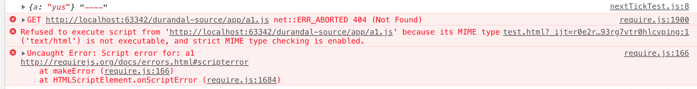
    1. 有报错，但是require(['a1'])仍然顺利加载完成，
    2. 之所以报错是因为首先尝试将'a1'作为js文件去加载，因此控制台有加载a1.js文件404的报错
        >require(['a1'])走context.nextTick回调中，会生成匿名模块，然后执行到该匿名模块的enable（Module.prototype.enable），然后加载其依赖即'a1'，... ，会尝试加载a.js文件
    3. 之所以仍然能够顺利加载完成是因为在nextTickTest.js文件执行完成以后，走completeLoad回调，该方法中有去加载完成模块'a1'的定义，因此并不影响require(['a1'])的加载
- 但是如果存在这两句的话，intakeDefines -> callGetModule -> getModule -> Module.prototype.init，将模块'a1' 的 inited置为true，因此后面则不会去加载a1.js


#### 2.2.1.2. context.nextTick回调
- 主动加载模块的一个特点就是 context.nextTick中会生成一个 内部名称(internal name: '_@r' + number) 的模块（内部模块），其作用是啥呢？
    - 该匿名模块会将deps作为其依赖，然后启动该模块的加载
    - 当这些依赖的模块加载完成后，标志着生成的 '内部模块' 完成定义
    - 因此：该内部模块的作用是用来检测主动加载模块的什么时候完成定义
    
- 内部模块的生成
```
context.nextTick(function () {
    //... 
    requireMod = getModule(makeModuleMap(null, relMap));
}
```


- 开始进行内部模块的定义
```
context.nextTick(function () {
    //... 
    requireMod.init(deps, callback, errback, {enabled: true});// {enabled:true}使得该模块先开始定义，而不是去检查
    //...
});
```
>1. 由于是内部模块因此不存在对应的js文件，又由于是刚创建的模块因此应该开始定义，因此通过init进入enable是合理的；
>2. 通过init是用来表明不要进行js文件的加载了（inited状态是用来标识文件是否已经进行加载）；
>3. 通过enable开始内部模块的定义

    
#### 2.2.1.3 开始内部模块的定义
> 跳过 Module.prototype.init 来到 Module.prototype.enable，enable方法的主要作用是加载其依赖模块，并添加其依赖模块的defined回调（通知该依赖模块完成了定义）
 
1. 内部模块的依赖模块处理入口：Module.prototype.enable
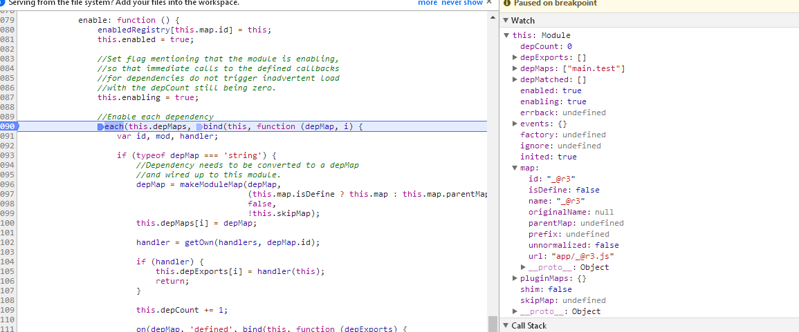
```
enable: function () { // 递归 context.enable -> Module.prototype.enable
    enabledRegistry[this.map.id] = this;
    this.enabled = true;
    this.enabling = true;
    
    each(this.depMaps, bind(this, function (depMap, i) {// 循环处理所有依赖
        if (typeof depMap === 'string') {
            this.depCount += 1;
            
            on(depMap, 'defined', bind(this, function (depExports) { // 监听defined事件
                this.defineDep(i, depExports);
                this.check();
            })); 
        }
        
        if (!hasProp(handlers, id) && mod && !mod.enabled) {
            context.enable(depMap, this); //关键
        }
    }
    
    this.enabling = false;
    this.check(); // 检查（1. 有可能调用该方法的模块的js文件尚未加载通过该方法进行检查调用fetch加载js文件，2. 也有可能该模块对应的js文件已经加载（或者是匿名模块）检查该模块是否可以完成定义）
}
```

- 内部模块的依赖模块'main.test'的处理
    makeModuleMap
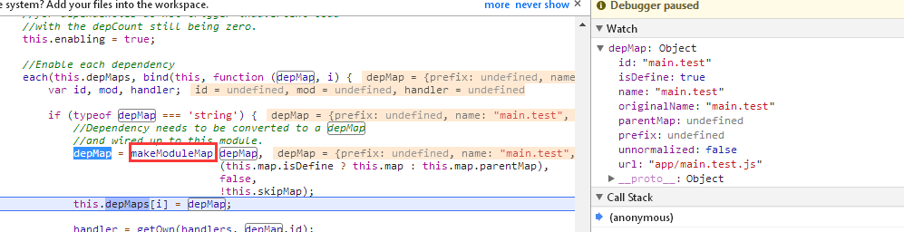

- 依赖模块'main.test' 的加载
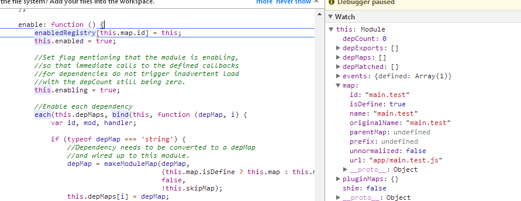
> enable -> check -> fetch（构造script标签加载main.test.js），当main.test.js文件加载完成后会立即执行js文件中的代码<br/>
> 执行main.test.js中的: requirejs.config <br/>
> 执行main.test.js中的: define -> 添加到模块基本信息到 globalDefQueue

- 执行完js文件中的代码后来到completeLoad回调
 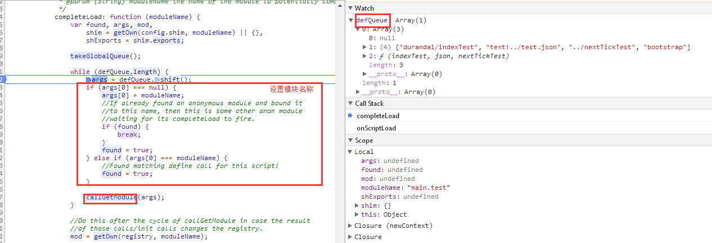

>参数moduleName其实是从其sctipt标签上获取的，在构造script标签时就添加了一个属性[data-requiremodule]
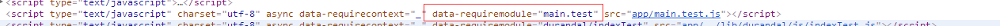

- completeLoad -> callGetModule -> Module.prototype.init (调用init方法就说明该模块已经没有必要再去加载js文件)
>当 main.test 模块完成定义后会触发main.test模块的defined事件（上面有提到在enable方法会去注册内部模块的依赖模块main.test的defined回调）、
defined回调中的this就是内部模块(_@r3)，this.check()则会检查该模块是否可以结束定义（通过this.depCount判断，见this.check代码块）
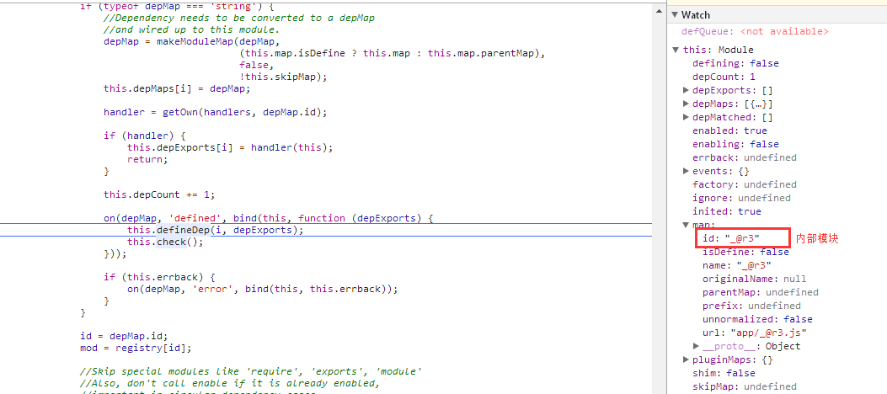 

- 至此 内部模块"_@r3" 定义结束


### 2.2.2 被动加载
> 不是使用require显示加载的方式，即模块是作为主动加载模块的依赖（链）模块被加载的，那么次模块的加载称为被动加载

1. 上面说到 main.test.js 加载并执行完成后的调用栈： onScriptLoad -> completeLoad -> callGetModule -> Module.prototype.init （初始化该模块）
2. 首先得说下：该模块在作为 内部模块"_@r3" 的依赖模块时  已经被 enabled 了，但是当时对应的js文件尚未加载因此其depMaps =[];
3. 现在main.test.js已经执行完成即此时该模块已经执行过define方法，因此确定了该模块了依赖模块。此时可以进行该模块的[定义] 进入 Module.prototype.enable
4. 后面的过程和加载 内部模块"_@r3" 的流程一致

#### 2.2.2.1  'text!./../test.json'
>特殊在于该模块依赖于text.js插件，并且需要通过该模块进行解析
- 1 父模块[main.test]的enable方法中
    - 1.1 调用makeModuleMap()，生成当前模块的moduleMap，其id为"text!../test.json_unnormalized2"<br/>
        
        - 关于 makeModuleMap 方法对 unnormalized 属性的处理
            'text!./../test.json'作为模块main.test依赖，在enable方法中调用了makeModuleMap，此时传入的 isNormalized:false，
            并且此时'test.js'模块也是第一次调用，因此pluginModule是undefined，prefix就是'text'
            => (prefix && !pluginModule && !isNormalized) 为 true
            ```
            function makeModuleMap(name, parentModuleMap, isNormalized, applyMap) {
                //...
                if (prefix) {
                    prefix = normalize(prefix, parentName, applyMap);
                    pluginModule = getOwn(defined, prefix);
                }
                suffix = prefix && !pluginModule && !isNormalized ? '_unnormalized' + (unnormalizedCounter += 1) :
                
                //...
                
                return {
                    unnormalized: !!suffix,
                };
            }
            ```
        
        makeModuleMap -> normalize 转化路径 './..test.json' => '../test.json' <br/>
        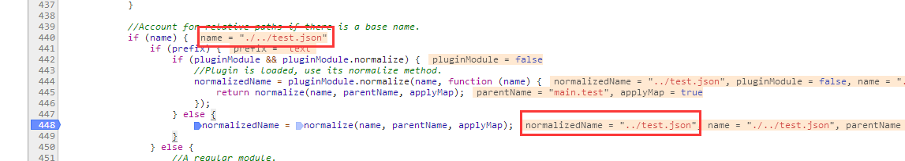
        
        makeModuleMap的结果<br/>
        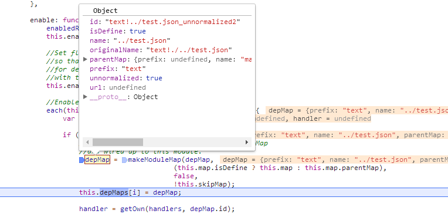 
    
    - 1.2 监听模块 "text!../test.json_unnormalized2" 的defined事件
    > 除了监听事件以外，如果该模块尚未完成定义的话，on还会调用getModule进行登记
    ```
    function on(depMap, name, fn) {
        var id = depMap.id,
            mod = getOwn(registry, id);

        if (hasProp(defined, id) && (!mod || mod.defineEmitComplete)) { // 如果 当前模块即depMap 已经完成了定义，那么同步执行defined回调
            if (name === 'defined') {
                fn(defined[id]);
            }
        } else {// 如果没有完成定义
            // 会将该模块注册 registry 变量中，表示当前已经登记过的模块 (上面已经排除了定义完成的可能性，这很重要)
            mod = getModule(depMap); 
            if (mod.error && name === 'error') {
                fn(mod.error);
            } else {
                mod.on(name, fn);
            }
        }
    }
    ```
    
    ```
    function getModule(depMap) {
        var id = depMap.id,
            mod = getOwn(registry, id);

        if (!mod) { // 如果没有登记过，则登记，但是这里得注意:如果该模块已经完成了定义，就不应该走这里了
            mod = registry[id] = new context.Module(depMap);
        }

        return mod;
    }
    ```
    >getModule 主要出现在 context.enable、callGetModule 两个方法中<br/>
        1. 在执行context.enable之前，都是会先执行on方法，如果已经完成了的定义，则不会调用getModule<br/>
        2. callGetModule在调用getModule方法时也是会先判断是否已经完成了定义<br/>
    
    - 1.3 调用context.enable 开始 "text!../test.json_unnormalized2" 模块的定义
        - context.enable的作用？如果该模块没有完成定义，则开始（或继续）定义 
        ```
        // context.enable
        enable: function (depMap) {
            var mod = getOwn(registry, depMap.id);
            if (mod) {
                getModule(depMap).enable();
            }
        },
        ``` 
    
- 2 开始 "text!../test.json_unnormalized2" 模块的定义
    > 跳过中间步骤（enable -> check）直接来到 fetch() 
    
    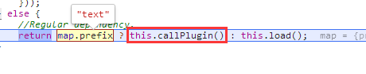  
    
    2.1 - callPlugin代码代码解释
    
    ```
    callPlugin: function () {
        this.depMaps.push(pluginMap); 
            on(pluginMap, 'defined', bind(this, function (plugin) { // pluginMap（在这里就是指text.js模块）defined回调
             //... pluginMap defined回调
            }
        }
        context.enable(pluginMap, this); // 加载pluginMap模块（被动加载）
        this.pluginMaps[pluginMap.id] = pluginMap; 
    }
    ``` 
    
    pluginMap defined回调
    ```
    function (plugin) {
        var load, normalizedMap, normalizedMod,
            bundleId = getOwn(bundlesMap, this.map.id),
            name = this.map.name,
            parentName = this.map.parentMap ? this.map.parentMap.name : null,
            localRequire = context.makeRequire(map.parentMap, {
                enableBuildCallback: true
            });
          
        if (this.map.unnormalized) { // 如果当前的moduleMap unnormalized
            if (plugin.normalize) {
                name = plugin.normalize(name, function (name) {
                    return normalize(name, parentName, true);
                }) || '';
            }
            // 现在的情况是，依赖的plugin：text已经加载完成，因此 需要重新 makeModuleMap (unnormalized这次一定为false）
            normalizedMap = makeModuleMap(map.prefix + '!' + name, this.map.parentMap); // normalizedMap.id = text!../test.json
            on(normalizedMap, 'defined', bind(this, function (value) {  // 监听defined事件，即当 text!../test.json 模块完成定义的回调
                this.init([], function () { return value; }, null, {
                    enabled: true,
                    ignore: true
                });
            }));
    
            normalizedMod = getOwn(registry, normalizedMap.id);
            if (normalizedMod) {
                //Mark this as a dependency for this plugin, so it
                //can be traced for cycles.
                this.depMaps.push(normalizedMap);
    
                if (this.events.error) {
                    normalizedMod.on('error', bind(this, function (err) {
                        this.emit('error', err);
                    }));
                }
                normalizedMod.enable();
            }
    
            return; // 关键，没有继续向下执行了
        }
     
        if (bundleId) { 
            //...
        }
    
        load = bind(this, function (value) {
            this.init([], function () { return value; }, null, { // 这里会去完成 text!../test.json 模块的定义 ，并触发该模块完成定义的回调
                enabled: true
            });
        });
    
        load.error = bind(this, function (err) {  });
    
        load.fromText = bind(this, function (text, textAlt) {   });
    
        plugin.load(map.name, localRequire, load, config);  // 走插件的逻辑，如text.js通过ajax加载text.json文件，加载成功后调用这里传入的回调：load
    } 
    ``` 
    
    2.2 - 下面说下 "text!../test.json_unnormalized2" 模块的加载流程
    pluginMap，this
    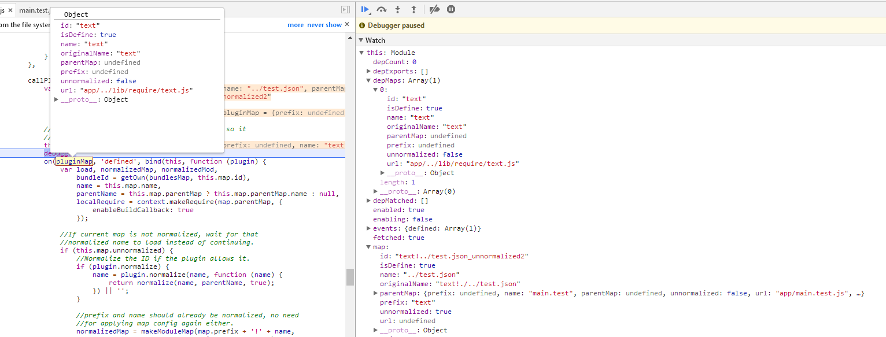
    
    - 2.2.1 pluginMap 监听defined事件（即text.js完成定义后触发这里的回调） 
        - text.js加载完成后进入defined回调：plugin
         
    
        >回调有两种情况
        - 2.2.1.1 unnormalized 情况 走if(this.map.unnormalized)语句块
            >this.map.id = "text!../test.json_unnormalized2"
            
            normalizedMap："text!../test.json" （normalize，因此下一次回调走 2.2.1.2）
            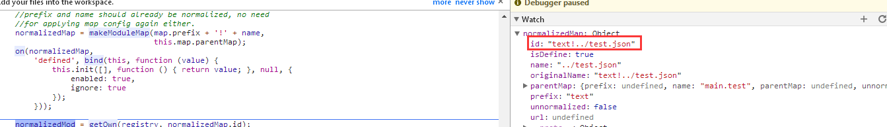
             
            - normalizedMap 监听defined事件 (即 "text!../test.json" 加载完成后 走这里的回调) 
            ```
            // 注意下面回调中的this是指向哪个模块，下面的回调会使得=="text!../test.json_unnormalized2"完成定义== 
            on(normalizedMap, 'defined', bind(this, function (value) {  // 监听defined事件，即当 text!../test.json 模块完成定义的回调
                this.init([], function () { return value; }, null, {
                    enabled: true,
                    ignore: true
                });
            }));
            ```
            - normalizedMod.enable() 进行 "text!../test.json"模块的定义 
                -> callPlugin -> 2.2.1.2（由于 text.js 已经完成了定义，所以会同步执行defined回调）<br/> 
                -> context.enable(pluginMap, this) （由于 text.js 已经完成了定义，因此会从registry，enabledRegistry中移除） 
                    >当一个模块已经完成了定义，如果再次context.enable时，则不会再次定义 
                    ```
                    enable: function (depMap) {
                        var mod = getOwn(registry, depMap.id); // 因为已经移除，所以 mod:false
                        if (mod) {
                            getModule(depMap).enable();
                        }
                    },
                    ``` 
        - 2.2.1.2 normalized 情况
            >this.map.id = "text!../test.json" 
            ``` 
            callPlugin: function () {
                on(pluginMap, 'defined', bind(this, function (plugin) {
                    //...
                    load = bind(this, function (value) { // text.js 加载并解析test.json文件后的回调
                        //注意这里的this是谁，this.init() 会完成 "text!../test.json" 模块的定义，并触发该模块defined回调
                        this.init([], function () { return value; }, null, {
                            enabled: true
                        });
                    });
                    plugin.load(map.name, localRequire, load, config); // 在text.js中区加载test.json文件，然后将转换后的内容回调给load
                }))
            ```

    - 2.2.2 context.enable(pluginMap, this)：因为这个模块尚未加载，因此直接enable，开始该模块的定义
    >js模块是否加载的标志：inited；<br/>
    当text.js加载完成后会走callGetModule -> init 会将 该模块的inited 重置为 true 表示该模块所在的js文件已被加载


- 3 为什么上面的回调要根据 unnormalized 分为两种情况呢？
    - makeModuleMap 中的 unnormalized
    >If the id is a plugin id that cannot be determined if it needs normalization, stamp it with a unique ID so two matching relative ids that may conflict can be separate.<br/>
    >如果id是一个插件ID，如果需要进行规范化则无法确定，请使用唯一ID标记它，以便可以将两个匹配的可能冲突的相对ID分开。<br/>
    （其实我也没找到相应的案例，但可以肯定是这是用来处理某种特殊情况的，因此并不妨碍阅读，你甚至可以把makeModuleMap修改下，比如像下面这样）
    ```
    function makeModuleMap(name, parentModuleMap, isNormalized, applyMap) {
        //...
        return {
            prefix: prefix,
            name: normalizedName,
            parentMap: parentModuleMap,
            unnormalized: false, // !!suffiex 修改为false
            url: url,
            originalName: originalName,
            isDefine: isDefine,
            id: (prefix ?
                prefix + '!' + normalizedName :
                normalizedName) + suffix
        };
    }
    ```
    
    
- 4 text.js加载并解析test.json文件流程
> 这里没啥好说的
             
- 5 总结：
    - 控制台日志看该模块的加载流程
        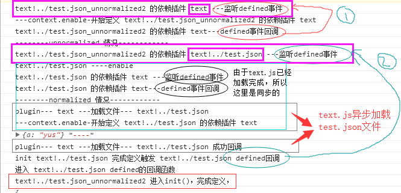    
        - 1. 首先"text!../test.json_unnormalized2"模块有两个依赖：text ，text/..test.json 两个模块
        - 2. normalize后的模块 "text/..test.json" 会去 通过text.js 加载test.json文件，然后"text/..test.json"该模块完成定义
        - 3. 当 "text/..test.json" 完成定义后 就会通知 "text!../test.json_unnormalized2" 去完成定义
    - 显然 unnormalized 这个鬼玩意让这里变的复杂很多。
    - 从思想来看，这里就是先加载 text.js 插件，然后把 text.json 文件的加载交给text.js（注意defined事件的使用，通过该事件的订阅与发布使得父模块得以完成定义）
 
 
#### 2.2.2.x  'durandal/indexTest'
1. 特殊在于 'durandal/indexTest' 其实代表的路径是：'../lib/durandal/js/indexTest.js' ，因为配置的paths时：durandal作为文件夹存在的
2. makeModuleMap 通过 nameToUrl() 转换此类路径
3. 这种情况：就这些


#### 2.2.2.x  'bootstrap' 
```
shim: {
    'bootstrap': {
        deps: ['jquery'],
        exports: 'jQuery'
    }
}

```
> 思路：生成一个‘require实例’：localRequire，通过它加载完依赖，然后在回调中加载bootstrap
```
fetch: function () {
    //...
    if (this.shim) {
        context.makeRequire(this.map, {
            enableBuildCallback: true
        })(this.shim.deps || [], bind(this, function () {
            return map.prefix ? this.callPlugin() : this.load();
        }));
    } else {
       //...
    }
},
```

### 2.2.3 callGetModule
```
1. callGetModule 
    makeModuleMap
    getMoule // 返回Module实例
2. this.init
3. this.check
4. this.fetch （构造scriptb标签加载资源）
    

    
```

#### 2.2.3.1 makeModuleMap,getModule
##### 1. makeModuleMap


 注意后面的 init
 ```
 function callGetModule(args) { 
     if (!hasProp(defined, args[0])) {
         getModule(makeModuleMap(args[0], null, true)).init(args[1], args[2]); 
     }
 }
 ```
 
##### 2. getModule
 
 getModule：注册到registry中
 ```
 function getModule(depMap) {
     var id = depMap.id,
         mod = getOwn(registry, id);
 
     if (!mod) {
         mod = registry[id] = new context.Module(depMap);
     }
 
     return mod;
 }
 ```
 

#### 2.2.3.2 Module[状态流转]看加载流程
context.enable
```
context = {
    enable: function (depMap) {
        var mod = getOwn(registry, depMap.id);
        if (mod) {
            getModule(depMap).enable(); // 调用 Module.prototype.enable()
        }
    },
}
```

Module.prototype
``` 
Module.prototype = {
    init: function (depMaps, factory, errback, options){ // 该方法执行的前提：模块（js文件）已经加载完成了 或者 框架‘内部模块’（因为内部模块压根不需要加载js文件）
        if (this.inited) {
            return;
        }
        //...
        this.inited = true;
        if (options.enabled || this.enabled) { 
            this.enable();
        } else {
            this.check();
        }
    },
    
    enable: function () { // enable方法用来标识：该模块开始进行定义；开始进行定义的前提：模块对应的js文件已经加载完成，但是js文件中定义的模块尚未开始进行定义（此时js中代码已经执行完毕） 或者 ‘内部模块’的初始化（因为内部模块没有对应的js文件）
        enabledRegistry[this.map.id] = this;
        this.enabled = true;
        this.enabling = true;
        
        each(this.depMaps, bind(this, function (depMap, i) {
            //...
            this.depCount += 1; （当前模块的依赖数）
                            
            // 监听依赖模块的defined事件，（每个模块完成后都会触发defined事件）
            on(depMap, 'defined', bind(this, function (depExports) { 
                this.defineDep(i, depExports); // 某个依赖模块完成后父模块的工作：缓存该模块，depCount--（依赖数）等
                this.check();
            }));
            
            if (!hasProp(handlers, id) && mod && !mod.enabled) {
                context.enable(depMap, this);
            }
        }) 
        
        this.enabling = false;
        this.check();
    },
    defineDep: function (i, depExports) { 
        if (!this.depMatched[i]) {
            this.depMatched[i] = true;
            this.depCount -= 1;
            this.depExports[i] = depExports; // this.depExports 将会作为父模块回调的参数：define(['a','b','c'],function(a,b,c){}); 回调函数的参数a,b,c就是通过depExports传递的
        }
    },
    check: function () {// 函数名已经表明了该方法的作用：检查，根据当前模块的状态检查下一步该做什么（代码中也可看出是各种if判断模块状态）、defiend/defining
        if (!this.enabled || this.enabling) { // 如果模块处于 enabled 的话，说明 模块（js文件） 还在加载中
            return;
        }
        
        if (!this.inited) { // inited 为 false 表明模块（js文件）尚未加载，因此需要通过this.fetch去加载该js文件
            this.fetch();
        } else if (this.error) {
            this.emit('error', this.error);
        } else if (!this.defining) {
            this.defining = true;
        
            if (this.depCount < 1 && !this.defined) {
            
            }
            
            if (this.defined && !this.defineEmitted) {
                this.defineEmitted = true;
                this.emit('defined', this.exports);
                this.defineEmitComplete = true;
            }
        }
    
    }

}
```
 Module.prototype.init：this.inited 用来标识：用来标识该模块（js）文件是否被加载了
 Module.prototype.enabled：this.enabled、this.enabling

# 补充 
## context.require = localRequire （闭包）, 为什么这里要这么做呢？

```
context = {
    //...
    makeRequire: function (relMap, options) {
        options = options || {};
        
        function localRequire(deps, callback, errback) {  }

        return localRequire;
    },
    //...
}
```

## useInteractive 的作用

## fetch 构造script标签加载资源

## makeModuleMap
moduleName的类型：require调用，define调用

## nameToUrl：把模块名称转为文件路径
核心代码

思想：以模块名称为 'a/b/c/d'为例
1. abcd在config.paths中是否有匹配 => matchRes
2. abc 在config.paths中是否有匹配 => matchRes + '/d'
3. ab  在config.paths中是否有匹配 => matchRes + '/bd'
4. a   在config.paths中是否有匹配 => matchRes + '/cbd'
=> url += '文件后缀名' 

## normalize
> 将 ./ 路径 转化为基于 baseUrl的路径，为了可以基于config.paths映射路径


#Module 与moduleMap的关系
on操作总是依赖于Module实例，Module实例总是依赖moduleMap，Module构造函数的参数就是moduleMap
moduleMap：当前模块的基本信息：name,id,prefix 
Module：用于管理 当前模块 定义过程中的相关属性，主要和其依赖模块的情况有关：比如记录依赖模块的加载情况，以及依赖模块的exports

## localRequire.undef

## 如何支持cmd规范的？

## context.nextTick:setTimeout ，为什么要异步？
>保证同步的代码块中的define被执行
```
req.nextTick = typeof setTimeout !== 'undefined' ? function (fn) {
    setTimeout(fn, 4);
} : function (fn) { fn(); };

// 改为 
req.nextTick = function (fn) { fn(); }
```

当加载下面nextTickTest.js时，则会报错
```
require(['a1'], function (a) {
    console.log(a,'----')
});

define('a1', [], function () {
    return {
        a: 'yus'
    }
}) ;
```
### 执行结果


1. 报错的原因
    因为执行require语句的时候不知道还有一个模块叫'a1'，默认情况下则会请求将模块作为js文件处理，因此会去请求a1.js，为什么报错在后呢？因为通过script标签请求文件是异步的过程<br/>


2. 执行成功的原因
    1. nextTickTest.js执行过程中调用了define('a1')
    2. 当nextTickTest.js执行完成后，会调用 context.onScriptLoad  -> callGetModule -> 完成在 nextTickTest.js 中进行定义的模块 'a1'，
    3. 当该模块完成定义后，其会触发一个 [defined]事件 ，这个事件的监听者就是依赖 a1 的模块，
    4. 在这里就是 require(['a1']) ，因此 require(['a1'],fn) 的回调也会成功执行
    5. 监听依赖项的defined事件(Module.prototype.check)<br/>


3. 如果异步处理，则会先执行后面的同步代码，那么require(['a1'])也就不会尝试加载a1.js文件了；
>我认为，这里应该是个优化的过程，并不是必须的。比如 nextTickTest.js 中的两句代码颠倒下顺序，也是可以顺利执行的；建议在看requirejs源码时，把这里改为同步


## text.js
```
finishLoad
```
